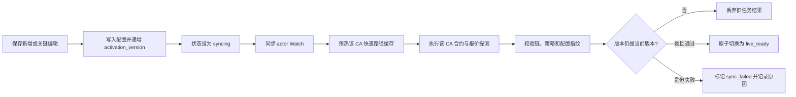
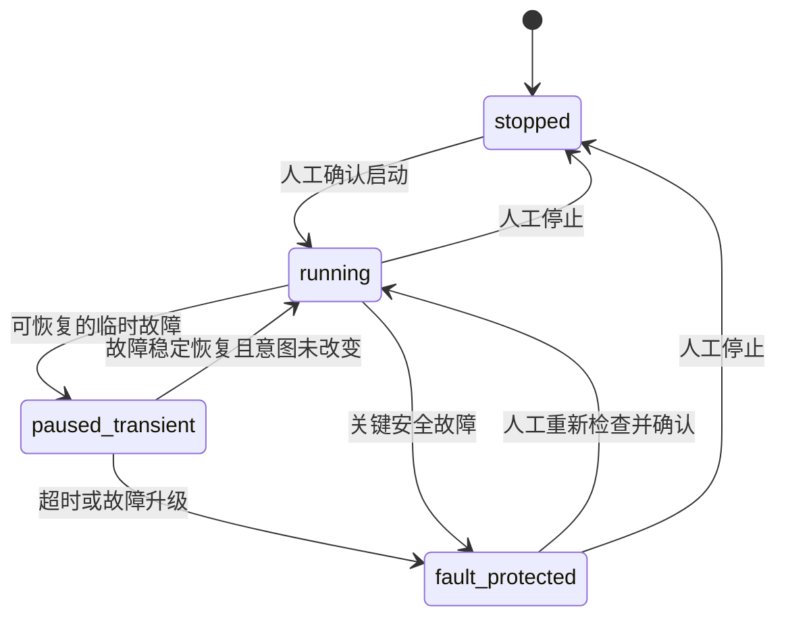

# P17 白名单热激活、临时故障恢复与紧凑启动方案

> 状态：代码更新与本地自动化/DOM 验收完成；生产热更新与真实故障演练待执行
>
> 审计基线：2026-07-27 当前本地代码与运行数据
>
> 前置方案：`P15_frontend_information_architecture_convergence_plan.md`、`P16_3_multi_target_ecosystem_relation_matrix_plan.md`
>
> 目标：新增或修改白名单时不停止其他自动交易；临时数据源故障恢复后自动继续；启动真实交易只检查一次，并把确认界面收敛到一屏。

## 1. 结论

用户提出的判断基本正确，但需要补一个安全边界：

1. 新增白名单不应该停止其他 CA 或其他链的自动交易。
2. 6551 短暂断线不应该永久把 Engine 留在故障保护状态。
3. 启动卡顿和超长确认页不是 CA 数量本身造成的，而是重复全量探测、串行探测和全量关系渲染叠加造成的。
4. 不能把“热添加”实现成“保存后立即实盘”。新白名单必须先完成自己的 Watch、缓存和合约探测，再单独进入实盘范围。
5. 启动确认仍有必要，用于防止误触真实交易；但确认页不应承担白名单管理和 720 条关系审阅。

因此，本方案采用：

```text
全局停机式变更
    ↓
对象级热激活 + 故障按范围隔离 + 临时故障自动恢复 + 紧凑启动确认
```

## 2. 当前代码审计

### 2.1 已经具备的热更新基础

| 位置 | 当前行为 | 结论 |
| --- | --- | --- |
| `backend/domains/whitelist/service.js` | 新增、编辑、暂停、删除在事务内保存，并写入 6551 Watch Outbox | 白名单 CRUD 本身没有主动停止 Engine |
| `backend/domains/signal/matcher.js` | 每次匹配时查询 `status = 'active'` 的白名单、来源和关系 | 不需要重启进程即可读取新规则 |
| `backend/domains/signal/live-policy.js` | 每次生成 Policy 时查询当前 active 白名单 | Policy 具备动态更新基础 |
| `backend/jobs/gmgn-cache-warmup.js` | 周期读取当前 Policy 并预热 CA | 缓存会最终更新，但每轮只处理 3 个 CA |

结论：系统并不是只能“停止 -> 新增 -> 再启动”。现有数据流已经支持动态读取，问题在于新增对象缺少独立的激活门。

### 2.2 当前热添加的一致性漏洞

保存新白名单后，当前顺序实际是：

```text
事务提交，白名单立即 active
    ├─ Matcher 和 Live Policy 已可读取
    ├─ 6551 Watch 仍可能 pending / failed
    ├─ GMGN 快速路径缓存可能尚未预热
    └─ 新 CA 没有独立的有效探测证据
```

这会产生两个问题：

1. 页面显示“已启用”，但新账号的 Watch 尚未同步，可能漏收事件。
2. 如果触发账号已经被其他白名单 Watch 复用，新白名单可能在自身 CA 尚未完成独立探测前进入实盘 Policy。

当前 `chain_live_readiness.contract_tested` 是链级状态，不能证明每一个新 CA 都已经验证。P17 必须增加白名单级激活证据，不能继续用链级通过替代 CA 级通过。

### 2.3 6551 临时故障无法自动恢复

当前 `ReadinessMonitor.checkOnce()` 只在 `engine.getArmed() === true` 时检查。发生 6551 心跳或 WSS 故障后：

```text
running
  -> setFaulted(preserveIntent = true)
  -> armed = false, status = fault_protected
  -> 后续 monitor 返回 not_armed
  -> 6551 恢复也不会再次执行恢复判断
```

`restoreDesiredState()` 目前只在进程启动阶段调用，所以“不重启进程的临时恢复”缺少闭环。这是明确的状态机漏洞。

### 2.4 启动卡顿的直接原因

当前启动链路会重复执行完整探测：

```text
第一次点击启动
  -> GET readiness?probe=true
  -> 前端展示确认弹窗
  -> 点击确认
  -> POST /arm
  -> 后端 assertReadyToArm()
  -> 再次 getSnapshot({ probe: true })
```

同时：

1. `probeContracts()` 使用 `for...of` 逐个 CA 串行请求 GMGN。
2. 当前运行范围约为 5 条链、30 个白名单、720 条关系。
3. 弹窗直接遍历每个白名单及其全部关系。
4. 弹窗打开后每 2 秒重新拉取 readiness。
5. 设置页每 1 秒拉取 `runtime-policy`，该接口又包含完整 readiness 和 relations。

因此，CA 增长到 100 个时，等待时间、响应体积和 DOM 数量都会继续线性增长。

### 2.5 `.env` 更新的停机范围过宽

当前通用 `POST /api/system/env` 对所有允许字段统一执行：

```text
保存 .env -> setFaulted(preserveIntent = false) -> 进程重启
```

修改 `XAI_API_KEY`、`XAI_MODEL` 等纯投研配置也会停止真实交易。这不是安全需求，而是配置影响范围没有分类。

### 2.6 上游事件时间未进入真实交易过期判断

`x_activities.source_created_at` 已保存 6551 上游发帖时间，但 `trade-repository.js`、`live-policy.js`、`live-execution-queue.js` 仍以本地 `trade_signals.created_at` 判断信号年龄。如果 6551 断线后补发旧帖，本地新建 Signal 会被误判为新信号。

P17 必须统一使用可信上游时间：

```text
6551 真实买入年龄 = x_activities.source_created_at
其他非 6551 兼容路径 = COALESCE(source_created_at, signal.created_at)
```

6551 事件缺失或时间无效时必须 fail closed，不得回退为本地创建时间。Engine 启动清理、Queue 扫描、claim 和 Live Policy 必须使用同一时间语义。

### 2.7 未发币首次 CA 与普通热激活不能混为一类

`launch-matcher.js` 会在首次发现 CA 的同一事务中创建白名单和 Signal。如果对所有 `syncing` 白名单都直接写成 `signal_only`，未发币项目将永远错过首次交易机会。

未发币路径需要专用的短时待激活语义：

1. 原始 Signal 保持 `recorded`，标记 `awaiting_activation`，不立即 claim。
2. 立即对新 CA 执行 Watch 确认、缓存预热、合约和报价检查。
3. 仅当白名单在 `SIGNAL_MAX_AGE_SECONDS` 内进入 `live_ready`，且上游事件时间仍新鲜时，Queue 才可 claim。
4. 超时或激活失败后改为 `signal_only`，记录明确原因，不追单。

### 2.8 KOL 生命周期未完整驱动 Watch 和最终准入

当前 KOL 停用后 Matcher 会停止新匹配，但已记录 Signal 的 `relationAllowsSignal()` / `sourceRuleAllowsSignal()` 没有再次校验 actor 仍为 enabled。同时 KOL 启用、停用或改名没有主动写 Watch Outbox，只能等下一次其他变更偶然带动全量对账。

P17 必须在 KOL 关键变更时：

- 查出其影响的 active 白名单和未发币规则。
- 为新旧 handle 写 Watch Outbox。
- 启用或改名时让受影响白名单重新激活。
- 停用时立即阻断该 actor 的新买入，并异步回收不再被引用的 Watch。
- 最终 Policy 校验必须 JOIN `x_kol_accounts.enabled = true`，不能只信任 Signal 中的旧 relation ID。

### 2.9 离场策略快照已有基础，但需明确持久化契约

当前建仓时已将 `exit_strategy`、`exit_strategy_version` 和编译后 `condition_orders` 写入 Trade Attempt metadata，Provider 策略组也保存 `requested_params`。这足以保证现有仓位不会因白名单策略修改而被重写。

P17 不改变 Provider 策略语义，但测试必须固化该契约：新建仓位使用当时快照，旧仓位在白名单编辑后仍使用原 `strategy_groups.requested_params`。

## 3. 设计原则与安全不变量

1. **保存成功不等于实盘就绪**：保存只代表配置落库，激活成功才代表可接收真实买入。
2. **新对象失败不影响旧对象**：新 CA、Watch 或缓存失败只隔离该白名单。
3. **故障按影响范围处理**：账号级、白名单级、链级、钱包级和全局故障不能统一全局停机。
4. **临时故障可自动恢复，关键变更不可自动恢复**：数据源抖动与私钥变更必须走不同状态。
5. **停止新买入不停止持仓保护**：对账、回执确认、止盈止损和人工平仓始终继续运行。
6. **恢复不追单**：断线期间或恢复前产生的旧事件不得在恢复后补成真实买入。
7. **配置版本必须可比较**：旧异步任务不能把更新后的白名单错误标记为已就绪。
8. **不新增风险限制**：P17 只调整激活、恢复和界面流程，不新增每日限额、连续亏损等第二套交易限制。

## 4. 白名单热激活

### 4.1 分离用户状态与实盘激活状态

保留现有 `status` 表达用户意图：

- `active`
- `paused`
- `exhausted`
- `expired`
- `archived`

新增 `live_activation_state` 表达系统是否已准备好：

- `syncing`：已保存，正在同步 Watch、缓存和证据。
- `live_ready`：所有检查通过，允许进入真实执行 Policy。
- `sync_failed`：该白名单激活失败，不影响其他白名单。

仅以下条件同时满足时，白名单才可进入真实执行范围：

```sql
status = 'active'
AND live_activation_state = 'live_ready'
AND 未过期
```

Matcher 对已经收到的事件仍可保留 `signal_only` 审计记录，但 `syncing` 或 `sync_failed` 白名单不得进入真实交易队列。这样既不会绕过激活门，也不会因为共享 Watch 已经收到事件而丢失排障证据。

### 4.2 激活流程



激活必须检查：

1. CA 格式、链归属、预算、滑点和离场策略可编译。
2. 所有作为 actor 的账号已被 6551 接管并处于 `in_sync`。
3. 只监控左侧 actor；右侧项目目标账号不额外创建 Watch。
4. `loadCachedContext()` 对该 CA 成功，不等待轮询批次偶然轮到。
5. 该 CA 的 GMGN 报价、钱包、RPC 和链配置通过。
6. 证据绑定 `whitelist_id + activation_version + context_hash + code_version`。
7. 最终更新使用 compare-and-set，旧版本结果不能覆盖新版本。

白名单原子切换为 `live_ready` 后直接热加入当前 Policy，不要求用户再次停止或启动 Engine。此处的对象级激活证据就是该白名单的实盘授权；全局 Arm 只表达“系统是否允许自动交易”，两者不能重复要求用户确认。

### 4.3 新增、编辑、暂停和删除的行为

| 操作 | 新行为 |
| --- | --- |
| 新增白名单 | 立即保存并显示 `同步中`；其他白名单继续交易；通过后自动变为 `可实盘` |
| 编辑 CA、链、金额、滑点、离场策略、触发账号或关系 | 仅该白名单暂时退出新买入并重新激活；其他 CA 不受影响 |
| 编辑名称、Symbol、Logo、备注或分类 | 不重新激活，不影响实盘 |
| 暂停 | 事务提交后立即退出 Matcher 和 Policy，再异步清理不再需要的 Watch |
| 删除 | 先归档并立即退出交易范围，再异步同步 Watch；远端失败不影响删除结果 |
| 激活失败 | 显示具体原因和“重新同步”命令；不会自动转为 `live_ready` |

关键编辑期间允许该 CA 短暂停止新的买入，这是 P17 的有意取舍。P17 不引入完整的双版本配置表，因此不保证“同一个 CA 编辑时零暂停”，但保证其他 CA 和其他链不停止。

已有持仓继续使用建仓时保存的离场策略快照；修改白名单策略只影响后续新买入，不能改变在途持仓的止盈止损。

## 5. Engine 状态机与自动恢复

### 5.1 新状态模型



状态语义：

| 状态 | 新买入 | 对账/卖出/持仓保护 | 自动恢复 |
| --- | --- | --- | --- |
| `running` | 允许 | 继续 | 不适用 |
| `paused_transient` | 暂停 | 继续 | 允许 |
| `fault_protected` | 停止 | 继续 | 禁止，需人工确认 |
| `stopped` | 停止 | 继续 | 禁止，用户已明确停止 |

`desired_running` 继续表示用户意图。人工停止必须把它设为 `false`；临时暂停保留 `true`。

### 5.2 故障分级

| 级别 | 示例 | 处理 |
| --- | --- | --- |
| 白名单级 | 新 Watch 冲突、新 CA 报价失败、缓存预热失败 | 仅该白名单 `sync_failed` |
| 链/钱包级 | 单链 RPC 暂时不可用、链熔断、钱包 Quarantine | 仅暂停受影响链或钱包的新买入 |
| 全局临时 | 6551 心跳超时、WSS 断开、GMGN 短暂限流或调度器冷却 | `paused_transient`，稳定恢复后自动继续 |
| 全局关键 | 私钥、交易模式、实盘总开关、紧急停止、数据库/迁移异常、配置指纹不一致 | `fault_protected`，必须人工重新确认 |

### 5.3 6551 自动恢复规则

1. 6551 心跳或 WSS 首次异常时立即停止新的真实买入，进入 `paused_transient`。
2. 恢复检查只读取本地心跳、WSS 订阅状态、Inbox 消费状态和关键配置指纹，不重复探测全部 CA。
3. 推荐连续 3 次、每次间隔 1 秒均健康后恢复，避免连接抖动造成反复启停。
4. 如果超过 60 秒仍未恢复，升级为 `fault_protected` 并通知用户。
5. 恢复前再次确认 `desired_running = true`，且关键配置指纹与暂停前一致。
6. 自动恢复时执行信号时间水位线：暂停开始前及暂停期间产生的事件只记录，不补做真实买入。
7. 对于 Provider 延迟补发的消息，使用上游事件时间与恢复水位线判断，不能只使用本地 `signal_created_at`。
8. 恢复动作写入审计记录，且同一故障周期只通知一次暂停和一次恢复。

## 6. 配置影响范围收敛

新增统一的 `configuration impact registry`，每个配置键必须声明影响范围和处理方式，禁止通用 `/env` 再无差别全局停机。

| 分类 | 主要配置 | 保存行为 |
| --- | --- | --- |
| `research_only` | `XAI_API_KEY`、`XAI_BASE_URL`、`XAI_MODEL` | 进程内热加载，只影响后续投研任务，不停止 Engine |
| `monitoring_critical` | `OPENNEWS_TOKEN`、`X_DATA_PROVIDER`、6551 WSS/Watch 认证配置 | 保留 `desired_running`，重连 ingestion；新认证恢复且订阅稳定后才可自动恢复 |
| `observability` | `TRADE_ALERTS_VERIFIED` | 更新状态，不停止交易 |
| `cache_runtime` | GMGN 缓存 TTL | 更新并失效相关缓存，不停止 Engine |
| `chain_scoped` | 单链 RPC、单链 Fee Reserve、单链 Gas Reserve | 仅该链进入验证状态；通过后恢复该链，不停止其他链 |
| `global_execution` | `GMGN_API_KEY`、`GMGN_PRIVATE_KEY`、`GMGN_KEY_EXCLUSIVE`、`SIGNAL_MAX_AGE_SECONDS` | 全局故障保护，重新探测并人工确认 |
| `global_control` | `TRADING_MODE`、`LIVE_TRADING_ENABLED`、`EMERGENCY_STOP`、`XBOT_PROCESS_ROLE` | 全局停止，必须人工重新启动 |
| `process_infrastructure` | DB、Backend Host/Port、`ADMIN_TOKEN` | 受控进程重启；DB 和角色变化按关键变更处理 |

实现要求：

1. `env-settings.js` 成为分类的唯一来源，路由不得自行猜测影响范围。
2. 保存接口返回 `impact_scope`、`restart_required`、`manual_rearm_required`。
3. 投研客户端每次任务从运行时配置读取 XAI 配置，不在模块加载时永久缓存旧值。
4. 链级配置变化只失效该链的 CA 证据和缓存。
5. 所有 Secret 继续脱敏，审计日志只记录键名，不记录值。
6. `OPENNEWS_TOKEN` 不得走投研热加载路径；无效新凭据必须保持 `paused_transient` 或升级人工处理，不得自动返回 `running`。

## 7. 启动真实交易的新流程

### 7.1 `prepare -> confirm`，不再探测两次

新增两个明确动作：

```text
POST /api/system/arm/prepare
  -> 复用有效证据
  -> 只探测新增、变更或过期的 CA
  -> 最多 4 个有限并发
  -> 生成短期 arm preparation
  -> 返回 compact summary + arm_token

POST /api/system/arm/confirm
  -> 校验 token 未过期、未使用
  -> 校验 configuration_fingerprint 未变化
  -> 校验 policy_fingerprint 未变化
  -> 原子启动，不再 full probe
```

`arm_token` 推荐有效期 60 秒，只保存哈希；绑定：

- 配置指纹。
- Policy 指纹。
- `live_ready` 白名单 ID 与 activation version。
- readiness snapshot hash。
- 操作人和过期时间。

确认前如果新增、编辑、暂停或删除了白名单，Policy 指纹会变化，旧 token 返回 `ARM_PREPARATION_STALE`，前端只重新执行一次 prepare。

### 7.2 增量探测与证据复用

1. 证据 Context Hash 没变化且仍在有效期内时直接复用。
2. 只对缺失、过期、代码版本变化或配置变化的 CA 探测。
3. 合约探测使用 4 个有限并发，禁止无限并发压垮 GMGN，也禁止逐个串行。
4. 链钱包、RPC 和 Strategy 探测按链去重，每条链只执行一次。
5. 激活阶段已经生成的 CA 证据可直接供启动阶段复用。
6. 全量结果只保存在后端；前端默认只接收摘要。

### 7.3 紧凑确认弹窗

弹窗只回答三个问题：

1. 现在能否启动？
2. 本次会启用多少链、CA、唯一 Watch 和关系？
3. 如果不能启动，阻断项是什么？

默认一屏内容示意如下，数量由后端实时统计：

```text
启动真实交易                         [关闭]
检查通过

5 条链  |  30 个 CA  |  14 个唯一 Watch  |  720 条关系

SOL        可实盘   钱包正常   余额正常
BSC        可实盘   钱包正常   余额正常
BASE       可实盘   钱包正常   余额正常
ETH        可实盘   钱包正常   余额正常
ROBINHOOD  可实盘   钱包正常   余额正常

[查看详细范围]                 [返回] [确认启动]
```

交互约束：

1. 默认不渲染全部 CA 和关系。
2. “查看详细范围”打开独立抽屉，支持搜索、按链筛选和每页 20 条。
3. 关系只显示数量与账号摘要，不展开 720 行 actor-target 明细。
4. Header 和 Footer 固定，内容区独立滚动，确认按钮始终可见。
5. 点击启动后立即显示检查进度，不让按钮无反馈地等待网络请求。
6. 离开设置页后关闭本地弹窗，不允许遮罩继续覆盖其他页面。
7. 阻断项优先显示；没有阻断时不展示内部诊断字段。

## 8. 接口与数据改造

### 8.1 数据库

在 `ca_whitelist` 增加：

```text
live_activation_state
activation_version
activation_context_hash
activation_error_code
activation_error_detail
activation_checked_at
```

新增 `whitelist_activation_outbox`：

- 每个白名单保留最新 desired version。
- 支持 pending、processing、succeeded、failed。
- 支持进程中断后的 lease 回收。
- 完成时必须比较 desired version，避免旧任务覆盖新编辑。

新增 `arm_preparations`：

- 只保存 token hash。
- 保存配置指纹、Policy 指纹、snapshot hash、过期时间和 consumed 时间。
- Token 单次使用，过期和重放均拒绝。

### 8.2 后端

1. `whitelist/service.js`：保存后写激活 Outbox，不直接假定实盘可用。
2. `signal/matcher.js`：读取激活状态；未就绪命中最多记录为 `signal_only`，不得进入真实交易队列。
3. `signal/live-policy.js`：只纳入 `live_ready` 白名单，作为真实执行的最终准入门。
4. 新增 Activation Worker：对象级执行 Watch、缓存、探测和 compare-and-set 激活。
5. `readiness-service.js`：拆分全局、链级、白名单级检查，支持证据复用和有限并发。
6. `engine-state.js`：增加 `paused_transient` 与运行时自动恢复循环。
7. `system/routes.js`：增加 arm prepare/confirm，并按配置影响范围处理 `.env`。
8. `trade/routes.js`：把 `runtime-policy` 拆为 compact summary 与按需 detail，禁止每秒返回完整 relations。
9. `trade-repository.js` / `live-execution-queue.js`：返回并使用 `source_created_at`，6551 时间缺失时 fail closed。
10. `launch-matcher.js`：新发现 CA 写入 Activation Outbox，Signal 短时等待该版本激活，超时不追单。
11. `kol/service.js`：KOL 启停、改名和删除必须协调 Watch Outbox 与受影响白名单激活。

建议接口：

```text
GET  /api/system/runtime-summary
POST /api/system/arm/prepare
GET  /api/system/arm/preparations/:id
POST /api/system/arm/confirm
POST /api/whitelist/:id/activation/retry
GET  /api/whitelist/:id/activation
GET  /api/trade/runtime-policy/detail?page=1&page_size=20&chain=...
```

### 8.3 前端

1. 白名单列表显示 `同步中 / 可实盘 / 同步失败`，不新增技术参数表单。
2. 同步失败显示人类可读原因和一个“重新同步”按钮。
3. 设置页默认轮询 compact runtime summary，不再每秒获取完整 readiness。
4. 启动弹窗显示 prepare 进度和摘要，详细范围按需获取。
5. X 事件接收仍由 6551 WSS/现有快速链路负责；前端状态轮询频率与 X 信号速度无关，不能混为一套参数。

## 9. 迁移与上线顺序

### 阶段 A：Schema 与影子激活

1. 增加激活字段、Activation Outbox 和 Arm Preparation 表。
2. Activation Worker 先以影子模式运行，不立刻改变 Matcher 和 Policy 查询。
3. 为当前 active 白名单生成逐项激活报告，不能直接把所有旧记录盲目标记为 `live_ready`。
4. Readiness 最低迁移门升级为 `025_p17_arm_failure_observability.sql`；缺少 018-025 任一必要结构时不得判定可启动。

### 阶段 B：白名单级准入切换

1. 对 Watch、缓存和证据完整的现有白名单回填 `live_ready`。
2. 未通过项目保持 `sync_failed`，列出原因，不影响已通过项目。
3. 确认全部 active 项目均有明确状态后，Matcher 增加审计分流，Live Policy 增加 `live_ready` 准入过滤。
4. 上线过程不自动修改用户的 Engine 开关和 `desired_running`。

### 阶段 C：临时暂停与自动恢复

1. 增加 `paused_transient`。
2. 先覆盖 6551 心跳/WSS 故障，再覆盖 GMGN 短暂限流。
3. 增加恢复稳定窗口、超时升级、事件水位线和通知去重。
4. 保留所有关键故障人工确认路径。

### 阶段 D：一次启动检查

1. 增加 prepare/confirm 和 token 防重放。
2. 合约探测改为增量、证据复用和有限并发。
3. 旧 `/arm` 在前端切换完成后废弃，不能长期保留两套启动逻辑。

### 阶段 E：前端收敛

1. 上线 compact runtime summary。
2. 替换超长启动弹窗。
3. 详细范围改为搜索、筛选、分页抽屉。
4. 删除旧弹窗中重复的 CA/关系渲染代码和完整 readiness 轮询。

## 10. 验收标准

### 10.1 白名单热添加

- [ ] Engine 运行时新增一个白名单，Engine 始终保持 `running`。
- [ ] 新白名单先显示 `syncing`，未就绪前不能生成真实买入。
- [ ] 其他白名单在激活期间继续正常匹配和执行。
- [ ] Watch 同步失败只把新白名单标记为 `sync_failed`。
- [ ] 复用现有 actor 时不重复创建 6551 Watch。
- [ ] Cache、CA 探测和 Watch 全部通过后，状态原子切换为 `live_ready`。
- [ ] 连续快速编辑两次时，第一次任务结果不能覆盖第二次配置。
- [ ] 暂停或删除后立即停止该白名单的新匹配，不等待远端 Watch 删除。
- [ ] 编辑白名单不改变已有持仓的离场策略快照。
- [ ] 未发币首次 CA 在激活成功且上游事件仍新鲜时可执行，激活超时后不追单。
- [ ] 停用 KOL 后其已入队但未执行的 Signal 也无法通过最终 Policy。

### 10.2 故障恢复

- [ ] 模拟 6551 断线后 1 个检查周期内停止新买入。
- [ ] 对账、止盈止损、卖出和人工平仓继续运行。
- [ ] 6551 连续 3 次健康后，在关键指纹未变化时自动恢复。
- [ ] 断线期间及恢复水位线之前的事件不会补做真实买入。
- [ ] 6551 断线后补发的旧帖使用 `source_created_at` 过期，不因本地新建 Signal 而变成新信号。
- [ ] 6551 事件缺失有效上游时间时不得执行真实买入。
- [ ] 超过 60 秒未恢复时升级为 `fault_protected`。
- [ ] 私钥、交易模式、实盘总开关或紧急停止变化后绝不自动恢复。
- [ ] 单链 RPC 故障不停止其他健康链。

### 10.3 启动流程与性能

- [ ] 一次启动操作最多执行一次重型 readiness probe。
- [ ] Confirm 只校验短期 token 和指纹，不再次逐 CA 探测。
- [ ] 无配置变化且证据有效时，prepare 复用证据，不访问每个 CA。
- [ ] 30 个需重新探测的 CA 使用最大并发 4，不串行也不无限并发。
- [ ] 弹窗打开后不再每 2 秒获取完整 readiness。
- [ ] 设置页不再每 1 秒获取包含全部 relations 的 runtime-policy。
- [ ] Compact summary 响应体目标不超过 20 KB。
- [ ] 使用 100 个 CA、1000 条关系进行 DOM 压力测试，主弹窗仍只渲染链摘要和统计。
- [ ] 桌面端与 `390x844` 移动端无横向溢出，Header/Footer 和按钮不重叠。
- [ ] 关闭弹窗或切换路由后，遮罩不出现在其他页面。

### 10.4 自动化测试

- [ ] Activation Outbox 去重、重试、lease 回收和版本竞争测试。
- [ ] Matcher 的 `signal_only` 审计分流与 Live Policy 的 `live_ready` 准入测试。
- [ ] 临时故障自动恢复、永久故障禁止恢复和事件水位线测试。
- [ ] 配置影响范围契约测试，XAI 配置不得停止 Engine。
- [ ] Arm token 过期、重放、Policy 变化和配置变化测试。
- [ ] 未发币 Signal 等待激活、成功释放、过期拒绝和版本变更测试。
- [ ] KOL 启停/改名触发 Watch 重算，且停用 actor 无法通过最终 Policy 测试。
- [ ] 后端完整测试、前端 build、lint、DOM 和 `git diff --check` 全部通过。
- [ ] 自动化测试禁止发送真实买卖订单。

## 11. 非目标

1. 不取消启动真实交易的人工确认。
2. 不新增每日、每周、连续亏损等第二套风险参数。
3. 不让激活失败的白名单自动绕过检查进入实盘。
4. 不把右侧项目目标账号全部创建为 6551 Watch。
5. 不在 P17 实现同一个 CA 编辑时的完整双版本零暂停；本次只保证其他 CA 不受影响。
6. 不改动 P12 已有的真实交易幂等、失败判定、Wallet Write Lane 和持仓保护语义。
7. 不在本方案审核阶段启动真实交易或修改现有 Engine 状态。

## 12. 审核决策

建议批准以下三个产品决策后再执行代码更新：

1. **白名单对象级激活**：保存立即成功，但只有显示“可实盘”后才进入真实交易；失败只隔离该条。
2. **6551 临时故障自动恢复**：连续 3 秒健康后自动继续，超过 60 秒升级为人工处理；恢复不追旧信号。
3. **保留但压缩启动确认**：主弹窗只显示一屏摘要，详细 CA 和关系进入按需分页抽屉，启动检查只执行一次。

这三个决策共同解决“新增白名单为什么要停其他交易”“短暂故障为什么不会自己恢复”“启动为什么卡且页面过长”，同时不降低真实交易安全边界。

## 13. 2026-07-27 实施与本地验收记录

已完成：

1. 白名单激活采用 `syncing -> live_ready/sync_failed`，Activation Outbox 对暂停、归档和旧版本任务执行明确终止；Watch 必须由 XBOT 管理、远端 flags 覆盖 desired flags 且 Watch Outbox 无待处理/失败任务，才允许进入 `live_ready`。
2. Engine 临时暂停与恢复、6551 上游时间 fail closed、KOL 最终准入、配置影响范围和停止新买入但继续持仓维护均已按本方案落地。
3. 启动流程统一为 `prepare -> confirm`，旧 `/arm` 返回 `410`；Token 绑定操作人，并通过 Migration 025 增加 `prepared -> arming -> consumed/failed` 的失败可观测状态。
4. 设置页改用 compact runtime summary；修复了查询不存在的 `production_approved` 列，实际来源统一为 `chain_live_readiness.live_enabled`。
5. 启动弹窗只显示链、CA、唯一 Watch 和触发关系统计；详细范围使用独立分页抽屉。没有本地管理口令时显示紧凑登录入口，不再出现空白设置页。
6. 白名单列表显示“同步中 / 可实盘 / 同步失败”，同步失败支持单条重新同步。
7. Trade Attempt 保存下单时的离场策略快照；仓位兼容字段和 `strategy_groups.requested_params` 均使用该快照，不读取确认时可能已被编辑的白名单策略。

本地验收证据：

- P12 历史迁移演练通过：13 张历史交易相关表数据保持不变，Robinhood 约束与 Watch Outbox 正常。
- P16 历史迁移演练通过：仓位、订单、信号、项目身份、未发币规则和旧离场策略语义保持不变。
- P17 Schema Audit 通过，Migration 000-025 可顺序应用。
- 最终全量回归通过：后端单元测试 `253/253`、专用测试库集成测试 `30/30`，前端 build/lint、`git diff --check` 均通过。
- 100 个 CA / 1000 条触发关系的 compact API 实际集成用例通过，测试总用时约 123ms；详情固定每页 20 条、账号预览最多 5 个。
- 桌面与 `390x844` DOM/截图验收通过：启动弹窗无横向溢出，详情抽屉可筛选和分页，路由切换无残留遮罩；白名单三种激活状态和重新同步按钮已实际验证。
- 自动化测试全程使用专用测试库，没有发送真实订单，也没有改变当前生产 Engine 状态。

生产升级与只读验收（2026-07-27）：

- 已创建并验证升级前 PostgreSQL custom-format 备份，`pg_restore --list` 可读，备份文件位于被 Git 忽略的 `backend/db/backups`。
- 生产数据库已应用 Migration 024-025；P17 字段、约束、激活状态和 `arm_preparations` 失败字段核对通过。
- 后端 execution 进程已由现有监督进程重启并加载新代码；前端进程未重启，Engine 持续保持 `stopped`，`desiredRunning=false`。
- 生产只读接口验收通过：readiness `ready=true` 且无 blockers；30 条白名单均为 `live_ready`；Activation Outbox `30/30 succeeded`；Watch Outbox `20/20 succeeded`；6551 WSS 为 `subscribed` 且心跳新鲜；旧 `/arm` 返回 `410`。
- 生产 `/whitelist` 页面刷新后当前页全部显示“可实盘”，顶部 Engine 状态显示“已停止”，浏览器控制台无 error/warn。

仍需生产环境受控人工验收：

1. Engine 保持 `running` 时新增/编辑一个真实白名单，确认其他 CA 不停机且新 CA 在激活后热加入。
2. 在可控窗口模拟真实 6551 短暂断线与恢复，确认不追旧信号；该操作不得在当前生产自动交易期间直接执行。
3. 在确认准备开启真实交易后，执行一次真实配置的 `prepare -> confirm`；本轮只验证了 readiness，没有执行 confirm，也没有开启真实交易。
