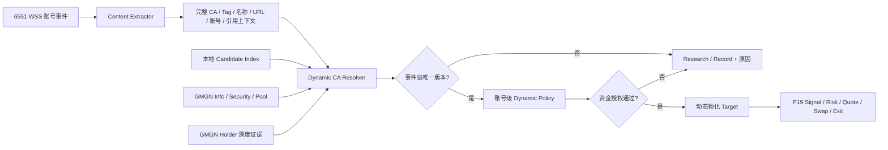

# P20 高权重账号动态关键词信号与 CA 解析方案

> 版本：v3。状态：P20.0/P20.1 只读实现已完成，P20.2 及后续阶段未实施。更新日期：2026-07-31。
>
> 本文定义技术方案、实施顺序和验收标准。当前只新增独立 Candidate Index、Asset Family/Variant、Resolver、Intent Gate、GMGN 只读接口和 Migration 028；未接入 6551 实时事件、现有 Matcher、Live Policy、Engine、资金提交或真实交易。
>
> 生产服务器版本是后续实施、测试和实盘验收的唯一基线；GitHub 用于版本备份，本地工作区仅用于开发、测试和备份。实施前必须重新核对三者提交号并检查密钥、数据库、日志和运行数据不会进入 Git。

## 1. 最终目标

P20 包含两条相互独立但共享研究数据的线路：

1. **账号清洗与历史回测工具**：批量输入 X 账号，分析哪些账号适合发帖自动交易，统计直接意图率、CA 解析成功率、误报率、历史收益和可执行胜率。
2. **动态关键词交易线路**：清洗后合格的高权重账号发帖后，识别完整 CA、Cashtag、Hashtag 或项目名，动态寻找与当次事件匹配的正确 `chain + CA`，再继承账号级资金和离场模板进入现有交易链路。

目标链路如下：

```text
合格 KOL 发帖
  -> 提取完整 CA / $TOKEN / #TOKEN / 项目名 / URL / 被引用账号
  -> 确定性逐帖 Intent Gate 判断是否为当前买入意图
  -> Dynamic CA Resolver 构建候选集合
  -> GMGN 快速核验身份、平台、池子和可交易性
  -> 事件级消歧
  -> 账号级 Dynamic Policy 最终授权
  -> 动态物化交易标的
  -> 复用 P19 Signal / 风控 / Quote / Swap / 离场链路
```

### 1.1 明确结论

- Token **不需要预先存在于白名单**。
- 不为每个 `Actor + Token` 提前固定 CA。
- Grok 不进入实时 CA 解析和资金热路径。
- 关键词匹配发生在 XBOT 本地，不为每个关键词创建 6551 Watch。
- 同一个 Symbol 可能对应多个假币，也可能对应原盘、迁移盘、社区重启盘等多个真实版本。
- “正确 CA”是**相对于当次帖子上下文的正确版本**，不一定存在全局唯一答案。
- 只有事件上下文将候选收敛为一个可交易版本时才允许继续；`0` 个或多个未消歧候选都必须失败关闭。
- 当前公开 GMGN 数据源不能覆盖任意未知 Symbol；候选缺失只能进入 Research/Record，不能猜测 CA。
- 账号历史清洗只决定该 Actor 是否值得配置，不能代替每条实时帖子的买入意图判断。
- 动态物化记录只是交易系统的数据载体，不构成资金授权；最终授权必须来自账号级 Dynamic Policy。

## 2. 本轮 GMGN 实测证据

测试时间：2026-07-31。Host 为 GMGN 官方 `https://openapi.gmgn.ai`。所有请求均为只读请求，未调用 `/trade/*`，未创建订单，未修改白名单或 Engine。

### 2.1 接口权重与实测延迟

| 能力 | 接口 | 官方权重 | 本轮典型延迟 | 用途 |
|---|---|---:|---:|---|
| Token 身份 | `GET /v1/token/info` | 1 | 约 200–600ms | Symbol、名称、X、平台、池子、创建时间、标签统计 |
| Token 安全 | `GET /v1/token/security` | 1 | 约 197–345ms | Honeypot、税、可卖性、权限和安全标志 |
| Pool | `GET /v1/token/pool_info` | 1 | 约 205–224ms | 主池与流动性复核 |
| KOL Holder | `GET /v1/market/token_top_holders` | 5 | 约 246–598ms | 区分主动买入、转入、已清仓和异常钱包 |
| Smart Money Holder | 同上，`tag=smart_degen` | 5 | 约 251–351ms | 辅助判断真实市场参与 |
| Trending | `GET /v1/market/rank` | 1 | 约 239–597ms | 构建活跃 Token 候选缓存 |
| Hot Search | `POST /v1/market/hot_searches` | 3 | 约 310ms | 扩大跨链热搜候选缓存 |
| Trenches | `POST /v1/trenches` | 3 | 约 724ms | 发现新创建、接近迁移和已迁移 Token |

本轮没有出现 429。现有 `gmgn-rate-scheduler.js` 尚未登记 Rank、Hot Search、Trenches 和 Top Holders 的正式权重，未登记接口会回退为权重 5；实施时必须补齐，不能依赖调用者手工覆盖。

### 2.2 已知 CA 核验

| Token | Chain | CA | GMGN 结果 |
|---|---|---|---|
| PONS | Robinhood | `0x39dbed3a2bd333467115de45665cc57f813c4571` | 命中 `@ponsdotfamily`、Uniswap V3、约 133 万美元流动性 |
| INDEX | Robinhood | `0x56910d4409f3a0c78c64dd8d0545ff0705389870` | 命中 `@TheIndexFi`、Uniswap V4、约 39 万美元流动性 |
| USELESS | Solana | `Dz9mQ9NzkBcCsuGPFJ3r1bS4wgqKMHBPiVuniW8Mbonk` | Token Info、Security、Pool 可正常读取 |
| LIT | Ethereum | `0x232ce3bd40fcd6f80f3d55a522d03f25df784ee2` | Token Info、Security、Pool 可正常读取 |

`token/info` 对 Robinhood 也能返回 `wallet_tags_stat`，但字段缺失时必须保存为 `unknown`，不能将未知伪装成 `0`。

### 2.3 榜单覆盖率与重名风险

本轮组合以下数据：

- 五条链各取 24h Rank 前 100，共 500 个唯一 CA；
- Hot Search 返回 483 个唯一 CA；
- 合并去重后得到 691 个 CA、605 个标准化 Symbol；
- 其中 60 个 Symbol 存在重名候选，最大单 Symbol 有 6 个候选。

已知样本覆盖：

| Token | Rank | Hot Search | 合并结果 |
|---|---:|---:|---:|
| PONS | 命中 | 命中 | 1 个同名候选 |
| INDEX | 命中 | 命中 | 1 个同名候选 |
| USELESS | 未命中 | 未命中 | 无候选 |
| LIT | 未命中 | 未命中 | 无候选 |

因此：

- Rank + Hot Search 可以形成快速热缓存，但不是任意 Symbol 搜索服务；
- 当前 GMGN OpenAPI/官方 CLI 文档没有提供“输入任意 Symbol 返回全部 CA”的公开接口；
- 仅依赖热门榜会漏掉已存在但当前不在榜单的 Token；
- 候选库必须同时吸收 Trenches、历史研究记录、帖子中的完整 CA/平台链接、既有 Token 记录和后续新增的数据源。

### 2.4 Trenches 新盘发现能力

BSC 单次 Trenches 返回：

| 分类 | 数量 | 本轮时间覆盖 | Flap 数量 |
|---|---:|---:|---:|
| `new_creation` | 80 | 最近约 5–127 秒 | 79 |
| `pump` | 80 | 最近约 91 秒–23.8 小时 | 72 |
| `completed` | 80 | 最近约 21 分钟–19.3 天 | 67 |

结论：Trenches 适合做新盘增量发现，尤其适合在关键词事件后开启短时事件驱动轮询；但它仍然是有限窗口和有限条数的榜单，不能保证覆盖所有 Token。

### 2.5 “币有”双真实版本案例

同一名称当前至少存在两个真实版本：

| 版本 | CA | GMGN 平台 | 创建时间特征 | 当前语义 |
|---|---|---|---|---|
| 原盘 | `0xd0bc8ab397851ecfa58009d03bbc1a41fc764444` | `fourmeme` | 源 X 帖子后约 107 秒创建 | 原始 Four.meme 版本 |
| 社区重启盘 | `0xe9337dde3dd9e97f1f45a56412767ce5098e7777` | `flap` | 后续因 Flap 热度重新启动 | 当前社区重启版本 |

两个版本都已迁移到 PancakeSwap，都不是简单意义上的假币。重启盘 metadata 引用了原盘 BscScan 地址，这应被解释为**版本关系证据**，不能作为硬拒绝条件。

运行时判断：

| 帖子上下文 | 结果 |
|---|---|
| 只有“币有”或 `$币有` | 两个真实版本均合理，`ambiguous_variant`，不自动交易 |
| 含 Flap、重启、新盘、对应平台 URL | 选择 Flap 重启盘 `0xe933...7777` |
| 含 Four.meme、原盘或完整原 CA | 选择原盘 `0xd0bc...4444` |
| 含完整新 CA | 精确选择新盘 |

该案例证明 P20 必须保存“资产家族”和“具体版本”，不能把所有同名候选压缩成一个 Token，也不能按最高流动性、最高 KOL 数或最早创建时间机械选取。

## 3. 核心数据模型

### 3.1 四个不同概念

1. **Observed Term**：帖子中观察到的 `$PONS`、`#PONS`、`币有`、项目名或完整 CA。
2. **Asset Family**：同一叙事或项目族，例如“币有”。
3. **Asset Variant**：原盘、跨链版本、迁移盘、社区重启盘等具体 `chain + CA`。
4. **Resolution Candidate**：本次事件中可能对应的 Asset Variant，包含事件证据、市场证据和风险证据。

### 3.2 唯一候选的准确含义

“唯一候选”不是白名单，也不是数据库中只有一个同名 Token，而是：

```text
本次帖子上下文
  + 账号允许链
  + 平台/URL/项目账号/完整 CA 证据
  + GMGN 身份与可交易性核验
  -> 最终只剩一个满足授权门槛的 Asset Variant
```

如果两个真实版本都满足条件但帖子没有说明版本，结果必须是 `ambiguous_variant`，不得按市场热度猜测。

## 4. 总体架构



### 4.1 与现有线路的边界

- P16“项目账号直接发布完整 CA”继续只匹配完整 CA，不改成 Symbol。
- P16“生态账号与项目账号互动”继续使用已配置关系，不与关键词动态解析混存。
- P20 新增独立的动态关键词证据 `matched_dynamic_resolution_id`。
- 现有 `matched_relation_ids` 和 `matched_source_rule_ids` 保持原语义。
- 新线路必须穿透 Signal、Live Policy、最终资金提交前授权和 UI 解释，不能只在 Matcher 内匹配成功。

## 5. 内容提取标准

按以下顺序提取，结果可以同时存在：

1. 完整 EVM/Solana CA；
2. Launchpad、DEX、GMGN、区块浏览器 URL 中的 CA；
3. `$TOKEN`；
4. `#TOKEN`；
5. 用户批准的完整中文项目短语；
6. 明确项目 `@handle`、被引用账号和 Reply 目标；
7. Tweet、Quote、Reply 的原始事件类型和引用链。

### 5.1 匹配规则

- 英文 Cashtag/Hashtag 不区分大小写：`$ANSEM` 与 `$ansem` 等价。
- `$ANSEM` 不得命中 `$ANSEMX`。
- `$PONS` 与 `#PONS` 是两个显式 Tag 入口，均可产生 `PONS` observed term。
- 裸英文词默认不进入实盘，避免 `LIT`、`INDEX`、`CASH` 等普通词误报。
- 中文项目名没有 `$`/`#` 时，只允许完整短语或已批准别名，不做模糊分词、拼音或语义猜测。
- Retweet 必须在本地检查顶层 `retweetedStatus/isRetweet`，不能只相信 Provider 的 `includeRetweets=false`。
- Quote 与 Reply 必须保存作者正文和引用正文的边界，不能把被引用者的 CA 错归给当前 Actor。

### 5.2 确定性逐帖 Intent Gate

CA 解析正确不等于交易方向正确。每条事件必须先通过本地、可版本化、可回放的 `Intent Gate`；Grok 不参与该热路径。Gate 输出固定枚举和原因码，而不是自由文本分数：

```text
buy_direct
launch_direct
full_ca_solo
neutral_reference
comparison_or_list
historical_review
sell_or_exit
negative_or_warning
security_incident
quoted_only
multi_asset_ambiguous
unknown
```

初始 Live 只允许 `buy_direct`、`launch_direct`，以及“Actor 原文仅包含一个完整 CA/平台 URL 且没有任何拒绝语义”的 `full_ca_solo`。其余状态全部降级为 Research/Record；Paper 可以采集但必须保留原状态。

判定顺序必须固定：

1. 只在 Actor 自己撰写的正文中确定动作和主资产；引用正文、Reply 上文只提供候选证据，不能自动继承买入意图。
2. 先执行安全事件、否定、警告、清仓/卖出、历史回顾和比较语境硬拒绝，再识别买入、建仓、看多、发布、上线等显式正向动作。
3. 初始 Live 一条帖子只允许一个主资产；出现多个不同资产词条时一律 `multi_asset_ambiguous`，不按词频或市值选一个。
4. Retweet 初始 Live 禁止；Quote/Reply 只有 Actor 自己的新增正文同时包含允许的正向动作和主资产时才可继续。
5. 否定作用域必须覆盖 `not/no/never/don't/avoid/scam/hack/sold/exit` 及经人工审核的中文等价词；命中拒绝词后不得被普通正向词抵消。
6. 纯 Cashtag、纯 Hashtag、裸项目名不能自动等同买入；可在 Record/Paper 统计后，按 Actor 单独批准例外。完整 CA 单独成帖是唯一初始例外，但仍需通过账号安全状态、可交易性和资金门。
7. 规则词典、事件类型和 Actor 例外都必须有 revision；修改后使相关 Live Approval 失效。

必须保存 `intent_class`、`intent_reason_codes[]`、`intent_rule_revision`、`author_owned_terms[]`、`quoted_terms[]` 和拒绝命中的文本位置，供回放和最终下单前复核。

## 6. Candidate Index

### 6.1 候选来源优先级

| 优先级 | 来源 | 说明 |
|---:|---|---|
| 1 | 当前帖子完整 CA 或 URL 中 CA | 最强、最快入口 |
| 2 | 当前引用链中的项目账号/平台链接/项目帖 CA | 强事件上下文 |
| 3 | 本地已研究 Token、历史动态 Target、现有白名单 Token | 只复用数据，不要求预先授权 |
| 4 | GMGN Trenches | 新创建、接近迁移、已迁移 Token |
| 5 | GMGN Rank / Hot Search / Token Signal | 活跃和热门 Token |
| 6 | 异步 Grok 研究结果 | 只补充项目身份和别名，不实时决定 CA |

### 6.2 索引结构

至少维护：

```text
normalized_symbol -> candidate variant ids[]
normalized_name   -> candidate variant ids[]
x_handle          -> candidate variant ids[]
source_post_id    -> candidate variant ids[]
launchpad         -> candidate variant ids[]
chain + ca        -> full token snapshot
asset_family_id   -> variant ids[]
```

每条索引记录必须保存来源、抓取时间、过期时间和字段可用性。`unknown`、`0` 和 `false` 必须严格区分。

### 6.3 刷新策略

- Rank：各允许链错峰刷新，建议 30–60 秒一次。
- Hot Search：30–60 秒一次，多链单请求。
- Trenches 后台：各活跃链错峰 10 秒一次。
- 事件驱动 Trenches：当合格 Actor 提到未知 Tag 且无候选时，只对该 Actor 允许链开启 2 秒一次、最长 30 秒的短时轮询。
- GMGN Token Info：活跃候选短 TTL，冷候选长 TTL；具体 TTL 由实现压测确定。
- Token Signal：只在 GMGN 支持的 Solana/BSC 上作为补充，不作为跨链统一入口。

所有刷新任务的优先级必须低于 Quote、Swap、订单查询和关键 Reconciliation；实时交易必须保留现有调度器的交易权重储备。

## 7. Dynamic CA Resolver

### 7.1 固定执行顺序

```text
Step 1  解析 Actor、事件类型、正文、引用链、URL、CA、Tag、名称
Step 2  执行逐帖 Intent Gate；非明确当前买入意图停止交易解析并记录原因
Step 3  读取 Actor Dynamic Policy 和允许链；未授权立即停止
Step 4  从本地 Candidate Index 取候选
Step 5  候选为空且属于新盘语义时，开启受限的事件驱动 Trenches 窗口
Step 6  对候选执行 GMGN Token Info 快速核验
Step 7  建立 Asset Family / Variant 关系，不把重启盘自动标成假币
Step 8  用完整 CA、平台、URL、项目账号、来源帖子和时间关系做事件级消歧
Step 9  对剩余候选并行执行 Security / Pool
Step 10 只有低成本证据仍不能区分时，才调用 Top Holders 深度证据
Step 11 应用账号级资金、风险、重复买入和离场策略
Step 12 唯一且授权通过时物化动态 Target；否则保存 Research/Record 原因
```

### 7.2 强锚点

以下证据可以直接绑定具体 Variant，但仍需通过可交易性门：

- 当前 Actor 原文中的完整 CA；
- 当前 Actor 原文中的 Launchpad/DEX URL 精确包含 CA；
- 被允许的项目账号原文明确发布完整 CA；
- 引用链中有完整 CA，且规则明确允许使用引用正文；
- 帖子明确写出平台，且同一 Asset Family 只有一个候选属于该平台。

GMGN metadata 中的 X、Website 和描述由 Token 创建者控制，只能作为候选证据，不能单独成为强锚点。

### 7.3 支持证据

- `link.twitter_username` 与项目账号一致；
- `launchpad_platform` 与帖子中的 Flap/Four.meme/Pump.fun 等平台词一致；
- Token 创建时间与源叙事帖或 Launch 事件接近；
- 同一 X 帖子 ID 被多个 Variant 引用时的先后关系；
- 主池、流动性、交易量、Holder 数和 Token 年龄；
- Creator 历史、改名历史、Dev 持仓状态；
- 有效 KOL/Smart Money 主动买入；
- 版本 metadata 对旧 CA 的引用，用于建立重启/迁移关系。

市场数据只能辅助确认“这是一个真实可交易市场”，不能单独证明“这就是当前帖子所指版本”。

#### 7.3.1 多候选市场主导版本规则

2026-07-31 对 `BRODIE`、`JUGGERNAUT`、`MARSCOIN` 和 `UNI` 的真实样本回放表明，可以增加一条确定性候选排序，但它只能在强锚点和正文上下文之后运行：

```text
1. 应用允许链、可交易性和明确上下文过滤
2. 只保留 wallet_tags_stat.renowned_wallets >= 3 的候选
3. 分别按当前 market_cap 和 liquidity 降序排列
4. 只有同一个 CA 同时位列两项第一时，才得到 market_dominant_variant
5. holder_count 第一作为额外一致性证据
6. 两项冠军不同、字段 unknown 或正文与冠军冲突时，继续返回歧义
```

本轮四组样本按该规则均选择了人工核验的版本：

| 词条 | 选中版本 | 关键结果 |
|---|---|---|
| `BRODIE` | Robinhood Pons `0x45f8...60e0` | 高市值仿盘 KOL=0，被预过滤 |
| `JUGGERNAUT` | Robinhood Noxa `0xd732...3b88` | 市值、流动性、Holder 数均第一，且匹配 Noxa 正文 |
| `MARSCOIN` | BSC Flap `0xfe18...7777` | KOL=94，市值和流动性显著领先，匹配两天约 10x 的正文 |
| `UNI` | Ethereum `0x1f98...f984` | 两项显著领先，且原文完整 CA 直接确认 |

该规则的字段语义必须固定：

- `renowned_wallets` 是 GMGN 标记的 KOL 总数，用于候选身份预过滤；
- `active_kol_buyers` 是当前仍主动持仓的有效 KOL，用于交易热度和风险；
- 二者不能互换。本轮四个赢家的 `active_kol_buyers` 为 `4 / 0 / 9 / 2`，若错误地设置“有效 KOL >= 3”身份门槛，会误杀 JUGGERNAUT 和 UNI；
- 市场主导规则不能覆盖完整 CA、明确平台、项目账号或账号安全状态；`$PUMP` 当前热榜单候选与正文语义冲突，仍必须拒绝；
- 市值和流动性的最小领先倍数必须通过更大样本校准，未达到领先要求时继续 `DYNAMIC_CA_AMBIGUOUS_VARIANT`。

### 7.4 硬拒绝条件

- Chain 不在 Actor Dynamic Policy 允许范围；
- GMGN 返回地址与请求 CA 不一致；
- Honeypot、不可卖、黑名单或超过策略允许税率；
- 无有效主池、流动性低于账号模板下限；
- Provider 关键字段为 `unknown`，但当前策略要求该字段必须已知；
- Token metadata 出现可疑指令或提示注入内容；
- 候选版本超过单次解析数量上限；
- 最终仍有多个合法 Variant，且既没有足够事件锚点，也不满足市场主导版本条件；
- 解析超时、GMGN 429/5xx、缓存过期且无法刷新。

### 7.5 歧义状态

标准错误码：

```text
DYNAMIC_CA_NOT_FOUND
DYNAMIC_CA_WAITING_FOR_LAUNCH
DYNAMIC_CA_MULTIPLE_CANDIDATES
DYNAMIC_CA_AMBIGUOUS_VARIANT
DYNAMIC_CA_CONTEXT_MISMATCH
DYNAMIC_CA_PROVIDER_UNKNOWN
DYNAMIC_CA_PROVIDER_TIMEOUT
DYNAMIC_CA_UNTRADABLE
DYNAMIC_CA_POLICY_BLOCKED
```

所有失败都必须保留候选列表、每个候选的通过/拒绝原因和数据快照；前端不能只显示“失败”。

## 8. 有效 KOL 与 Smart Money 证据

`wallet_tags_stat.renowned_wallets` 和 `smart_wallets` 是标签地址数量，不是有效买家数量，不能直接设置“>= 3 就是真币”。

### 8.1 有效主动买家建议口径

一个地址至少满足：

- `buy_tx_count_cur > 0`；
- `buy_volume_cur > 0`；
- 当前 `balance/amount_cur > 0`；
- `sell_amount_percentage < 1`；
- 不是纯 `transfer_in`；
- `is_suspicious != true`。

再分别统计：

- `active_buyer_count`：满足上述基本条件；
- `net_buyer_count`：同时仍为净买入或净持仓；
- `transfer_only_count`：只有转入，没有主动买入；
- `fully_exited_count`：已全部卖出；
- `bundler/wash_trader/rat_trader` 标签分布。

### 8.2 平台相关解释

Bundler、Wash Trader、Top10 和 Creator 持仓都不能设为跨链统一身份硬门槛：

- Flap、Four.meme 等平台的启动机制会显著影响 Bundler 标签；
- 创始人、团队、交易所、LP、Burn、Bridge、Vesting 地址会扭曲 Top10；
- 同一个项目的原盘和重启盘可能呈现完全不同的钱包结构。

这些字段进入平台相关风险评分和仓位限制，不决定 Variant 身份。初始的 `有效 KOL >= 3` 或 `有效 KOL >= 2 且有效 Smart Money >= 1` 只能作为待回测参数，不能直接硬编码为实盘标准。

## 9. 账号级 Dynamic Policy

每个可执行账号只创建一个 6551 Watch，并配置一份独立的 Dynamic Policy：

```text
enabled
rollout_mode: research / record / paper / live
allowed_event_types
allowed_chains
allowed_launchpads
allowed_term_modes: cashtag / hashtag / approved_phrase / full_ca
buy_amount_usd
max_new_tokens_per_day
max_daily_dynamic_notional_usd
max_single_token_notional_usd
max_candidates_per_resolution
launch_wait_window_seconds
minimum_liquidity_usd_by_chain
maximum_price_impact_pct
maximum_buy_tax / maximum_sell_tax
minimum_resolution_confidence
minimum_score_margin
ambiguous_action: research_only
existing_position_policy
repeat_buy_policy / cooldown
exit_strategy_template_id
```

只有用户显式批准为 `live` 的账号级策略才能为未知 Token 提供资金授权。Actor Profile、Grok 画像、历史胜率和自动创建的 Target 均不能替代该授权。

## 10. 动态 Target 物化

现有交易链路依赖 `whitelist_id`。P20 不要求用户提前创建白名单，但可以在解析成功后由系统物化一条兼容记录：

```text
source = dynamic_keyword
managed_by_system = true
actor_policy_id
resolution_attempt_id
asset_family_id
asset_variant_id
chain
contract_address
token_snapshot
trade_template_snapshot
expires_at
```

要求：

- 唯一键至少覆盖 `actor_policy_id + chain + contract_address`；
- 并发解析只能物化一次；
- 物化和 Signal 创建必须在同一事务或可靠 Outbox 内完成；
- `dynamic_targets` 是动态授权上下文的主记录，`ca_whitelist` 只是一对一兼容载体；两者必须互相保存外键，不能只靠 JSON 关联；
- Migration 必须显式扩展当前 `ca_whitelist.source` 约束以允许 `dynamic_keyword`，并增加 `managed_by_system`、`dynamic_target_id`、`actor_policy_id` 和 `actor_policy_revision`；
- 当前 `uq_whitelist_ca_chain_active` 会阻止不同 Actor 对同一 CA 物化，不能直接沿用。新约束必须分别保证“手工活跃记录按 `chain + CA` 唯一”和“动态活跃记录按 `actor_policy + chain + CA` 唯一”，且不能破坏已有手工记录；
- 同一钱包、同一 `chain + CA` 的 Active Intent 和已开仓检查必须跨 `whitelist_id` 执行。不同 Actor 命中同一 Token 时默认合并/拒绝重复买入，只有显式重复买入策略才可追加；
- 资金、重复买入、每日总额和离场模板以不可变的 `trade_template_snapshot + actor_policy_revision` 为准，不能让后来修改的兼容白名单行重写历史 Signal；
- 动态兼容行不得要求新建 6551 Watch 或 P16 Relation。P17 Activation、Readiness 和 Live Approval 必须增加 Dynamic Policy 分支，不能因没有 Relation 被永久卡在 `syncing`；
- 自动物化记录不能出现在普通手工白名单中造成误解，应显示为“动态关键词标的”；
- 记录过期不等于自动卖出，持仓仍由已绑定离场策略管理；
- 删除或暂停 Actor Policy 必须阻止新的动态买入，但不能破坏已有仓位对账和离场。

## 11. 数据库设计

建议新增独立 Migration，编号在实施前按生产 schema 重新确认：

### 11.1 核心表

- `x_actor_dynamic_policies`：账号级动态授权与资金模板；
- `dynamic_asset_families`：项目/叙事家族；
- `dynamic_asset_variants`：具体 `chain + CA + launchpad` 版本；
- `dynamic_asset_variant_relations`：original、relaunch、migration、cross_chain、cto、unknown；
- `dynamic_ca_resolution_attempts`：每次事件的候选、证据、结果、延迟和失败原因；
- `dynamic_ca_resolution_candidates`：逐候选评分、字段可用性和拒绝原因；
- `dynamic_targets`：系统物化的兼容交易标的；
- `x_actor_screening_runs`：账号清洗批次；
- `x_actor_screening_results`：账号统计、回测和建议等级。

### 11.2 Signal 证据

Signal 至少新增：

```text
matched_dynamic_resolution_id
dynamic_target_id
observed_terms
intent_class
intent_reason_codes
intent_rule_revision
resolved_asset_family_id
resolved_asset_variant_id
resolution_confidence
resolution_reason_codes
provider_snapshot_at
actor_policy_revision
trade_template_snapshot
```

最终资金提交前必须重新检查：

- Actor Policy 仍为 Live；
- Revision 未变化；
- Intent Gate 仍为允许的 Live 状态且规则 Revision 未变化；
- 解析结果仍是同一 `chain + CA`；
- Dynamic Target 未过期；
- 重复买入、持仓、预算和 Engine 门仍通过。

## 12. 后端模块

建议新增：

```text
backend/domains/dynamic-signal/content-extractor.js
backend/domains/dynamic-signal/intent-gate.js
backend/domains/dynamic-signal/candidate-index.js
backend/domains/dynamic-signal/gmgn-market-source.js
backend/domains/dynamic-signal/asset-family-service.js
backend/domains/dynamic-signal/ca-resolver.js
backend/domains/dynamic-signal/resolution-policy.js
backend/domains/dynamic-signal/dynamic-target-service.js
backend/domains/dynamic-signal/routes.js
backend/jobs/gmgn-candidate-cache-warmup.js
backend/jobs/dynamic-launch-window.js
backend/domains/actor-screening/*
```

现有模块需要接入：

- `gmgn-http.js`：增加正式只读方法和正确 endpoint weight；
- `gmgn-rate-scheduler.js`：登记 Rank、Hot Search、Trenches 和 Top Holders 的真实权重，禁止未知接口回退为错误权重；
- `gmgn-adapter.js`：规范化 Link、Launchpad、Dev、Stat、Wallet Tag、Holder 行为字段；
- `signal/matcher.js`：停止继续扩展旧隐式 `ticker_mention`；
- `signal/queries.js`：持久化动态解析证据；
- `signal/live-policy.js`：加入 Actor Dynamic Policy；
- `trade-repository.js`：提交前复核动态授权；
- `system/routes.js`：展示第三类实盘授权证据；
- Provider usage、日志和监控：记录 GMGN 权重、缓存命中率和各阶段延迟。

## 13. 延迟与 GMGN 成本设计

### 13.1 热路径分层

| 路径 | 运行方式 | 目标 |
|---|---|---|
| 完整 CA | 直接并行 Info + Security + Pool | 解析阶段目标 `< 800ms`，以生产 p95 验收 |
| Symbol/Name + 缓存唯一候选 | Info 复核后进入 Security/Pool | 解析阶段目标 `< 900ms` |
| 多候选但有平台/URL强锚点 | 只深查被锚定候选 | 避免对所有同名 Token 调 Holder |
| 未知新盘 | 事件驱动 Trenches 短轮询 | 允许等待新盘出现，不伪造候选 |
| 多个合法版本且无锚点 | 立即失败关闭 | 不为了成交延长热路径或调用 Grok |

上述目标只覆盖 CA 解析，不等于最终链上成交时间。完整交易还包括 6551 推送、Signal、风控、Quote、Swap 提交和链上确认，必须继续使用 P19 Execution Trace 分段统计。

### 13.2 重接口使用原则

- Info/Security/Pool 每次权重 1，可并行但必须经过统一 Scheduler；
- Top Holders 每次权重 5，KOL + Smart Money 共 10，只在低成本证据不足时使用；
- 同一 CA 的 Holder 结果必须缓存，不能为同一 Tweet 重复扣权重；
- 候选超过上限时直接 `DYNAMIC_CA_MULTIPLE_CANDIDATES`，不批量深查；
- 缓存刷新任务不得挤占 Quote、Swap 和关键订单对账；
- 429 后遵守 `reset_at/X-RateLimit-Reset`，不得持续重试延长封禁。

## 14. Grok 与 6551 边界

### 14.1 6551

- 复用现有账号 Watch；
- 关键词在本地匹配，不上传到 6551；
- 同一 KOL 只创建一个 Watch；
- 需要的事件权限通过 Watch Reconciler 管理；
- 6551 不负责从 Symbol 寻找 CA。

### 14.2 Grok

允许：

- 账号清洗和内容风格分析；
- 历史 Tweet 意图分类；
- 异步识别项目账号、创始人、平台和版本关系；
- 为 Candidate Index 生成待核验别名；
- 对失败解析生成研究说明。

禁止：

- 对每条实时 Tweet 调用 Grok 后才交易；
- 让 Grok 在多个 CA 中直接选择一个并授权资金；
- Grok 超时后降级为猜测 CA；
- 将 Grok 的自然语言结论直接写成 Live Policy。

## 15. 账号清洗与回测工具

### 15.1 输入

- 一次输入一个或多个 X Handle；
- 可选择 Tweet 时间范围和最多样本数；
- 可选择允许链和最低历史市值/流动性范围；
- 默认只研究，不创建 Watch、不启用交易。

### 15.2 固定分析顺序

```text
获取账号与近期 Tweet
  -> 本地剔除 Retweet、广告、诈骗和无资产内容
  -> 提取 CA / Cashtag / Hashtag / 项目名
  -> 按历史时点重建 Candidate Index
  -> 用当时可见证据解析 CA，禁止使用未来信息
  -> GMGN Kline 计算 P19 延迟后的可成交价格
  -> 模拟重复买入、滑点、Gas、Price Impact 和离场模板
  -> 输出逐笔证据与聚合统计
```

### 15.3 输出指标

- 原创 Tweet 数、资产相关 Tweet 数、直接意图率；
- 完整 CA、Cashtag、Hashtag、中文短语各自命中率；
- CA 唯一解析率、歧义率、Provider 缺失率；
- 假币/错误版本误选率，目标必须为 0；
- 5m、15m、1h、6h、24h 收益；
- 按真实离场模板计算的净收益、胜率、最大回撤；
- 同一 Token 重复喊单后的边际收益；
- 推荐等级：不适合、Research、Record、Paper、Live Candidate。

Live Candidate 仍需用户显式批准，工具不能自动把账号升级为 Live。

## 16. API 与前端

### 16.1 API

```text
POST /api/dynamic-signals/resolve-preview
GET  /api/dynamic-signals/resolutions
GET  /api/dynamic-signals/resolutions/:id
GET  /api/dynamic-signals/candidate-index/status
GET  /api/dynamic-signals/asset-families/:id
POST /api/actor-screening/runs
GET  /api/actor-screening/runs/:id
PUT  /api/kol/:id/dynamic-policy
POST /api/kol/:id/dynamic-policy/approve-live
POST /api/kol/:id/dynamic-policy/pause
```

### 16.2 前端分区

KOL 页面新增两个明确分区：

1. **账号清洗**：批量输入、运行进度、逐账号统计、误报样本、收益回测和建议等级。
2. **动态喊单策略**：允许链、允许平台、关键词类型、资金、风险、离场、歧义处理和当前授权状态。

Signal 页面显示：

- 原始 observed term；
- 候选数量和被拒绝原因；
- 最终 Asset Family / Variant / Launchpad；
- 原盘、重启盘、迁移盘关系；
- GMGN 快照时间与字段缺失；
- 资金授权来自哪个 Actor Policy Revision；
- 未交易时显示明确错误码。

用户不得在前端看到“GMGN 认为这是唯一正确 CA”这种误导文案。应显示“基于本次帖子上下文解析为该版本”。

## 17. 测试矩阵

### 17.1 必备 Fixture

- PONS：Rank/Hot 唯一候选；
- INDEX：大小写标准化后唯一候选；
- USELESS：Rank/Hot 缺失但直接 CA 可核验；
- LIT：普通英文词禁止裸词实盘；
- 币有原盘：Four.meme + 原 CA；
- 币有社区重启盘：Flap + 新 CA；
- 币有纯关键词：两个真实版本，必须 `ambiguous_variant`；
- metadata 引用旧 CA：建立版本关系，不能自动判假；
- 假 Token 复制名称/X/网站：没有事件强锚点时不得胜出；
- Provider 字段缺失：保存 `unknown`，不得当作 0；
- Holder 纯转入：不得计为有效主动买家；
- Bundler 较高的 Flap Token：进入平台相关风险，不得自动判假。
- “I sold $TOKEN”“avoid $TOKEN”“account hacked, CA ...”：Intent Gate 必须硬拒绝；
- “$A vs $B”“top tokens: $A $B $C”：必须 `multi_asset_ambiguous`；
- Actor 只 Quote 别人的 `$TOKEN`、自己未表达动作：必须 `quoted_only`；
- Actor 原文只有一个完整 CA，且无拒绝语义：可得到 `full_ca_solo`，随后仍执行所有 CA 与资金门；

### 17.2 并发与资金安全

- 同一 Tweet 重复推送只产生一个 Resolution 和一个 Signal；
- 同一 Actor + CA 并发物化只创建一个 Dynamic Target；
- Policy 在解析后、下单前被暂停时必须阻止买入；
- Engine 停止、预算不足、已有持仓、Pending Attempt 均继续生效；
- 解析超时或 GMGN 429 不得降级为旧 Symbol 猜测；
- Research/Paper 绝不调用真实 Swap；
- Migration 和部署脚本不得自动 Arm。

### 17.3 性能

- 记录 `x_event_received -> content_extracted -> candidates_loaded -> gmgn_verified -> variant_resolved -> policy_authorized -> quote_started -> swap_submitted -> chain_confirmed`；
- 分别统计缓存命中、直接 CA、唯一 Symbol、新盘等待和歧义路径的 p50/p95/p99；
- GMGN Cache Warmup 压测不得使交易请求排队或触发 429；
- 页面读取不得同步等待 GMGN、6551 或 Grok。

## 18. 分阶段实施

### P20.0 基线冻结

- 备份当前生产提交到 GitHub；
- 扫描 API Key、私钥、`.env`、日志和数据库文件；
- 导出生产 schema 与 Migration 状态；
- 确认生产交易正常后再进入开发。

### P20.1 只读 Candidate Index 与 Resolver

- 增加 GMGN 只读方法、Adapter 和正确权重；
- 建 Candidate Index、Asset Family/Variant 和 Resolution 表；
- 所有 Feature Flag 关闭；
- 用本文 Fixture 做离线测试。
- 不修改 Engine、现有 P16/P19 Matcher、Live Policy 或最终资金提交路径，不创建 Dynamic Target。

### P20.2 Research / Record

- 接入 6551 WSS 事件；
- 动态解析但不进入交易队列；
- 上线 Intent Gate 并统计逐类误判；
- 上线账号清洗工具；
- 收集真实歧义、漏检和 Provider 成本。

### P20.3 Paper

- 账号级 Policy 只允许 Paper；
- 完成动态 `whitelist_id` 兼容载体、跨白名单持仓去重和第三类授权证据，但真实 Swap Feature Flag 仍保持关闭；
- 使用真实 P19 延迟、Quote、滑点、Gas 和离场模板；
- 连续运行至少 7 天并完成逐笔人工核对。

### P20.4 单账号 Live 灰度

- 只选择一个历史样本充分的账号；
- 只开放 Cashtag/Hashtag 或完整 CA，不先开放裸中文短语；
- 单笔、每日新 Token 数和每日总额使用最低上限；
- 用户显式批准后限时运行；
- 任一错误版本、重复买入或 Provider 降级立即回滚。

### P20.5 扩大范围

- 按账号独立晋级，不按全局模板一次性开放；
- 中文短语和新盘等待在单独完成样本验证后再灰度；
- 每次扩大链、平台或关键词类型都使旧 Live Approval 失效并重新批准。

## 19. 验收标准

### 19.1 功能

- 未预存白名单的 Tag 可以进入动态解析；
- 完整 CA 可走最快精确路径；
- Rank/Hot 缺失时不会伪造“无此 Token”；
- 原盘和社区重启盘可以同时存在于一个 Asset Family；
- 币有纯关键词不会自动选原盘或重启盘；
- Flap/Four.meme 上下文能选择对应版本；
- 每个失败都有用户可读原因和逐候选证据。
- 比较、历史、卖出、否定、安全事件和多资产正文即使解析到正确 CA 也不能进入 Live。

### 19.2 安全

- 多候选未消歧、Provider 未知、超时和 429 均失败关闭；
- Grok 不能提供实时资金授权；
- 自动物化 Target 不能绕过 Actor Dynamic Policy；
- 最终提交前再次核验 Policy Revision、预算、持仓和 Engine；
- 最终提交前再次核验 Intent Revision、Dynamic Resolution、Dynamic Target 和 `chain + CA` 一致性；
- 旧 P16 直接 CA 与生态互动线路语义不变；
- 不上传任何 API Key、私钥、`.env` 或生产数据。

### 19.3 性能与稳定性

- 缓存命中的 CA 解析不显著增加 P19 现有链路延迟；
- 重接口不挤占交易权重；
- 热更新 Policy 不要求停止其他账号的自动交易；
- 页面读取不依赖第三方实时返回；
- 所有新 Worker 有 Lease、Heartbeat、退避、限流和健康状态。

## 20. 实施前仍需校准的参数

以下参数不能仅凭本轮少量样本直接定值：

- 各链/平台最低流动性；
- Event 与新 Token 创建时间窗口；
- Resolution Confidence 和候选分差；
- 有效 KOL/Smart Money 的最低数量；
- Bundler、Wash Trader、Insider 的平台相关阈值；
- Trenches 后台轮询和事件驱动轮询频率；
- 各类关键词从 Record/Paper 晋级 Live 的最小样本量；
- 账号级单笔金额、每日新 Token 数和累计预算。

这些值必须通过账号清洗工具和至少 7 天 Paper 数据校准。任何阈值调整都要版本化，并使受影响的 Live Approval 失效。

另外，当前公开 GMGN Rank/Hot/Trenches 只是有限候选源，不具备任意 Symbol 全量搜索能力。P20.1 必须把 Provider 抽象和 `candidate_coverage` 指标做好；在新增可靠搜索源或长期索引前，漏检属于可接受的失败关闭，错误猜测 CA 不可接受。

## 21. 审核结论

P20 v3 的核心不是“为关键词提前绑定一个 CA”，而是：

```text
先清洗账号
  -> 对每次帖子提取确定性线索
  -> 逐帖确认这是当前、单一资产的买入意图
  -> 用本地候选缓存和 GMGN 快速核验建立 Asset Family / Variant
  -> 只在当次事件唯一指向一个可交易版本时继续
  -> 由账号级 Dynamic Policy 授权金额和离场策略
  -> 复用 P19 完成交易
```

GMGN 能显著加快身份、平台、池子、安全和市场参与核验，但不能单独回答所有“正确 CA”问题。尤其在原盘与社区重启盘同时真实存在时，正确答案必须来自帖子上下文；上下文不足时，不交易本身就是正确结果。

最终实施结论：方案允许进入 **P20.0 基线冻结和 P20.1 只读实现**；不允许从当前版本直接跳到 Live。P20.2、P20.3 必须依次通过真实事件和至少 7 天 Paper 验收后，才可另行审核 P20.4 单账号小额 Live。
