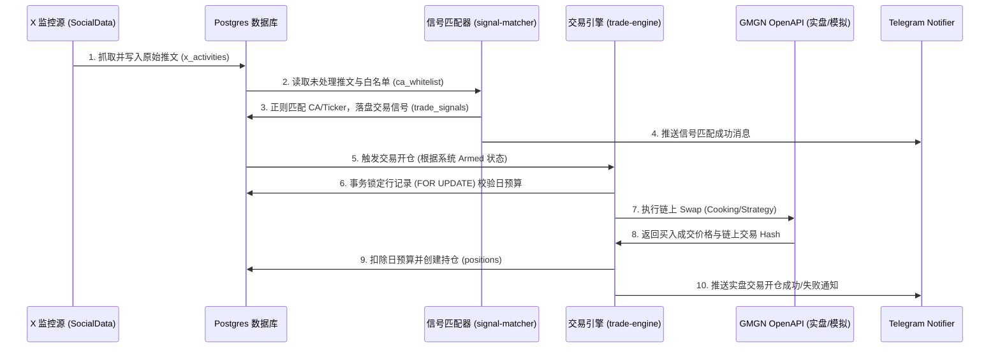

# xbot 全系统完工交接与实盘操作指南 (P4_handover_report.md)

本指南作为 xbot 系统（Phase 1 至 Phase 5 全量功能完工）的终极交接文档，旨在帮助系统管理员及后续开发者快速理解架构、配置环境并安全开启实盘运行。

---

## 1. 系统核心架构与数据流 (System Architecture)

xbot 是一个基于 **KOL 推文信号匹配** 与 **CA 自动买入白名单机制** 的多链 MEME 代币右侧自动交易系统。

### 1.1 数据流向与逻辑链条


---

## 2. 本地与服务器快速部署指南 (Setup & Installation)

### 2.1 数据库依赖部署 (PostgreSQL)
1. **创建空数据库**：
   ```sql
   CREATE DATABASE xbot;
   ```
2. **导入 DDL 与种子数据**：
   ```bash
   psql -U pm_user -d xbot -f D:\AI_Projects\xbot\backend\db\init.sql
   psql -U pm_user -d xbot -f D:\AI_Projects\xbot\backend\db\seed.sql
   ```

### 2.2 环境变量配置文件 (`backend/.env`)
请将下列模板内容保存于 `backend/.env`，并在前端 API 配置面板或本地直接填入您的密匙：

```env
BACKEND_PORT=3011
DB_HOST=localhost
DB_PORT=5432
DB_NAME=xbot
DB_USER=pm_user
DB_PASSWORD=pm123456

# 交易授权（由您填写）
GMGN_API_KEY=your_gmgn_api_key
GMGN_PRIVATE_KEY=your_wallet_private_key

# X 抓取源配置 (socialdata 或 mock)
X_DATA_PROVIDER=socialdata
SOCIALDATA_API_KEY=your_socialdata_api_key

# 消息提醒机器人（由您填写）
TG_BOT_TOKEN=your_tg_bot_token
TG_CHAT_ID=your_telegram_chat_or_group_id

# 多链接收钱包公钥（由您填写）
WALLET_SOL=your_solana_public_key
WALLET_EVM=your_evm_public_key

# 面板安全 Token
ADMIN_TOKEN=xbot_admin_2026
```

---

## 3. 运行与操作手册 (Operations Guide)

### 3.1 启动服务

**后端 Express & Cron 监控服务**：
```bash
cd D:\AI_Projects\xbot\backend
npm install
npm run dev
```
*注：启动前 `check-env.js` 会自动核对配置连通性，并自动在后台生成 `private_key.pem` 与 `public_key.pem` 数字签名密钥对。*

**前端 Vite HMR 精美管理控制台**：
```bash
cd D:\AI_Projects\xbot\frontend
npm install
npm run dev
```
*注：控制台运行于 `5173` 端口，自动代理发往 `3011` 的 API 路由。*

### 3.2 诊断与集成测试脚本 (`backend/scripts/`)
我们为您提供了一组强大的测试命令，用于在实盘运行前排查接口和连通性：

1.  **核验 SocialData 数据源拉取**：
    ```bash
    node scripts/test-socialdata.js
    ```
    *检查后台能否正确链接到 SocialData，并获取 elonmusk 的最新推文。*
2.  **核验 Telegram 预警卡片推送**：
    ```bash
    node scripts/test-tg-notifier.js
    ```
    *验证您的 TG 机器人能否即时在群组中发送包含加粗、等宽代码与区块链接的精美交易提醒。*
3.  **模拟并发冲突与事务锁**：
    ```bash
    node scripts/test-concurrency-locks.js
    ```
    *模拟一瞬间产生多笔买单，验证行锁防重入及超预算自动回滚拦截。*
4.  **手动平仓与极值落盘审计**：
    ```bash
    node scripts/test-close.js
    ```
    *测试手动平仓逻辑、订单撤销动作及历史极值曲线统计数据是否成功写入 positions 的 `sim_peaks` jsonb 字段。*
5.  **查看当前数据库活动抓取数**：
    ```bash
    node scripts/check-tweets.js
    ```

---

## 4. 实盘安全运行防线 (Risk Controls)

实盘运行前，请务必核实设置面板中的以下防线配置：
1.  **日亏损熔断** 与 **连续亏损熔断**：当实盘交易今日累计亏损额超过阈值，或连续平仓触发止损次数达标时，风控引擎将自动切换为防守熔断态，物理截断任何新开仓。
2.  **CA 冷却时间**（默认 30 分钟）：对同一个合约地址（CA）在限定时间内仅买入一次，防止推特讨论热度过高、KOL 密集转发时机器人产生刷单式重复开仓。
3.  **日预算硬限制**：每个交易链有独立的今日预算限额（在 `budget_tracking` 表中），每日凌晨 00:00 由 cron 定时清理重置。任何一笔交易开仓前都会利用 `SELECT ... FOR UPDATE` 锁行校验，杜绝超支。
