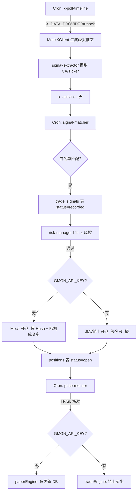

# P5 全链路审查与修复报告

> 文档编号：P5
> 创建日期：2026-07-20
> 审查范围：后端 36 文件 + 前端全部 TypeScript/CSS + 运行时日志
> 审查结果：TypeScript `tsc --noEmit` **0 错误** ✅ | 后端 Express + 6 Cron Jobs **稳定运行** ✅

---

## 一、P0 级关键缺陷修复记录

共发现并修复 **4 个 P0 级缺陷**，修改 6 个文件，已全部推送至 GitHub。

### 1.1 止盈止损平仓引擎路由错误（资金安全）

- **文件**：`backend/jobs/price-monitor.js`
- **根因**：价格监控 Job 在检测到持仓达到止盈（TP）或止损（SL）阈值时，始终调用 `paperEngine.closeSimulatedPosition()`（纸交易引擎），而非实盘引擎。
- **后果**：实盘模式下代币不会被链上卖出，资金滞留在链上。
- **修复**：按 `GMGN_API_KEY` 环境变量分流调用：
  - 有 Key → `tradeEngine.closeRealPosition()`（链上卖出）
  - 无 Key → `paperEngine.closeSimulatedPosition()`（仅更新 DB）

```diff
+const tradeEngine = require('../domains/trade/trade-engine');
 ...
 if (pnlPct >= tpThreshold) {
-  await paperEngine.closeSimulatedPosition(pos.id, currentPriceUsd, 'tp_hit', wsBroadcast);
+  if (process.env.GMGN_API_KEY) {
+    await tradeEngine.closeRealPosition(pos.id, currentPriceUsd, 'tp_hit', wsBroadcast);
+  } else {
+    await paperEngine.closeSimulatedPosition(pos.id, currentPriceUsd, 'tp_hit', wsBroadcast);
+  }
 }
```

---

### 1.2 链级风控默认值导致全部信号被拦截（功能阻断）

- **文件**：`backend/domains/signal/risk-manager.js`
- **根因**：风控引擎 L2 层检查 `chainConf.enabled === true`。当用户未通过前端配置过链级参数时，`configService.get('chain_configs')` 返回 `null`，此时 `chainConf.enabled` 为 `undefined`，不等于 `true`。
- **后果**：所有信号全部被 `CHAIN_DISABLED` 拦截，无法触发任何交易。
- **修复**：改为反向判定 `!== false`，默认允许所有链。

```diff
-riskCheck.chain_enabled = chainConf.enabled === true;
+riskCheck.chain_enabled = chainConf.enabled !== false;
```

---

### 1.3 Armed 状态重启丢失（重启后功能丢失）

- **文件**：`backend/lib/engine-state.js` + `backend/server.js` + `backend/domains/system/routes.js`
- **根因**：引擎解锁（Armed）状态仅存储在 Node.js 进程内存变量中。每次 `process.exit(0)`（配置保存触发）或 nodemon 热重启后，Armed 自动回落为 `false`。
- **后果**：用户在前端点击"解锁引擎"后，服务重启即失效，需手动再次解锁。
- **修复**：
  1. `engine-state.js` 重写为异步模块，`setArmed()` 时同步写入 DB `config` 表（key = `engine_armed`）。
  2. `server.js` 启动流程中增加 `await engineState.init()`，从 DB 恢复状态。
  3. `system/routes.js` 的 `arm/disarm` 路由改为 `async`。
  4. 若 DB 不可达则降级为内存模式。

---

### 1.4 init.sql 缺少 sim_peaks 列定义（部署阻断）

- **文件**：`backend/db/init.sql`
- **根因**：`positions` 表的 DDL 中没有 `sim_peaks JSONB` 列。虽然 `server.js` 启动时会用 `ALTER TABLE ADD COLUMN IF NOT EXISTS` 动态补列，但如果在全新环境中直接用 `init.sql` 建表后运行脚本，会报列不存在错误。
- **修复**：将 `sim_peaks jsonb DEFAULT '{}'` 直接加入 `CREATE TABLE positions` 的 DDL。

---

## 二、P1 级建议修复项（未修复，记录备忘）

| # | 问题 | 文件 | 影响 |
|---|---|---|---|
| 5 | 纸交易原生币美元价格硬编码（SOL=$150，实际约 $180） | `paper-engine.js` | 纸交易成交量估算偏差 |
| 6 | `x-poll-follows` 缺少合成唯一 tweet_id | `x-poll-follows.js` | follow 事件可能缺少去重标识 |
| 7 | `cron.json` 使用 6 段秒级表达式，需锁定 `node-cron` 大版本 | `cron.json` + `package.json` | 升级后可能静默失效 |
| 8 | `signal-matcher` 每 5 秒全表扫描 `recorded` 信号 | `signal-matcher.js` | 信号量大时 DB 压力 |
| 9 | `configService.set()` 可能双重 JSON 序列化 | `config/service.js` | 配置值变为嵌套字符串 |

---

## 三、系统降级方案与模拟设置全览

系统采用**环境变量驱动的双模式架构**。当密钥配置齐全时走真实链路，否则自动降级为模拟模式。所有降级行为均有日志告警（`[WARN]` 级别）。

### 3.1 模拟/降级判定逻辑一览表

| 模块 | 判定条件 | 模拟行为 | 真实行为 |
|---|---|---|---|
| **X 数据抓取** | `X_DATA_PROVIDER=mock` 或 `SOCIALDATA_API_KEY` 为空 | 每 30 秒生成含假 CA 的虚拟推文 | SocialData API 真实拉取 X 时间线与关注变更 |
| **代币价格查询** | `GMGN_API_KEY` 为空 | 根据 CA 哈希生成确定性波动假价格 | GMGN `getTokenInfo` 获取链上实时价格 |
| **代币安全检测** | `GMGN_API_KEY` 为空 | 固定返回安全结果（非貔貅、0 税率、98.5% 锁仓） | GMGN `getTokenSecurity` 获取真实安全属性 |
| **交易报价** | `GMGN_API_KEY` 为空 | 返回 1:1 报价 + 0.1% 价格冲击 | GMGN `quote` 获取真实 DEX 路由报价 |
| **买入开仓** | `GMGN_API_KEY` 为空 | 生成 `0xmock_real_buy_xxx` 假哈希，95%~100% 随机成交率 | Swap 路由 → 本地离线签名 → 链上广播 |
| **卖出平仓** | `GMGN_API_KEY` 为空 | 生成 `0xmock_real_sell_xxx` 假哈希 | 撤销在途 TP/SL 条件单 → Swap → 签名 → 广播 |
| **TP/SL 条件单** | `GMGN_API_KEY` 为空 | 返回 `mock_strategy_order_xxx` 假订单 ID | GMGN `submitStrategyOrder` 创建真实链上条件单 |
| **订单状态同步** | `GMGN_API_KEY` 为空 | 持仓超 60 秒后 20% 概率随机触发止盈/止损 | GMGN `queryStrategyOrder` 查询链上执行状态 |
| **价格监控 TP/SL** | `GMGN_API_KEY` 为空 | `paperEngine` 仅更新 DB 状态 | `tradeEngine` 执行链上卖出交易 |
| **Telegram 通知** | `TG_BOT_TOKEN` 或 `TG_CHAT_ID` 为空 | 仅输出控制台 `[WARN]` 日志 | Telegram API 发送 HTML 卡片通知 |
| **Armed 状态** | DB 无 `engine_armed` 记录 | 降级为内存模式（重启丢失） | DB `config` 表持久化，重启自动恢复 |
| **纸交易原生币价格** | 始终硬编码（P1 级） | SOL=$150 / BNB=$600 / ETH=$3000 | 仅影响纸交易估算，实盘不受影响 |

### 3.2 模拟模式数据流



### 3.3 进入全真实模式所需环境变量

在前端设置面板或 `backend/.env` 中配置以下变量，系统自动切换为全真实模式：

```env
# ── 交易引擎 ──
GMGN_API_KEY=<GMGN OpenAPI 授权 Key>
GMGN_PRIVATE_KEY=<Ed25519 私钥，用于 GMGN 请求签名>
WALLET_SOL=<Solana 钱包公钥地址>
WALLET_EVM=<EVM 钱包公钥地址（BSC/Base/ETH 共用）>

# ── 信号数据源 ──
X_DATA_PROVIDER=socialdata
SOCIALDATA_API_KEY=<SocialData API Key>

# ── 通知推送 ──
TG_BOT_TOKEN=<Telegram Bot Token>
TG_CHAT_ID=<Telegram Chat ID>
```

> [!IMPORTANT]
> 只要上述 Key 配齐，系统会自动切换到全真实模式，无需修改任何代码。
> 未配置的模块会自动降级为模拟模式并输出 `[WARN]` 日志。

---

## 四、修改文件清单

| 文件 | 修改类型 | 说明 |
|---|---|---|
| `backend/jobs/price-monitor.js` | MODIFY | P0-1：TP/SL 平仓引擎分流 |
| `backend/domains/signal/risk-manager.js` | MODIFY | P0-2：chain_enabled 默认值 |
| `backend/lib/engine-state.js` | REWRITE | P0-3：Armed 状态持久化到 DB |
| `backend/server.js` | MODIFY | P0-3：启动时调用 engineState.init() |
| `backend/domains/system/routes.js` | MODIFY | P0-3：arm/disarm 路由改为 async |
| `backend/db/init.sql` | MODIFY | P0-4：positions 表补 sim_peaks 列 |
