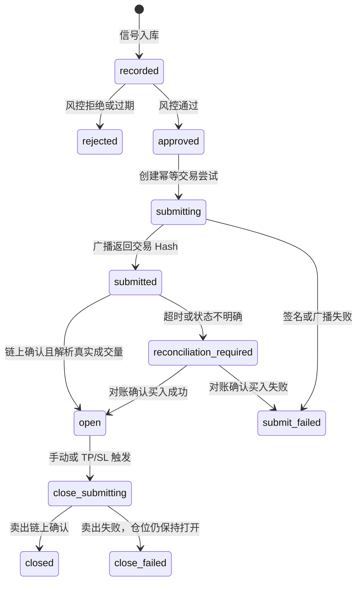
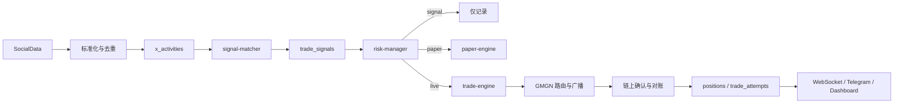

# P6 从快速原型到真实运行的更新迭代方案

> 文档编号：P6  
> 创建日期：2026-07-20  
> 最近校正：2026-07-21  
> 文档状态：长期执行基线  
> 当前执行入口：[P8_6551_max_realtime_signal_execution_plan.md](./P8_6551_max_realtime_signal_execution_plan.md)  
> 适用范围：xbot 后端、前端、PostgreSQL、X 数据 Provider、GMGN、链上钱包与部署环境  
> 目标：保留现有快速原型与已完成 API 边界，通过分阶段验证和加固，使系统能够安全、可观测、可回滚地完成真实小额交易

---

## 一、项目定位与迭代原则

当前项目是依据 PRD 快速构建的可运行原型，已经具备管理后台、数据库模型、KOL 与白名单管理、信号提取、风控框架、定时任务、WebSocket、交易引擎接口和通知接口。现阶段的核心价值是：

1. 产品主流程和模块边界已经形成，不需要推倒重做。
2. SocialData、GMGN、Telegram、钱包签名等外部能力已有适配层或调用入口。
3. 纸交易与实盘交易的主要数据结构已经存在，可在兼容现有数据的基础上演进。
4. 当前缺口集中在真实 API 合约验证、模式隔离、链上状态确认、数据一致性、安全门禁和持续运行验证。

本轮迭代遵循以下原则：

- **保留原型，逐段替换**：沿用现有模块和页面，只替换不可靠的模拟分支与状态处理。
- **显式模式，禁止猜测**：系统运行模式必须由明确配置决定，不能再根据某个 Key 是否存在自动判断。
- **实盘失败关闭**：Live 模式下，行情、安全、报价、签名或广播任一环节异常，都必须拒绝交易，禁止降级为 Mock。
- **链上事实优先**：数据库只能记录链上已发生或明确待确认的状态，不能用数据库状态代替链上成交事实。
- **先单链后多链**：第一阶段只开放 Solana，完成小额闭环后再评估 BSC、Base 和 Ethereum。
- **每阶段可验收**：未达到上一阶段退出标准，不进入下一阶段。

---

## 二、当前运行基线

### 2.1 已具备并可继续复用的能力

| 能力 | 当前状态 | 后续处理 |
|---|---|---|
| React/Vite 管理后台 | 可构建、可访问，主要页面完整 | 保留并增加运行模式、就绪状态和链上状态展示 |
| Express API 与 Bearer Token | API 主流程可用 | 加固认证、CORS、限流和敏感配置管理 |
| PostgreSQL 数据结构 | 核心表完整，结构审计通过 | 使用正式 migration 增补运行模式和交易状态字段 |
| KOL、白名单、信号 CRUD | 基本可用 | 增加输入校验、来源时间、去重和信号新鲜度 |
| Cron 与 WebSocket | 任务可持续运行，前端可接收事件 | 接入动态配置、超时、鉴权和任务健康状态 |
| SocialData 客户端 | Timeline 真实接口可访问 | 修正字段、Following API、分页和首次快照逻辑 |
| GMGN 客户端骨架 | 已封装行情、报价、路由、提交和策略单方法 | 对照真实 API 重做合约测试，Live 模式禁用自动 Mock |
| 风控框架 | 已形成白名单、预算、安全、滑点等检查 | 修正数据可信度、原子预算和未生效配置 |
| 交易引擎 | 已有签名、广播、持仓和 TP/SL 流程骨架 | 增加确认、对账、幂等、重试和失败状态机 |
| Telegram 通知类 | 消息模板与发送方法已存在 | 接入真实交易事件和告警升级 |

### 2.2 本次审查确认的实时状态

- 后端运行于 `http://localhost:3011`，健康接口可访问。
- 前端运行于 `http://127.0.0.1:5173`，生产构建通过。
- PostgreSQL 连接及数据库结构审计通过。
- 当前 `engine_armed=false`，KOL、白名单、信号、持仓均为 0。
- `X_DATA_PROVIDER=socialdata`，SocialData Profile 与 Timeline 返回 HTTP 200。
- SocialData Timeline 实际时间字段为 `tweet_created_at`，现有代码读取 `created_at`。
- SocialData Following 当前调用返回 HTTP 404，尚未形成真实关注变更闭环。
- `GMGN_API_KEY` 已配置，但当前 `token_info` 请求返回 HTTP 403。
- 当前交易私钥无法按现有 Solana 或 EVM 解析逻辑加载。
- BSC 当前处于启用状态，但 `WALLET_EVM` 未配置。
- Telegram 当前未配置。
- 当前 `ADMIN_TOKEN` 仍为前端内置默认值。

因此，当前系统应定义为：**可运行开发原型，已具备部分真实数据接入能力，但尚未达到 Paper 验证或 Live 运行条件。**

---

## 三、目标运行架构

### 3.1 三种显式运行模式

新增环境变量：

```env
# signal: 只采集和记录信号，不创建持仓
# paper: 使用真实 X 数据和真实行情，模拟成交，不使用资金
# live: 使用真实 X 数据、真实行情和真实链上交易
TRADING_MODE=signal
```

运行行为必须满足：

| 模式 | X 数据 | 行情与安全数据 | 交易执行 | 数据标识 |
|---|---|---|---|---|
| `signal` | 可选 Mock/真实 | 可不调用 | 不创建持仓 | 信号标记来源 |
| `paper` | 必须真实后才可用于策略验收 | 必须真实，失败时跳过 | 仅数据库模拟成交 | `execution_mode=paper` |
| `live` | 必须真实且在新鲜度范围内 | 必须真实，失败时拒绝 | 链上签名、广播、确认、对账 | `execution_mode=live` |

Mock 只能作为开发测试 Provider 使用，不得成为 Paper 或 Live 的异常降级路径。

### 3.2 目标交易状态机



核心约束：

- 只有链上确认后才能将 Live 持仓标记为 `open`。
- 卖出失败时必须保留 `open` 或进入 `close_failed`，不得直接记为已平仓。
- 任一交易必须有幂等键，重复 Cron、进程重启或 API 重试不能导致重复成交。
- Paper 与 Live 持仓必须在数据库、API、WebSocket 和前端中可明确区分。

### 3.3 目标数据流



---

## 四、分阶段更新计划

## Phase 0：冻结实盘与建立迭代基线

**目标**：确保迭代期间不可能误触发真实交易，并建立可重复验证环境。

计划工作：

- [ ] 保持 `engine_armed=false`，在完成 Live 门禁前禁止解锁。
- [ ] 将 BSC、Base、ETH 全部设为禁用，首条目标链仅保留 Solana。
- [ ] 立即更换 `ADMIN_TOKEN`，移除前端内置默认 Token。
- [ ] 备份当前 PostgreSQL 数据库和 `.env`，记录当前依赖锁文件。
- [ ] 增加统一的环境状态检查输出，但不得输出密钥正文。
- [ ] 为关键迭代建立测试数据清理和数据库重建流程。
- [ ] 将 P6 文档作为后续任务与验收的唯一状态基线。

退出标准：

- 引擎保持锁定；所有非目标链禁用。
- 默认 Token 无法访问管理 API。
- 数据库可以从 `init.sql`、`seed.sql` 或 migration 在空库中重建。

预计时间：0.5-1 天。

---

## Phase 1：运行模式隔离与数据库演进

**目标**：从架构上消除“有 Key 就实盘”和“实盘失败转模拟”的混合行为。

涉及模块：

- `backend/jobs/signal-matcher.js`
- `backend/domains/trade/paper-engine.js`
- `backend/domains/trade/trade-engine.js`
- `backend/jobs/price-monitor.js`
- `backend/jobs/order-sync.js`
- `backend/db/`
- `frontend/src/pages/SettingsPage.tsx`
- `frontend/src/pages/PositionsPage.tsx`
- `frontend/src/pages/TradeLog.tsx`

计划工作：

- [ ] 新增 `TRADING_MODE=signal|paper|live`，默认值必须为 `signal`。
- [ ] 信号任务按模式调用：只记录、`paperEngine` 或 `tradeEngine`。
- [ ] 删除所有通过 `GMGN_API_KEY` 是否存在决定交易模式的逻辑。
- [ ] Live 模式下删除行情、安全和报价的自动 Mock fallback。
- [ ] 在 `positions` 增加 `execution_mode`、`open_state`、`close_state`、`provider` 字段。
- [ ] 在 `trade_signals` 增加 `execution_mode`、`source_created_at`、`expires_at` 字段。
- [ ] 新建 `trade_attempts` 表，记录 side、attempt、idempotency_key、request、response、tx_hash、状态和错误。
- [ ] 使用 migration 文件管理数据库变更，不再依赖 `server.js` 启动时执行 `ALTER TABLE`。
- [ ] 前端所有持仓、历史和信号增加 Paper/Live 标识。
- [ ] Live 解锁前增加二次确认和后端就绪检查；配置变化后自动 Disarm。
- [ ] Live 模式服务重启后默认回到 Locked，不自动恢复 Armed。

退出标准：

- 三种模式拥有独立自动化测试。
- Paper 持仓永远不会进入真实平仓方法。
- Live 模式任一 Provider 不可用时交易被拒绝，数据库中不存在 Mock Hash。
- 历史数据可完成兼容迁移，并明确标记为 `legacy` 或 `paper`。

预计时间：1-2 天。

---

## Phase 2：真实外部 API 接入与就绪检查

**目标**：让 SocialData 和 GMGN 的真实 API 合约可验证、可监控、失败时可解释。

### 2.1 SocialData

- [ ] 将 Timeline 时间字段映射为 `tweet_created_at`，统一转换为 UTC。
- [ ] 在 `x_activities` 保存 `source_created_at`，禁止使用入库时间代替推文发布时间。
- [ ] 设置 `MAX_SIGNAL_AGE_SEC`，过期推文只归档、不产生可执行信号。
- [ ] 修正 Following API：先解析用户 ID，再使用正确 endpoint 获取关注列表。
- [ ] 实现 Following 分页与游标处理。
- [ ] 首次抓取只建立 follow snapshot，不生成“新增关注”事件。
- [ ] 为 tweet/follow 生成稳定的 `provider_event_id`，增加数据库唯一索引。
- [ ] 使用 SocialData 返回的实体数据识别 retweet、quote、reply 和所有 target handles。
- [ ] 防止 Cron 与手动 `poll-now` 并发造成重复活动。
- [ ] 将 `x_monitor_config.enabled` 和轮询间隔真正接入调度器。

### 2.2 GMGN

- [ ] 对照正式文档确认 Base URL、endpoint、认证头、签名文本和时间戳规则。
- [ ] 分别验证 `token_info`、`token_security`、`quote`、`get_swap_route`、`submit` 和策略单接口。
- [ ] 为每个接口建立响应 Schema 校验；字段缺失视为失败，不能默认安全或默认低滑点。
- [ ] 明确所有金额单位：展示单位使用 Decimal，链上单位使用 `BigInt`/`parseUnits`。
- [ ] 读接口允许有限重试；交易提交只能结合幂等键和链上对账重试。
- [ ] 记录 Provider 请求 ID、HTTP 状态、延迟和错误分类，但禁止记录密钥与完整签名。

### 2.3 密钥与钱包

目标配置建议：

```env
TRADING_MODE=signal
LIVE_ALLOWED_CHAINS=sol
LIVE_MAX_TRADE_NATIVE=0.01
MAX_SIGNAL_AGE_SEC=120

GMGN_API_KEY=
GMGN_API_SIGNING_KEY=

WALLET_SOL=
SOLANA_PRIVATE_KEY=

WALLET_EVM=
EVM_PRIVATE_KEY=

AUTO_ARM_ON_RESTART=false
```

- [ ] 分离 GMGN API 签名密钥、Solana 私钥和 EVM 私钥。
- [ ] 明确支持的编码格式，并在启动时严格校验长度。
- [ ] 从私钥派生公钥并与 `WALLET_SOL`/`WALLET_EVM` 比较。
- [ ] 检查目标链、钱包余额、Gas 余额和最小保留余额。
- [ ] 禁止通过前端读取或回显私钥；生产环境使用服务器 Secret Store 或受限环境变量。

### 2.4 Readiness API

新增 `/api/system/readiness`，至少返回：

- 数据库连接与 migration 版本。
- 当前交易模式、Armed 状态和允许链。
- SocialData 最近成功时间和延迟。
- GMGN 各只读接口健康状态。
- 钱包地址匹配、余额是否满足最低要求。
- Cron 最近成功时间、是否超时或停滞。
- Telegram 是否可发送告警。

退出标准：

- SocialData Timeline 和 Following 合约测试全部通过。
- GMGN 所有实盘必需接口返回真实且通过 Schema 校验的数据。
- 当前私钥能够成功派生并匹配目标钱包。
- Readiness 任一关键项失败时无法 Arm Live 引擎。

预计时间：2-4 天，取决于 GMGN 账号权限和官方 API 合约确认。

---

## Phase 3：链上交易状态机与资金安全

**目标**：完成“信号到真实成交再到真实平仓”的可确认、可重试、可对账闭环。

计划工作：

- [ ] 为每次买入和卖出生成稳定的 `idempotency_key`。
- [ ] 信号状态改为 `recorded -> approved -> submitting -> submitted -> executed/failed`。
- [ ] 广播返回 Hash 后进入 `submitted`，不得直接创建已确认持仓。
- [ ] 查询链上 receipt/transaction，确认成功后读取实际 `amount_in`、`amount_out`、手续费和区块高度。
- [ ] 超时或结果不明确时进入 `reconciliation_required`，由对账任务继续处理。
- [ ] 平仓使用行锁或 advisory lock，防止手动平仓、价格监控和订单同步重复卖出。
- [ ] 卖出失败保持持仓打开并发送最高级别告警。
- [ ] TP/SL 策略单创建失败进入重试队列，不只记录日志。
- [ ] 明确条件单与本地价格监控的职责，避免两个执行器同时卖出。
- [ ] 对策略订单进行逐单状态查询，不用一个 ID 代替多个独立订单。
- [ ] 真实成交后再扣减预算；失败、回滚和部分成交需要按真实金额结算。
- [ ] 使用数据库原子条件更新执行每日、每周和白名单预算限制。
- [ ] 移除所有链共用的 `5.0` 硬编码每日额度。
- [ ] 修正 `budget-reset`：历史周期不可清零；按新日期创建新周期。
- [ ] 明确 `total_budget` 和 `current_buy_count` 是累计还是每日语义，并在字段名和 UI 中统一。
- [ ] Telegram 接入信号、提交、确认、失败、平仓失败、预算熔断和引擎状态事件。

第一阶段仅实现 Solana：

- `LIVE_ALLOWED_CHAINS=sol`
- 单笔硬上限 `0.01 SOL`
- 每日硬上限不超过 `0.05 SOL`
- 只使用独立小额钱包，不使用主钱包
- BSC/Base/ETH 代码可以保留，但不得通过 readiness 和 Arm 门禁

退出标准：

- 买入和卖出均可从数据库记录定位到链上已确认交易。
- 重复执行同一信号不会产生第二笔成交。
- 进程在广播前、广播后、确认前任一时刻崩溃，重启后都可正确对账。
- 卖出失败不会把仓位标记为关闭。
- 并发测试无法突破白名单、每日和每周预算。
- TP/SL 与手动平仓并发时最多发生一笔有效卖出。

预计时间：3-5 天。

---

## Phase 4：真实数据纸交易验证

**目标**：使用真实 X 数据和真实行情运行 Paper 模式，验证信号质量与系统稳定性，不动用资金。

运行要求：

- `TRADING_MODE=paper`
- `X_DATA_PROVIDER=socialdata`
- GMGN 只读接口必须通过 readiness
- 引擎可以 Armed，但只能创建 `execution_mode=paper` 持仓

计划工作：

- [ ] 连续运行至少 3-7 天。
- [ ] 记录信号总数、去重数、过期数、风控拒绝数和 Paper 开仓数。
- [ ] 统计 5m、15m、1h、4h 最大涨跌幅。
- [ ] 统计 KOL 胜率、盈亏比、信号延迟和 activity type 表现。
- [ ] 区分 CA、Ticker、Handle 三类匹配，检查误匹配率。
- [ ] 对抽样信号人工核对 X 原文、发布时间、CA 和行情。
- [ ] 验证外部 API 限流、超时、恢复和 Cron 堆积行为。
- [ ] 输出第一版 Paper 策略报告，并据此调整阈值。

退出标准：

- 连续运行期间无重复信号、无历史推文误触发、无 Mock 数据混入。
- Provider 故障时只跳过或拒绝，不产生虚假持仓。
- 所有 Paper 持仓都能解释其信号来源、价格来源和风控结果。
- 形成可审阅的策略报告，确认是否值得进入小额实盘。

预计时间：实现与修复 1-2 天，连续观察 3-7 天。

---

## Phase 5：Solana 小额实盘灰度

**目标**：使用独立小额钱包完成 3-5 天可控实盘验证。

上线前门禁：

- [ ] Phase 0-4 全部验收通过。
- [ ] Readiness 所有关键项为通过状态。
- [ ] 仅 Solana 启用，其他链强制禁用。
- [ ] 单笔和每日硬上限同时在配置层与数据库层生效。
- [ ] Telegram 告警已实测。
- [ ] 管理员可以一键 Disarm，Disarm 后不再创建新交易。
- [ ] 已准备手动链上卖出流程和钱包应急操作说明。
- [ ] 已完成数据库备份和进程重启演练。

灰度步骤：

1. 使用一个人工确认的 KOL 和一条人工确认的白名单进行首笔交易。
2. 首笔交易限制在不超过 `0.005 SOL`，人工核对买入、余额、成交数量和数据库记录。
3. 人工触发或等待小额平仓，核对卖出 Hash、实际到账和 PnL。
4. 首个完整闭环通过后，将单笔上限提高到不超过 `0.01 SOL`。
5. 连续运行 3-5 天，每日人工执行链上余额与数据库持仓对账。

立即停止条件：

- 出现重复买入或重复卖出。
- 数据库状态与链上状态不一致。
- Provider 返回异常数据但风控仍放行。
- 预算计算或余额变化无法解释。
- 卖出失败且没有触发告警。
- 信号发布时间、CA 或 KOL 来源无法核验。

退出标准：

- 连续 3-5 天无重复成交、无预算超支、无未对账仓位。
- 每笔交易都有完整信号、风控、请求、签名、Hash、确认和通知记录。
- TP/SL、手动平仓、崩溃恢复和 Disarm 均已完成真实验证。

预计时间：灰度准备 1 天，连续观察 3-5 天。

---

## Phase 6：生产部署与多链准备

**目标**：将已验证的 Solana 单机灰度能力升级为可持续运行的生产服务。

计划工作：

- [ ] 使用 PM2、Windows Service、systemd 或容器托管后端进程，配置自动重启与日志轮转。
- [ ] 前端使用生产构建，由 Nginx/Caddy 等服务托管并反向代理 API/WebSocket。
- [ ] 配置 HTTPS、CORS allowlist、WebSocket 鉴权、请求限流和审计日志。
- [ ] 移除前端 `.env` 编辑中的私钥字段；敏感配置由服务器 Secret Store 管理。
- [ ] 配置 PostgreSQL 定期备份、恢复演练、连接监控和 migration 发布流程。
- [ ] 为 Cron 增加真实 timeout、最后成功时间、失败次数和卡死恢复。
- [ ] 增加日志保留策略，避免长期运行造成磁盘或数据库膨胀。
- [ ] 增加依赖漏洞扫描、CI 构建、Lint、自动测试和部署检查。
- [ ] 完成 Solana 稳定运行后，再分别设计 BSC/Base/Ethereum 的密钥、Gas、nonce、交易确认和合约授权方案。

退出标准：

- 服务重启、数据库短暂断连、Provider 超时均能恢复且不重复成交。
- 发布与回滚流程经过演练。
- 监控可以在用户发现问题前识别 Provider、钱包、Cron 和交易异常。
- 多链必须逐链执行 Phase 2、Phase 3 和 Phase 5，不得一次性全部开放。

预计时间：2-4 天；新增每条 EVM 链需要独立评估与灰度周期。

---

## 五、重点代码改造清单

| 优先级 | 文件/模块 | 改造重点 |
|---|---|---|
| P0 | `backend/jobs/signal-matcher.js` | 显式模式路由、信号抢占、失败状态和幂等 |
| P0 | `backend/lib/gmgn-http.js` | 真实 API 合约、Schema 校验、Live fail-closed |
| P0 | `backend/domains/trade/trade-engine.js` | 密钥分离、BigInt 单位、链上确认、状态机、对账 |
| P0 | `backend/jobs/price-monitor.js` | 按 execution mode 处理、可信行情、平仓并发锁 |
| P0 | `backend/jobs/order-sync.js` | 真实订单逐单同步、异常对账、禁止随机状态 |
| P0 | `backend/lib/x-client.js` | SocialData 字段、Following endpoint、分页与游标 |
| P0 | `backend/jobs/x-poll-timeline.js` | 来源时间、首次游标、新鲜度、稳定去重 |
| P0 | `backend/jobs/x-poll-follows.js` | 首次快照、分页、稳定事件 ID |
| P0 | `backend/domains/signal/risk-manager.js` | 真实数据失败拒绝、原子预算、钱包与模式门禁 |
| P0 | `backend/db/` | migration、execution mode、trade attempts、唯一索引 |
| P1 | `backend/domains/system/routes.js` | readiness、配置保存自动锁定、敏感字段保护 |
| P1 | `backend/lib/engine-state.js` | Live 重启默认 Locked、Arm 前置检查 |
| P1 | `backend/cron.json` / `backend/server.js` | 动态配置、真实 timeout、任务健康与停滞恢复 |
| P1 | `backend/lib/notifier.js` | 接入交易状态和最高级别资金告警 |
| P1 | `frontend/src/pages/SettingsPage.tsx` | 模式控制、Readiness 展示、移除私钥回显 |
| P1 | `frontend/src/pages/PositionsPage.tsx` | Paper/Live、提交中、对账中、失败状态展示 |
| P1 | `frontend/src/pages/TradeLog.tsx` | 链上 Hash、确认高度、费用和异常记录 |
| P1 | `frontend/src/lib/api.ts` | 移除默认 Token、认证失败流程、响应类型校验 |

---

## 六、自动化测试与故障演练矩阵

### 6.1 单元测试

- 运行模式分流：`signal`、`paper`、`live` 不得串线。
- SocialData 字段标准化、时间转换、分页与稳定事件 ID。
- Solana/EVM 地址和私钥格式校验。
- Decimal 与链上最小单位互转，禁止 JS 浮点误差。
- 风控字段缺失、价格过期、流动性未知时必须拒绝 Live。
- 预算边界、每日/每周周期和累计额度语义。

### 6.2 Provider 合约测试

- SocialData Profile、Timeline、Following 的真实响应 Schema。
- GMGN 行情、安全、报价、交易路由、广播和订单状态 Schema。
- HTTP 401/403/404/429/500、超时和无效 JSON。
- Provider 字段变化时测试应失败并阻止发布。

### 6.3 数据库与并发测试

- 相同事件重复入库只产生一条活动。
- 相同信号并发处理只产生一次交易尝试。
- 多白名单并发交易不能突破链级预算。
- 手动平仓、TP/SL 和订单同步并发时只能有一个卖出执行者。
- 广播后进程退出，重启后通过 Hash 完成对账。

### 6.4 端到端测试

- 真实 X 数据 -> 信号 -> Paper 持仓 -> PnL -> Paper 平仓。
- Live 小额买入 -> 链上确认 -> 持仓 -> 小额卖出 -> 到账确认。
- Disarm 后已有仓位仍可安全监控和平仓，但不再创建新仓位。
- 数据库、GMGN、SocialData 或 Telegram 暂时不可用后的恢复行为。

---

## 七、上线门禁清单

只有以下条件全部满足，才能将 `TRADING_MODE` 改为 `live`：

- [ ] Git 工作区、数据库 migration 和发布版本可追踪。
- [ ] 前端构建、后端测试、Provider 合约测试全部通过。
- [ ] SocialData Timeline 与 Following 连续运行稳定。
- [ ] GMGN 必需接口均通过真实凭证验证，不存在 HTTP 403。
- [ ] 私钥可解析，派生地址与钱包地址一致。
- [ ] Readiness 所有关键项通过。
- [ ] Paper 模式连续运行 3-7 天并形成报告。
- [ ] 没有 Mock 数据进入 Paper 策略统计。
- [ ] 交易状态机、幂等、预算和对账测试通过。
- [ ] Telegram 资金告警测试通过。
- [ ] 生产环境已移除默认 Admin Token，并启用 HTTPS 和访问控制。
- [ ] 仅 Solana 被允许，单笔上限不超过 `0.01 SOL`。
- [ ] 独立小额钱包中只存放可承受损失的测试资金。
- [ ] 手动停止、手动卖出、数据库恢复和服务回滚步骤已演练。
- [ ] 负责人最终人工确认后再执行 Arm。

---

## 八、里程碑与交付物

| 里程碑 | 主要交付物 | 预计周期 |
|---|---|---|
| M0 安全基线 | Token 轮换、链禁用、备份、测试基线 | 0.5-1 天 |
| M1 模式隔离 | 三模式路由、数据库 migration、前端模式标识 | 1-2 天 |
| M2 Provider 就绪 | SocialData/GMGN 合约测试、密钥拆分、Readiness | 2-4 天 |
| M3 交易闭环 | 确认、对账、幂等、预算、TP/SL、通知 | 3-5 天 |
| M4 Paper 验证 | 真实数据纸交易报告 | 3-7 天观察期 |
| M5 Live 灰度 | Solana 小额实盘与每日对账记录 | 3-5 天观察期 |
| M6 生产加固 | 托管部署、监控、备份、安全与回滚 | 2-4 天 |

在外部 API 权限正常、需求不扩张的情况下，首个可信 Solana 小额实盘闭环预计需要约 **2-3 周**，其中至少 6-12 天属于必须保留的 Paper/Live 连续观察期，不能用开发完成替代运行验证。

---

## 九、真实运行完成定义

项目不能再以“代码已写完”作为完成标准。真实运行完成必须同时满足：

1. **数据真实**：信号、发布时间、行情、安全属性和报价均可追溯到真实 Provider。
2. **执行真实**：买卖状态由链上确认决定，每笔交易可在区块浏览器核验。
3. **状态一致**：数据库、钱包余额、链上持仓和前端展示一致。
4. **风险可控**：模式、链、单笔、每日、每周和总预算均有不可绕过的硬限制。
5. **失败可恢复**：进程、数据库和 Provider 故障后能够对账恢复，不重复成交。
6. **过程可观测**：关键任务、外部 API、钱包、交易和告警状态可在 Readiness 与日志中查看。
7. **操作可回滚**：可以快速 Disarm、手动平仓、回滚版本和恢复数据库。
8. **结果已验证**：完成规定时长的真实数据 Paper 和独立钱包小额 Live 观察。

达到以上条件后，xbot 才能从“快速迭代原型”正式转入“可控真实运行系统”。
