# P8 6551 Max 实时信号更新与测试方案

> 文档编号：P8  
> 创建日期：2026-07-21  
> 最近复核：2026-07-21  
> 文档状态：当前执行入口  
> 上位基线：[P6_real_operation_iteration_plan.md](./P6_real_operation_iteration_plan.md)  
> 前期记录：[P7_twitterapi_signal_mvp_execution_plan.md](./P7_twitterapi_signal_mvp_execution_plan.md)  
> 当前阶段：M1-M5 代码与自动化测试已完成；M2 只读 dry-run 已通过，等待人工批准 Watch 变更后进入 M6  
> 核心目标：以 6551 Max Watch + WSS 替换高频轮询，在不触发交易的前提下完成实时 X 行为到唯一信号的稳定闭环

---

## 一、决策与边界

### 1.1 当前技术决策

1. 6551 Max 作为 XBOT 当前实时信号主 Provider。
2. TwitterAPI.io 保留为已验证的对照与应急补偿能力，默认不与 6551 同时生成生产信号。
3. 6551 的 Watch + WSS 负责实时发现，REST 只用于账户解析、事件补全和断线后的有界对账。
4. P8 只完成 `signal` 模式，不在本阶段接入自动买入。
5. GMGN 官方 CLI 已证明托管钱包可以真实成交，但应用内 GMGN 契约仍需单独重构，不与 P8 第一阶段混做。

### 1.2 强制安全状态

P8 全阶段保持 Signal-only。M1 接入完成后才切换到目标 Provider：

```env
TRADING_MODE=signal
X_DATA_PROVIDER=6551
```

M1 完成前保持当前 `X_DATA_PROVIDER=twitterapi`，并继续关闭旧 Follow/Stream/Matcher/Price/Order 自动任务，不能提前写入代码尚不支持的 `6551` 值。

- `engine_armed=false`。
- 不调用 GMGN 报价、Swap、订单提交或链上广播。
- 不创建 Position，不增加 Paper/Live Budget，不增加买入次数。
- 6551 失败时不得回退 Mock，也不得静默切换到另一个会生成信号的 Provider。
- 未通过 P8 完成定义前，不进入 Paper 或 Live。

### 1.3 本阶段不做

- 不重构 `gmgn-http.js` 和 `trade-engine.js` 的旧交易契约。
- 不执行第二次真实链上买卖。
- 不一次性添加 50 或 200 个真实 Watch。
- 不承诺供应商尚未提供的端到端延迟 SLA 或断线重放能力。

---

## 二、Max 权限基线

2026-07-21 曾使用只读临时脚本完成无变更验证；该脚本现已删除，运行状态统一从正式 6551 状态接口读取：

| 项目 | 实测结果 | 判定 |
|---|---:|---|
| `POST /open/twitter_watch` | HTTP 200，358ms | Max Watch 查询权限已生效 |
| Watch 查询费用 | `cost=0` | 本次列表查询未扣 point |
| 当前 Watch 数 | 3 | 已盘点账号，所有权仍待确认 |
| WSS 建连 | 476ms | Max WSS 权限已生效 |
| `twitter.subscribe` | 654ms 返回成功 | 订阅协议可用 |
| `ping/pong` | 成功 | 基础心跳可用 |
| 本次配置变更 | 0 | 未新增、删除或修改 Watch |

这次验证只证明 Max 权限和协议入口可用，尚未证明：

- 实际事件会完整、低延迟地推送。
- Reply、Quote、Retweet 的 payload 能直接识别被互动项目账号。
- `NEW_FOLLOWER` 在真实关注动作中的方向与内容完全符合文档。
- 断线期间是否补发，重连是否产生重复事件。
- 不足 20 条消息的计费取整方式。

当前 3 条远端 Watch 为 `RootDataCrypto`、`leakmealpha`、`WY_mask`，均只开启 Tweet + CA。它们不是本次 MVP 的目标账号，在所有权确认前一律视为“非 XBOT 管理”，任何代码都不得自动删除。

### 2.1 方案复核修正

本次结合 P7 真实数据和当前代码再次核对后，确认以下约束：

1. `wanshenme -> neet_sol` 已在 P7 生成过永久 Follow 信号，P8 中再次关注必须被跨 Provider 去重，不能再把它当作正向 Follow 首次触发用例。
2. Follow 正向闭环必须使用一条数据库中从未进入 `x_follow_signal_once` 的新项目关系；不允许删除历史去重记录来伪造首次关注。
3. 不再保留独立的 6551 WSS 测试入口，避免双连接和重复计费；统一使用正式 consumer 的状态与心跳证据。
4. Watch add/delete 属于有费用或破坏性的合约操作，只能在 M2 dry-run 后人工执行，不进入默认 CI。
5. 50/200 账号统一指 XBOT 管理的去重后 Watch 数；供应商 600 上限还必须加上现有非 XBOT Watch。

---

## 三、业务语义

### 3.1 多对多关系

> 2026-07-21 修正：账号关系改为显式的 `actor -> target -> CA`，详见 `P8_1_explicit_x_relation_fix_plan.md`。旧的“全部启用 KOL 与全部项目账号隐式交叉匹配”不再是有效契约。

系统必须继续支持：

- 一个项目 X 账号绑定多个 CA。
- 多个项目 X 账号绑定同一个 CA。
- 一个 KOL 同时监控多个项目关系。
- 同一个账号同时扮演 KOL 与项目账号时，Watch 事件开关取两种角色的并集。

最终信号按“同一 KOL、同一来源行为、同一 CA”永久幂等。多个项目关系命中同一 CA 时只生成一个信号，但保留全部命中的项目账号和关系 ID 供审计。

### 3.2 可生成信号的行为

| 用户需求 | 6551 事件 | XBOT 判定 |
|---|---|---|
| KOL 新关注项目账号 | 项目账号的 `NEW_FOLLOWER` | 新粉丝列表中包含被监控 KOL |
| KOL 直接发帖 | `NEW_TWEET` | 文本、mentions、CA 或关键词命中项目关系 |
| KOL 回复项目推文 | `NEW_TWEET_REPLY` | 原推作者或目标账号命中项目关系 |
| KOL 引用项目推文 | `NEW_TWEET_QUOTE` | 被引用推文作者命中项目关系 |
| KOL 转发项目推文 | `NEW_RETWEET` | 原推作者命中项目关系 |
| KOL 发帖直接包含 CA | `CA` 或 `NEW_TWEET` | CA 精确匹配白名单 |
| KOL 发帖提及关键词 | `NEW_TWEET` | 按边界匹配关键词，不要求 `$` 符号 |

`NEW_UNFOLLOWER` 只记录状态和指标，永不生成信号。取消后重新关注不得再次生成信号，永久去重沿用 `x_follow_signal_once`。

### 3.3 MVP 验收关系

- KOL：`wanshenme`。
- 回归项目账号：`neet_sol`。
- 回归 CA：`Ce2gx9KGXJ6C9Mp5b5x1sn9Mg87JwEbrQby4Zqo3pump`。
- Follow 正向项目账号与 CA：M6 前新增一条从未触发过的测试关系，不复用 `neet_sol`。
- 关键词：使用白名单配置中的项目 Symbol，匹配时不要求 `$` 前缀

MVP Watch 目标开关：

| 账号角色 | 开启 | 关闭 |
|---|---|---|
| `wanshenme` KOL | Tweet、Reply、Quote、Retweet、CA | Name、Bio、Avatar、Banner、Pin、Follower |
| `neet_sol` 项目账号 | New Follower；MVP 期间可开启 Unfollower 观测 | Tweet、Reply、Quote、Retweet、资料更新、Pin |

MVP 同时开启 `NEW_TWEET` 和 `CA` 是为了验证真实 payload。若确认二者会对同一推文重复推送，生产配置可关闭独立 `CA` 事件并由本地从 Tweet 提取 CA，以减少消息消耗。

---

## 四、目标数据流

```mermaid
flowchart LR
    DB["KOL 与项目-CA 关系"] --> WR["Watch Reconciler"]
    WR --> REST["6551 Watch REST"]
    REST --> WSS["单例 6551 WSS"]
    WSS --> INBOX["原始事件 Inbox"]
    INBOX --> NORMALIZE["标准化与语义去重"]
    NORMALIZE --> ACTIVITY["x_activities"]
    ACTIVITY --> MATCHER["多对多匹配"]
    MATCHER --> SIGNAL["trade_signals: signal_only"]
    SIGNAL --> UI["Dashboard / WebSocket / 告警"]
    WSS -. "断线窗口" .-> CATCHUP["有界 REST 对账"]
    CATCHUP --> INBOX
```



关键约束：

1. 远端事件先持久化，再做解析与匹配，进程崩溃不能丢失已收到事件。
2. WSS 只允许一个生产消费者，使用 PostgreSQL advisory lock 防止多进程重复连接。
3. Provider event ID 防传输重放，语义键防 `NEW_TWEET`/`CA` 等不同事件对同一行为重复生成信号。
4. 前端看到的是数据库已提交状态，不能把内存事件直接当作已生成信号。

---

## 五、代码更新阶段

## M0：安全冻结与 Max 合约基线

状态：**进行中，权限探针已完成**

- [x] Watch 列表只读权限返回 HTTP 200。
- [x] WSS 建连、订阅和心跳成功。
- [x] 测试过程未修改 Watch、未触发交易。
- [x] 读取当前 3 条 Watch 的账号与开关，确认目标账号尚未添加。
- [ ] 由用户确认当前 3 条 Watch 的归属以及是否长期保留。
- [ ] 记录测试前后 Max points/messages，建立费用基线。
- [ ] M6 前准备一条从未产生过 Follow 信号的项目账号与 CA 关系。
- [x] 再次确认 Position、Budget、Trades Today 均为 0。

退出标准：Max 权限、现有 Watch 归属和安全状态均可解释。

## M1：增加 6551 Provider 边界

涉及：

- `backend/lib/x-client.js`
- `backend/lib/x-client-6551.js`（新增，仅放 6551 REST 合约）
- `backend/domains/x-monitor/6551/`（新增，放 Watch、WSS 与事件标准化）
- `backend/scripts/check-env.js`
- `backend/domains/x-monitor/routes.js`
- `backend/domains/system/routes.js`
- `frontend/src/pages/SettingsPage.tsx`
- `backend/.env.example`

工作项：

- [x] 支持 `X_DATA_PROVIDER=6551`，要求 `OPENNEWS_TOKEN`。
- [x] `x-client.js` 只增加 Provider factory 路由，不把 Watch、WSS 和 normalizer 继续堆入该文件。
- [x] 前端 Provider 下拉框增加 `6551 Max (Watch + WSS)`。
- [x] Provider 切换后自动停止旧 Stream/Cron，并保持交易引擎 Locked。
- [x] `/poll-now`、`/poll-follows-now` 和 `/stream/sync` 按 Provider 明确返回支持状态；6551 模式不得误调用旧 Timeline/Followings 轮询。
- [x] `/provider-usage` 不再写死 `twitterapi`，按当前或显式 Provider 返回隔离指标。
- [x] 所有日志、错误、状态接口对 Token 和 WSS URL 查询参数脱敏。
- [x] 增加 6551 REST timeout、错误分类、有限重试和 usage 记录。
- [x] 更新 `check-env`，禁止 `paper/live` 在 6551 readiness 未通过时启动。

新增配置默认值：

```env
X_6551_WSS_ENABLED=false
X_6551_WATCH_APPLY_ENABLED=false
X_6551_HEARTBEAT_MS=20000
X_6551_RECONNECT_MAX_MS=30000
X_6551_MONTHLY_MESSAGE_LIMIT=2000000
```

M1-M2 默认保持 WSS 和 Watch apply 关闭；只有 M2 dry-run 通过后才允许 Watch apply，M3 自动化测试通过后才允许常驻 WSS。

退出标准：配置能保存和自检；6551 缺 Token 时失败关闭；旧 Provider 不会同时产生信号。

## M2：Watch Client 与所有权安全同步

工作项：

- [x] 封装 Watch list/add/delete REST Client，并用响应 Schema 校验结果。
- [x] 新增本地 Watch 状态表，记录账号、目标 flags、远端 flags、角色、是否由 XBOT 管理、最后同步时间和错误。
- [x] 从启用的 KOL 与去重后的项目账号计算 desired Watch 集合。
- [x] P8.1 修正后只从启用的显式账号关系计算 actor/target，并按账号角色合并 desired Watch。
- [x] 同一账号多角色时合并 flags，不重复添加。
- [x] 支持 `dry-run`，先展示 add/change/delete 差异和预计 points，再允许 apply。
- [x] 只删除明确标记为 XBOT 管理的 Watch；未知远端 Watch 永不自动删除。
- [x] flags 变化若只能通过 delete + add 完成，必须提示会再次消耗 10 points，并要求人工确认。
- [x] 添加失败或部分成功时保持可重试状态，不把本地期望误记为远端成功。

退出标准：MVP 两账号可通过 dry-run 得到准确差异；未知 3 条 Watch 不受影响；重复同步不产生新增费用。

2026-07-21 dry-run 记录：

- 当前数据库有 1 个 enabled KOL 和 2 个 active 白名单项目账号，所以 desired Watch 实际为 3 条：`wanshenme`、`neet_sol`、`blackbullsol`。
- 远端仍为 `RootDataCrypto`、`leakmealpha`、`WY_mask` 3 条，全部保持 `managed=false`，未修改 flags。
- 计划为新增 3 条、预计 30 points；本次 Watch list 请求 `cost=0`，未执行 add/delete/update。
- `X_6551_WATCH_APPLY_ENABLED=false`，无确认短语调用也会在发起远端请求前失败关闭。

## M3：单例 WSS 消费器

工作项：

- [x] 实现连接状态机：`stopped -> connecting -> subscribed -> stale -> reconnecting`。
- [x] 订阅成功后才标记 Ready，定时 `ping` 并要求 `pong`。
- [x] 使用指数退避与随机抖动重连，设置最大退避和连续失败熔断告警。
- [x] 使用数据库 advisory lock 保证多实例只有一个主连接。
- [x] 配置变更、Token 轮换和服务退出时优雅 unsubscribe/close。
- [x] 暴露 connected、subscribed、last_message_at、last_pong_at、reconnect_count、connection_age。
- [x] 不把 Token、完整连接 URL 或原始鉴权错误写入日志。

退出标准：单进程和双进程测试都只有一个活跃订阅；断网后可恢复；前端能看到连接健康状态。

## M4：原始事件 Inbox、标准化与双层去重

工作项：

- [x] 新增原始事件 Inbox，唯一键为 `provider + provider_event_id`。
- [x] 缺少稳定事件 ID 的 payload 进入 dead-letter，不用本地接收时间拼接 ID 后继续生成信号。
- [x] 保存 receive time、provider created time、event type、处理状态、重试次数和脱敏后的 raw payload。
- [x] 为 Tweet、Reply、Quote、Retweet、CA、Follower、Unfollower 分别建立标准化器和 Schema fixture。
- [x] 原始事件入库与后续处理解耦，失败事件进入可见 dead-letter 状态。
- [x] 定义语义幂等键，防同一 tweet 通过 `NEW_TWEET` 和 `CA` 生成两条可执行信号。
- [x] 保留 provider event、activity、signal 三层追踪 ID。
- [x] 时间统一存 UTC，同时保存供应商时间和本地接收时间。

退出标准：相同 payload 重放 10 次只产生一条 activity；不同事件类型描述同一来源行为时每个 CA 仍只产生一条 signal。

## M5：真实互动匹配与永久幂等

工作项：

- [x] `NEW_FOLLOWER` 按“被监控项目账号 + content 中的新粉丝 KOL”确定关注方向。
- [x] P8.1 增加数据库级 `actor -> target -> CA` 关系授权，未配置的 KOL/项目账号交叉组合不得生成信号。
- [x] Reply/Quote/Retweet 优先从 payload 识别原推作者；字段不足时才有界调用 Tweet by ID。
- [x] 直接发帖从 text、mentions、CA 和项目关键词匹配，不要求 `$` 符号。
- [x] 一个项目账号多 CA 时按 distinct CA fan-out。
- [x] 多个项目账号命中同一 CA 时合并为一个信号并保留全部命中关系。
- [x] 为“来源行为 + KOL + chain + CA”增加数据库级 canonical signal 唯一键，不能只依赖进程内去重。
- [x] Follow 延续“首次新增才触发，取消后重关不再触发”的永久规则。
- [x] Unfollow 只更新观测状态，不进入 signal matcher。
- [x] Signal-only 状态固定为 `signal_only`，不得进入 Risk 或 Trade Engine。

退出标准：单元和集成测试覆盖多对多、同 CA 合并、大小写/边界、历史事件、重放和重关。

## M6：两账号真实事件验收

执行前必须先由系统明确显示“WSS Ready、Watch flags 正确、Inbox 正常、Signal-only、Locked”，再由用户操作 X。

| 用例 | 用户动作 | 预期结果 |
|---|---|---|
| E1 首次关注 | `wanshenme` 关注一条从未触发过的新项目关系 | 一条 follow activity、一个 CA signal |
| E2 取消关注 | 取消关注 E1 项目账号 | 只记录状态，不生成 signal |
| E3 重新关注 | 再次关注 E1 项目账号 | 永久去重，不生成第二条 signal |
| E4 跨 Provider 重关 | 取消后重新关注 `neet_sol` | 事件可入 Inbox/Activity，但因 P7 历史记录不得生成新 signal |
| E5 回复 | 回复 `neet_sol` 的推文 | 一条 reply activity、一个 CA signal |
| E6 引用 | 引用 `neet_sol` 的推文 | 一条 quote activity、一个 CA signal |
| E7 转发 | 转发 `neet_sol` 的推文 | 一条 retweet activity、一个 CA signal |
| E8 CA 发帖 | 发帖包含目标 CA | 即使收到 Tweet + CA 两个事件，也只有一个 CA signal |
| E9 关键词发帖 | 发帖包含项目关键词且无 `$` | 一条 keyword signal |
| E10 无关发帖 | 发布不含项目关系的内容 | 可归档 activity，但不得生成 signal |

每个用例记录：X 时间、Provider 时间、WSS 接收时间、Inbox 提交时间、Activity 时间、Signal 时间、payload 字段、points/messages 前后差值。

退出标准：受控测试零漏报、零多报、零 Position、零资金变化；无法识别 target 的事件不得猜测生成信号。

## M7：断线、补偿、计费与 24 小时运行

工作项：

- [ ] 人为断开 WSS 60 秒并制造测试事件，确认供应商是否补发。
- [ ] 若不补发，按断线起止时间执行有界 REST 对账，并记录最大不可恢复窗口。
- [ ] 测试服务重启、Token 失效、HTTP 401/429/5xx、WSS stale 和数据库短暂断连。
- [ ] 确认单连接与重复连接是否重复计算消息；生产禁止双连接。
- [ ] 按控制台可观测的自然计费窗口核对少量和跨 20 条边界的推送；不能精确控制供应商结算窗口时记录为待供应商确认，不伪造结论。
- [ ] 连续运行 24 小时，统计事件、重复、解析失败、漏报抽样、重连、REST 补查和用量。

延迟指标分开统计：

- `provider_to_receive_ms`：Provider event time 到本地收到，受供应商时间精度和时钟偏差影响。
- `receive_to_persist_ms`：本地收到到 Inbox 提交。
- `persist_to_signal_ms`：Inbox 提交到 Signal 提交。
- `end_to_end_ms`：Provider event time 到 Signal 提交。

MVP 目标：本地 `receive_to_signal` P95 不超过 1 秒，300ms 为优化目标。供应商未提供 SLA，端到端 P95 必须以实测报告为准，不能用 WSS 建连时间代替事件延迟。

退出标准：24 小时无进程崩溃、无不可解释重复；断线缺口有明确恢复结果；费用与事件量可对账。

## M8：50 账号灰度

本节的 50 指 XBOT 管理的去重后 Watch 数。远端总量还包括现有 3 条非 XBOT Watch，因此供应商控制台预计至少显示 53 条。

- [ ] 先用本地 fixture 和负载测试验证 50 账号的匹配与数据库吞吐。
- [ ] 远端添加前输出去重后的 Watch 数和预计一次性成本，人工批准后分批添加。
- [ ] 第一批 10 个，稳定 2 小时后扩至 25，再扩至 50。
- [ ] 每批检查 WSS 延迟、错误率、Inbox backlog、REST 补查量和 points/messages。
- [ ] 运行至少 24 小时，确认静默账号无轮询消耗。

退出标准：50 账号无漏订阅、无重复 Watch、无持续 backlog，月用量投影在 Max 额度内。

## M9：200 账号容量验证

本节的 200 同样指 XBOT 管理的去重后 Watch 数；容量和 600 上限判断必须使用远端全部 Watch 总数。

- [ ] 本地先完成 200 账号突发事件压测，不以真实 Watch 消耗换取代码性能测试。
- [ ] 远端按 50 -> 100 -> 200 分批增加，每批必须重新计算项目账号去重后的总 Watch 数。
- [ ] 模拟热点账号突发，确认数据库锁、匹配 fan-out 和前端推送不会阻塞 WSS 接收。
- [ ] 运行 24-72 小时并输出容量、费用、延迟和错误报告。

Max 当前支持最多 600 个自定义 Watch。按当前规则估算：

- 50 个新 Watch 一次性约 500 points。
- 200 个新 Watch 一次性约 2,000 points。
- 200 账号平均 100 事件/账号/日时约 20,000 messages/日，约 640,000 messages/首月（含 Watch 新增折算）。

以上是套餐规则估算，最终以 M7 的控制台实测计费为准。

## M10：进入 Paper 的前置门禁

只有同时满足以下条件，才允许另开阶段切换 `TRADING_MODE=paper`：

- [ ] E1-E10 真实事件全部通过。
- [ ] 24 小时稳定运行通过，50 账号灰度通过。
- [ ] 受控测试零漏报、零重复 signal，未知 payload 失败关闭。
- [ ] WSS 断线缺口可补偿或已明确可接受风险窗口。
- [ ] Max 用量有日报、软告警、硬熔断和月度预测。
- [ ] 前端能展示 Provider、连接、Watch、事件、延迟、用量和错误状态。
- [ ] `engine_armed=false`、Position=0、Budget=0 的安全证明持续成立。
- [ ] GMGN 应用契约重构尚未完成时，即使进入 Paper 也不得进入 Live。

---

## 六、自动化测试矩阵

| 层级 | 重点测试 |
|---|---|
| Unit | Watch flags 合并、payload Schema、target 提取、CA/关键词边界、语义幂等键 |
| Database | Inbox 重放、并发插入、follow once、多关系同 CA 合并、迁移回滚 |
| Contract | 自动测试只覆盖 Watch list、payload fixture 和本地协议；Watch add/delete 仅限 M2 人工验收 |
| Integration | WSS fixture -> Inbox -> Activity -> Signal，Provider 错误失败关闭 |
| Concurrency | 双实例 advisory lock、同事件并发 20 次、matcher 并行处理 |
| Recovery | WSS 断开、服务重启、DB 断连、处理器崩溃、dead-letter 重试 |
| End-to-end | E1-E10 真实人工行为、延迟、费用、无 Position/资金变化 |
| Capacity | 50/200 账号、突发事件、慢数据库、前端广播背压 |

每次提交的离线最小验证：

```powershell
cd D:\Axiangmu\xbot\backend
npm.cmd test
node scripts/check-env.js

cd D:\Axiangmu\xbot\frontend
npm.cmd run lint
npm.cmd run build
```

人工 Max 合约探针：

```powershell
# 通过设置页“6551 Max”状态区或正式 API 查看连接、心跳和 Watch 同步状态。
# 不再启动第二条临时 WSS 连接。
```

Watch add/delete 不提供无保护的通用测试脚本，必须通过 M2 Reconciler 的 dry-run、费用确认和所有权保护执行。

---

## 七、可观测性与费用保护

后端和前端至少展示：

- Watch：desired、managed、remote、pending add/delete、sync error。
- WSS：状态、连接时长、最后消息、最后 pong、重连次数、是否持有主锁。
- Event：received、persisted、processed、duplicate、dead-letter、unknown type。
- Signal：matched、deduped、ignored、按行为类型统计。
- Latency：P50/P95/P99，分别显示四段时间。
- Usage：points/messages 日用量、月度投影、REST 补查占比。

费用门禁：

1. Watch 同步默认 dry-run。
2. 新增 Watch 必须显示预计一次性 points。
3. 未知 Watch 不删除，flags 不变不重建。
4. 达到月额度 70% 告警、85% 限制非必要 REST 补查、95% 停止新增 Watch并告警。
5. 用量字段异常或控制台无法对账时，保持已存在 WSS，但停止任何会增加固定成本的 Watch 变更。

---

## 八、回退策略

- 6551 异常时先停止 Signal 生成并告警，不自动切换 Mock。
- 需要切回 TwitterAPI.io 时，必须显式修改 Provider、停止 6551 consumer、建立新的 baseline，再允许生成信号。
- Watch Reconciler 部署失败时保留远端 Watch，不执行批量删除。
- 新 migration 必须向前兼容现有 P7 数据，回退代码时不能破坏已保存的 Activity、Signal 和 follow once 记录。
- 任一阶段出现重复 signal、未知费用增长或资金状态变化，立即停止 WSS consumer 和 matcher，保持交易引擎 Locked。

---

## 九、执行顺序与预估

| 顺序 | 阶段 | 预估 | 需要用户操作 |
|---:|---|---:|---|
| 1 | M0 权限、Watch 盘点、安全快照 | 0.5 天 | 确认现有 Watch 是否保留 |
| 2 | M1 Provider + M2 Watch dry-run | 1-2 天 | 批准 MVP Watch 差异 |
| 3 | M3 WSS + M4 Inbox/去重 | 2-3 天 | 无 |
| 4 | M5 匹配与自动化测试 | 1-2 天 | 无 |
| 5 | M6 真实行为验收 | 0.5-1 天 | 按 E1-E10 操作 X |
| 6 | M7 可靠性、费用、24 小时运行 | 1-2 天 + 24 小时 | 配合一次断线窗口测试 |
| 7 | M8 50 账号灰度 | 1 天 + 24 小时 | 批准新增 Watch |
| 8 | M9 200 账号验证 | 1-2 天 + 24-72 小时 | 批准分批扩容 |
| 9 | M10 Paper 门禁评审 | 0.5 天 | 确认是否进入 Paper |

先完成 M0-M6 的两账号闭环，再谈 50/200 账号。这样可以在最小 Watch 成本下发现 payload、去重和断线协议问题。

---

## 十、P8 完成定义

- [ ] `X_DATA_PROVIDER=6551` 已成为正式 Provider，缺 Token 时失败关闭。
- [ ] Watch 同步具备所有权、dry-run、费用预估和未知 Watch 保护。
- [ ] 单例 WSS、心跳、重连、主锁和健康状态通过测试。
- [ ] 原始事件先入库，重放和跨事件类型语义去重通过。
- [ ] Follow 首次触发、跨 Provider 重关去重、Reply、Quote、Retweet、CA、关键词和无关事件真实验收通过。
- [ ] 取消后重关不再生成信号，多项目/多 CA 按规则 fan-out 与合并。
- [ ] 本地 receive-to-signal P95 不超过 1 秒，端到端延迟有真实报告。
- [ ] 断线补偿和计费规则有书面实测结论。
- [ ] 24 小时稳定运行及 50 账号灰度通过；200 账号容量结论明确。
- [ ] 全过程 Position=0、Live/Paper Budget=0、无 GMGN 交易调用、无资金变化。

P8 完成后，进入 P6 的真实数据 Paper 连续观察阶段；GMGN Agent API 应用重构与 Live 小额交易另建后续执行方案。
