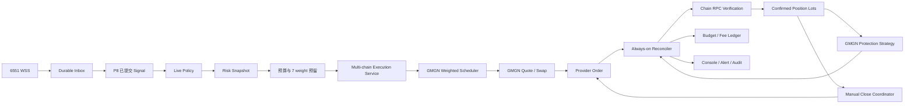

# P9.1 GMGN 托管钱包真实交易更新与测试方案

> 文档编号：P9.1  
> 创建日期：2026-07-21  
> 最近复核：2026-07-22  
> 文档状态：M0-M7 核心代码与历史恢复已完成，M8 控制面已实现但外部门禁未通过；M8.5-M11 未执行  
> 上位基线：[P6_real_operation_iteration_plan.md](./P6_real_operation_iteration_plan.md)  
> 实时信号基线：[P8_6551_max_realtime_signal_execution_plan.md](./P8_6551_max_realtime_signal_execution_plan.md)  
> 显式关系基线：[P8_1_explicit_x_relation_fix_plan.md](./P8_1_explicit_x_relation_fix_plan.md)  
> GMGN 本地文档：[docs/external/gmgn/README.md](../external/gmgn/README.md)  
> 核心目标：把已经验证过的 GMGN Agent API 单笔真实买入流程，重构为支持 `sol/bsc/base/eth`、具备亚秒 Fast Path、主动避免 429、可幂等、可确认、可恢复、可审计的正式交易执行系统

---

## 一、结论与执行边界

### 1.1 当前项目的准确状态

当前系统不是“完全模拟”，也不是“自动实盘已经完成”，而是处于以下中间状态：

1. 6551 Max 的 Watch、WSS、Inbox、Activity、显式关系和 Signal-only 主链路已经形成，并有自动化测试覆盖。
2. Reply 真实事件已经完成从 6551 到 Signal 的闭环；Follow 真实事件仍未通过，Quote、Retweet、直接发帖等类型也不能在没有真实验收记录时直接授权实盘。
3. GMGN Agent API 的官方 `/v1` 鉴权、报价、Swap、订单查询和策略单查询已经由一次性脚本真实验证。
4. CUPSEY 已完成 `0.1 SOL` 真实买入和后续全部卖出；GMGN Strategy 已取消，链上 Token 余额为 `0`，数据库已恢复为 `closed` 并按实际净到账重建 PnL。
5. 旧 `trade-engine.js` 和危险测试脚本已删除；开仓、对账、策略触发、部分平仓和手动平仓已切换到 GMGN 托管钱包领域服务，旧 Cron 入口保持禁用。
6. 默认测试已覆盖 Client/Adapter、Weighted Scheduler、预算并发、Live Queue、Readiness、Strategy/手动 Close 竞争、Lot/PnL、钱包余额对账和链上 Token Transfer；真实四链 Contract、Shadow 与小额 E2E 仍未执行。

因此，当前定义为：

> **P9.1 核心资金代码已形成并保持失败关闭；自动实盘仍被 Live Policy、RPC、Contract Test、Shadow Live、告警验收和逐链真实 E2E 阻断。**

### 1.2 P9 与 P6、P8 的关系

- P6 是从原型走向真实运行的长期总纲。
- P8 负责 X 行为到唯一 Signal，不负责资金执行。
- P9 落实 P6 中尚未完成的 GMGN 合约、交易状态机、预算、对账、平仓和 Live 灰度。
- P8 与 P9 分别验收，不能用“一次真实成交”替代 P8 的事件完整性验收，也不能用“信号很快”替代 P9 的资金安全验收。
- P9 可以先使用人工选择的已记录 Signal 测试交易执行，但自动 Live 只能消费已通过 P8 真实验收且显式授权的事件类型。

### 1.3 强制安全状态

P9 M0-M8.5 默认保持：

```env
X_DATA_PROVIDER=6551
TRADING_MODE=signal
LIVE_TRADING_ENABLED=false
```

- 服务重启后 `engine_armed=false`，继续保持 Locked。
- `backend/cron.json` 中 `signal-matcher`、`price-monitor` 和旧 `order-sync` 保持关闭。
- `check-env.js` 负责环境格式和数据库启动检查；真正的 Live 启用由 Mode、Live Enable、Readiness、Arm 和 Live Policy 五层独立门禁控制。
- CUPSEY 已关闭的历史 Order、Strategy、Receipt、Lot 和 PnL 不得因部署、迁移、Disarm 或 Cron 开关被覆盖。
- Armed 只控制“创建新订单”；已有订单、策略和持仓的查询、对账及资金告警必须始终运行。
- P9 的任何自动化测试不得真实提交 Swap；真实资金测试必须单独、逐笔、显式确认。

### 1.4 本阶段范围

P9 包含：

- GMGN Agent API 正式 Client、响应适配器和 Schema 校验。
- `sol/bsc/base/eth` 共用交易内核，以及各链独立的托管钱包、原生资产、Gas、Security、Pool、Quote、Swap、Query Order、策略单和链上最终性适配。
- 6551 WSS 收到事件后的亚秒 Fast Path、Slow Path 补全和分段延迟 SLO。
- GMGN Weighted Rate Scheduler、全局 429 冷却和订单自适应查询。
- 交易意图、Provider 订单、策略单、预算账本、持仓和状态历史。
- 单次提交、幂等、提交结果不确定、崩溃恢复和持续对账。
- 安全手动平仓与 GMGN 保护策略协同。
- Readiness、Arm 门禁、前端交易控制台和资金告警。
- 人工单笔、受控自动单笔和小额自动 Live 灰度。

P9 不包含：

- 未完成该链 Contract Test、Shadow Live 和小额真实闭环就同时开放所有链实盘。
- 在 P8 未验收的 X 事件类型上自动买入。
- 自动删除或修改非 XBOT 所有的 6551 Watch。
- 将本地价格监控作为 Live 仓位的第二个卖出执行器。
- 用估算成交量、报价价格或数据库状态代替 GMGN/链上最终成交事实。

### 1.5 2026-07-22 实施状态

| 阶段 | 当前结论 | 是否允许进入下一资金阶段 |
|---|---|---|
| M0 | Signal-only、Locked、Live disabled；CUPSEY 已只读审计、回填并关闭；数据库已有前后备份 | 是 |
| M1-M4 | 官方 `/v1` Client、严格 Adapter、14/14 Weighted Scheduler、交易表、预算/幂等、Risk/Cache 已实现 | 只允许 Mock/只读测试 |
| M5 | Execution Service、DB 可恢复 Live Queue、500ms 扫描、Fast Path 时间戳、2 秒 Cache Warmer 和生产进程角色已实现 | 不允许自动资金；生产部署与 P95 实测待完成 |
| M6-M7 | Always-on Reconciler、1/2/5/15-30 秒退避、Strategy/余额对账、安全手动 Close、部分 Lot/PnL 已实现 | 只允许继续只读对账 |
| M8 | Readiness、自动 Disarm、Outbox、Settings、Live Policy、Arm 明细、Position/Trade/Signal 状态已实现 | 当前门禁仍失败 |
| M8.5 | 未开始；需要至少 24 小时且至少 50 条有效 Signal | 否 |
| M9-M11 | 未执行任何新的逐链真实资金测试、自动灰度或链级解锁 | 否 |

当前已确认阻断：`TRADING_MODE=signal`、Engine Locked、`LIVE_TRADING_ENABLED=false`、Live Policy 为空、正式 RPC 未配置、资金告警未验收、四链 `contract_tested/shadow_verified/live_enabled=false`、全局 USD 限额未配置。EVM 原生币净到账无法精确核验时强制进入 `reconciliation_required`，不会使用 Provider 估算值伪造真实 PnL。

---

## 二、复盘审计结果

### 2.1 已真实验证的资金事实

#### CUPSEY 应用内真实买入与历史恢复

```text
Signal ID: 100
Input: 0.1 SOL
Output: 4132.773117 CUPSEY
GMGN Order: od10sol00000019f855cf7c1b34d65a7769a956a
Solana Tx: eCm5YdTt7TSWnunrqKJ47qrZB9xbPkpjqBEL63TpStUDg4tnZoz492MmrurEhvPmAdk6btrSR4JaSRugEedm8P9
Position: id=1, execution_mode=live, status=closed
Entry price: 0.001875909402 USD
```

后续真实卖出与链上核验：

```text
Strategy ID: 598c5fe0-623f-42b5-ab73-9eb4e84538c3
Strategy: cancelled
Sell input: 4132.773117 CUPSEY
Provider output: 0.099515233 WSOL
Wallet native net delta: 0.097582155 SOL
Token delta: -4132773117 raw
Receipt: confirmed
Realized cost: 0.1 SOL
Realized proceeds: 0.097582155 SOL
PnL: -0.002417845 SOL (-2.42%)
```

该事实证明 `/v1/trade/swap` 可以使用 GMGN 账户托管钱包真实成交，也证明条件单可能已经在远端创建，但 Swap 初始响应不一定携带 `strategy_order_id`。恢复脚本已按钱包、CA、数量和时间窗口唯一关联 Buy、Strategy、Sell、Receipt 与 Lot，没有提交任何新 Swap 或 Cancel。

本次请求中的条件单 `priority_fee` 为 `0.00001 SOL`，远端策略最终记录为 `0.0001 SOL`。因此预算、费用和前端展示必须采用服务器最终参数，不能直接回放请求值作为成交事实。

#### NEET 独立真实闭环

NEET 曾通过官方 CLI 完成约 `0.004995014 SOL -> 18.700189 NEET -> 0.004984157 SOL` 的真实买卖闭环，但不在 XBOT 正式 Position 流程内。它只能证明账号和钱包具备交易能力，不能作为应用状态机已通过的证据。

### 2.2 当前代码审计表

| 模块 | 当前事实 | 风险判定 | P9 处理 |
|---|---|---|---|
| `backend/lib/gmgn-http.js` | 纯 `/v1` HTTP、官方签名、Keep-Alive、Header 元数据、读写重试分离 | 写请求不自动重试；429 进入全局 Scheduler 冷却 | 已完成，待真实 Contract Test |
| `backend/lib/gmgn-adapter.js` | 严格适配 User、Token、Security、Pool、Quote、Order、Strategy、Balance | 必要字段缺失或类型漂移失败关闭 | 已完成 Fixture 门禁 |
| `backend/domains/trade/execution-service.js` | Prepare/Execute、Live Policy、Risk、7 weight 预留、一次 Swap | 未通过 Readiness 不可提交 | 已完成代码，未做新真实 Buy |
| `backend/domains/trade/live-execution-queue.js` | Signal commit 后异步排队，DB 扫描恢复，同 Signal CAS，Arm 时间边界 | Locked 信号只记录，重启后旧信号不会补单 | 已完成；生产由 `execution` 角色独占 |
| `backend/domains/trade/reconciliation-service.js` | Locked 下持续处理 Order、Strategy、Wallet、Receipt；EVM dropped 后仅接受 GMGN 同订单明确返回的新 Hash | EVM 原生币净到账或 replacement 无法唯一证明时转人工，不伪造 PnL | 已完成代码，逐链 RPC 与 reorg 观察待执行 |
| `backend/domains/trade/close-service.js` | `prepare -> confirm -> execute`，先查/撤 Strategy，再按 Lot 和钱包余额卖出 | Strategy 撤单不确定时禁止 Sell | 已完成代码，新的真实 Close 待 M9 |
| `backend/jobs/price-monitor.js` | Paper 可执行模拟 TP/SL；Live 只更新观测价格/PnL | 不再成为第二个 Live 卖出所有者 | 已完成 |
| `backend/db/migrations/005-009` | Attempt、Order、Strategy、Lot、Receipt、Budget、Outbox、Latency、Shadow Evaluation | Migration 009 已应用；旧 P7/P8 数据保留 | 已完成 |
| `backend/lib/process-role.js` / `server.js` | 生产拆分 `ingestion` 与 `execution`；生产禁止 `all` | 所有 GMGN 请求只在 `execution` 进程，共享单个内存 Scheduler | 已完成代码，待按双进程方式部署 |
| `frontend/src/pages/SettingsPage.tsx` | Scheduler、Cache、Reconciler、逐链 Readiness、Live Policy、Arm 明细 | 保存安全配置自动 Disarm；无法在前端伪造链验收状态 | 已完成代码与桌面/移动端浏览器验收 |
| `frontend/src/pages/PositionsPage.tsx` / `TradeLog.tsx` | 显示异常 Position、Attempt、Order、Strategy、Lot、Receipt、查询阶段 | Accepted 不再等同于 Confirmed | 已完成代码 |
| 自动化测试 | 默认 `node:test` 现为 103/103，覆盖资金状态、并发、恢复、进程角色和失败关闭 | 真实 API/资金测试与默认测试分离 | 已完成代码门禁，M8.5/M9 独立执行 |

### 2.3 当前必须保持关闭的入口

在对应 P9 阶段退出标准完成前，以下入口不得启用：

1. LiveExecutionQueue 的真实提交：当前被 Signal Mode、Live disabled、Locked 和空 Live Policy 阻断。
2. 旧 `trade-engine`：已删除，不得恢复。
3. 旧 Cron `signal-matcher`、`price-monitor` 和 `order-sync`：继续禁用；正式 Reconciler 由服务启动独立运行。
4. 前端 Live 手动平仓：只有已验收链、真实 Open Position 和两阶段确认全部通过后才能使用。
5. Solana、BSC、Base、Ethereum 的 Live 能力声明：四链当前均未通过 Contract/Shadow/Live Enable。

### 2.4 紧急处置手册

1. **Strategy 仍运行**：立即 Disarm；禁止手动 Sell；查询 GMGN `open` 与本地 Strategy Group/Leg，核对保护数量等于 Lot remaining；只允许继续 Reconciler 和告警。
2. **Strategy 已触发或正在成交**：禁止 Cancel 和手动 Close；以 `close_sign_hash/close_amount` 建立唯一 Sell Attempt/Order，等待 RPC Receipt 和精确 Token Transfer；无法唯一关联时进入 `close_uncertain`。
3. **Strategy 失效、取消不确定或查询不到**：立即 Disarm 并停止新 Buy；同时查询 `open/history`、Wallet Balance 和 Wallet Activity；只有明确已取消且无 close hash 才允许重新 `prepare close`，否则保持人工处理。
4. **钱包余额与 Lot 不一致**：禁止按钱包总余额卖出；余额高于 Lot 只记录外部同 CA 资产，余额低于 Lot 且存在 Strategy 时直接 `close_uncertain`；仅当 Wallet Activity 存在唯一同数量 Sell 且 Receipt 可验证时恢复正式 Order。

任何场景都不得删除 Attempt/Order/Receipt/Lot 历史，不得自动重试 Swap/Cancel，不得因通知失败回滚资金事实。需要停止自动动作时设置 `EMERGENCY_STOP=true` 并 Disarm，但 Always-on Reconciler 与只读告警继续运行。

---

## 三、核心架构决策

### 3.1 GMGN 托管钱包是唯一执行钱包来源

正式流程从 `/v1/user/info` 获取当前 GMGN 账号下的钱包，并按交易的 `chain` 精确选择唯一地址。钱包缺失、重复、链不匹配或余额未知时，该链 Readiness 必须失败。P9 不再要求：

- `WALLET_SOL`
- `WALLET_EVM`
- `SOLANA_PRIVATE_KEY`
- `EVM_PRIVATE_KEY`

`GMGN_PRIVATE_KEY` 只用于 GMGN API 请求签名，不是 Solana/EVM 链钱包私钥。任何代码都不得把它传入 `Keypair` 或 `ethers.Wallet`。

### 3.2 事件授权与资金授权分离

白名单关系命中只代表“形成 Signal”，不自动代表“允许真实下单”。P9 增加显式 Live Policy：

| 维度 | 第一阶段规则 |
|---|---|
| Provider | 仅 `6551` |
| Chain | 每条链独立授权；默认全部关闭 |
| 事件类型 | 仅真实验收通过并手动启用的类型 |
| Follow | 当前禁止 Live，直到 P8 真实 Follow 通过 |
| Reply | 已有真实 Signal 证据，但仍需通过 P9 的资金门禁 |
| Quote/Retweet/Tweet/CA/Keyword | 分类型真实验收后逐项启用 |
| KOL/Target/CA | 必须命中启用的显式 `actor -> target -> CA` 关系 |
| Signal age | 必须小于 Live Policy 配置的硬上限 |

默认策略是空允许列表。代码部署不会自动授权任何事件类型或任何 CA。

### 3.3 创建新订单与持续对账分离

- `engine_armed=true`：只代表允许经过全部门禁的新交易进入提交阶段。
- `engine_armed=false`：立即停止 claim 新 Signal 和创建新订单。
- Reconciler：无论 Signal/Paper/Live、Armed/Locked，都必须继续处理已提交订单、策略和 Live Position。
- Emergency Stop：分为“停止新订单”和“停止所有自动动作”；后者也不能停止只读对账和告警。

### 3.4 读请求可有限重试，写请求禁止盲重试

- `user/info`、Security、Pool、Quote、Order Query、Strategy Query：只在 Weighted Rate Scheduler 放行后请求；timeout 和 5xx 可按接口做有界退避重试。
- 429 不是普通重试条件。收到 429 后读取 `X-RateLimit-Reset` 或响应 `reset_at`，全局暂停到重置时间加随机抖动；冷却期内禁止继续请求。
- `POST /v1/trade/swap`、Strategy Create、Strategy Cancel：默认单次提交。
- 写请求发送后发生 timeout、断连或进程退出时，进入 `submission_uncertain`，保持预算占用并由 Reconciler 查证。
- 未证明上一笔写请求明确失败前，不得以“重试”名义再次提交同一业务动作。
- 只读请求在 429 冷却结束后最多有限重试；写请求无论 429、timeout 或断连都禁止自动循环重试。

### 3.5 链上和 Provider 成交事实优先

只有 `query_order` 返回明确成功、存在可校验 report，并完成对应链的 RPC 校验后，才能创建 Open Position。正式金额来自成交 report 与链上 receipt：

- 实际 input/output amount。
- 实际成交价格。
- 交易 Hash。
- Gas、平台费、路由费。
- Provider Order ID。

Solana 必须校验 transaction、meta 和 Token balance 变化；EVM 必须校验 chain ID、receipt status、Transfer Logs 和要求的确认数，并处理 reorg、replaced 或 dropped transaction。Provider `confirmed` 不能替代链上最终性。

Quote 只用于交易前判断，不能成为成交记账依据。所有最小单位使用字符串或 `BigInt`，数据库使用足够精度的 `numeric`；禁止用 JS 浮点数构造链上数量。

### 3.6 Live 退出只有一个执行所有者

第一阶段由 GMGN 策略单负责 Live TP/SL：

- 本地价格监控可以展示浮盈亏和告警，但不得提交卖出。
- 手动平仓必须先锁定 Position、查询策略最新状态、确认撤单结果，再按钱包真实可用余额卖出。
- 策略已成交、撤单不确定或卖出提交不确定时，不允许第二个执行器继续卖出。
- 只有卖出订单确认成功后，Position 才能进入 `closed`。

### 3.7 多链公共内核，逐链独立解锁

P9.1 一次实现 `sol/bsc/base/eth` 的公共交易内核，但“代码已实现”不等于“允许实盘”。每条链分别维护：

```text
implemented -> contract_tested -> shadow_verified -> live_enabled
```

- `implemented`：Adapter、金额精度、预算、订单、平仓和链上校验已经编码。
- `contract_tested`：使用该链真实只读接口完成契约探针。
- `shadow_verified`：真实 Signal、真实 Quote 和风险计算运行通过，但不提交 Swap。
- `live_enabled`：完成该链小额 Buy/Close 和故障恢复验收后，由独立 Policy 显式开启。

链差异必须放在 Adapter，不能散落在业务服务：

| Chain | 原生资产地址 | Fee/Anti-MEV 重点 | 最终性要求 |
|---|---|---|---|
| Solana | `So11111111111111111111111111111111111111112` | 支持 anti-MEV；条件单需要 `priority_fee/tip_fee` | transaction/meta/余额变化 |
| BSC | `0x0000000000000000000000000000000000000000` | 支持 anti-MEV；使用 `gas_price`，可配置 BNB tip | chain ID/receipt/logs/确认数 |
| Base | `0x0000000000000000000000000000000000000000` | 不支持 anti-MEV；使用 EIP-1559/Gas 参数 | chain ID/receipt/logs/确认数 |
| Ethereum | `0x0000000000000000000000000000000000000000` | `gas_level/auto_fee` 与 EIP-1559 | chain ID/receipt/logs/确认数 |

本地新旧 GMGN 文档对 Ethereum 支持状态存在版本差异，因此 Ethereum 必须以当前真实 Contract Test 为准；未通过时只显示“未验证”，不得声明可交易。

### 3.8 亚秒 Fast Path 与延迟 SLO

最快路径固定为：

```text
6551 WSS
-> 原始 Inbox 快速持久化
-> 内存/本地缓存关系匹配
-> 读取有 TTL 和版本的 Wallet/Token/Security/Pool/Gas 快照
-> 仅实时请求 Quote
-> 原子建立预算 Reservation 与 Trade Attempt
-> 单次 Swap
-> 订单热查询
```

在 6551 payload 字段完整、缓存已预热、GMGN Scheduler 已预留额度且本地服务健康时，目标为：

| 分段 | P95 目标 | 边界 |
|---|---:|---|
| WSS receive -> Inbox commit | `<=50ms` | 只做校验、去重和原始事件落库 |
| WSS receive -> Signal committed | `<=300ms` | 300ms 是本地优化目标 |
| Signal committed -> Swap request started | `<=300ms` | 必须已取得完整 7 weight 预留 |
| WSS receive -> GMGN order accepted | `<=1s` | 不包含 X 操作到 6551 推送的上游延迟 |
| Order accepted -> 首次状态更新可见 | `<=1.2s` | 不代表链上 confirmed |

执行规则：

1. Payload 完整时走 Fast Path；需要 `getTweetById` 或其他 REST 补全时进入 Slow Path。
2. Slow Path 超过 Signal age 硬门禁后拒绝，不猜测 target，不补发迟到交易。
3. WSS Inbox 提交与 enrichment/matcher 解耦；Trade Worker 不能阻塞 6551 `processingQueue`。
4. API/WebSocket、6551 Ingestion、Trade Execution、Trade Reconciliation、Notification Outbox 分进程运行。
5. GMGN 使用 HTTP keep-alive 和预热连接；关系、钱包和风险数据使用带 `fetched_at/version/ttl` 的缓存。
6. Wallet/Token decimals 可使用较长 TTL；Security/Pool/Gas Fast Path 快照默认 `5-10s`；Quote 每次交易实时请求。
7. 缓存过期、版本变化、Readiness 失败或权重不足时进入等待/拒绝，不得为了速度绕过 Security、Quote、预算或幂等。

6551 心跳 `20000ms` 仅检测连接存活，不参与正常消息传递，也不决定事件延迟。6551 未提供 X 操作到 WSS 到达的端到端 SLA；GMGN 和链上 confirmed 同样不承诺 1 秒完成。

### 3.9 GMGN Weighted Rate Scheduler 与 429 零触发目标

GMGN 官方为 leaky bucket：`rate=20 weight/s`、`capacity=20`，依据本地官方文档 [gmgn-swap/SKILL.md](../external/gmgn/official/gmgn-skills/skills/gmgn-swap/SKILL.md)。P9.1 不能按“请求次数”限流，必须按接口权重统一调度：

| 请求 | Weight |
|---|---:|
| Swap / Strategy Create | 5 |
| Quote / Strategy Cancel | 2 |
| Order Get / Strategy List / Gas Price | 1 |

内部 Scheduler 规则：

- 生产内部桶使用 `rate=14 weight/s`、`capacity=14`，只使用官方额度的 70%，至少保留 `6 weight/s` 给网络延迟、时钟抖动和紧急对账。
- 每次新交易开始前原子预留 `Quote 2 + Swap 5 = 7 weight`；没有完整 7 weight 时不发 Quote，可短暂排队，超过 Signal age 门禁则拒绝。
- 多实例共用同一个 GMGN API Key 时，必须使用单例 Scheduler 或 PostgreSQL 原子权重桶；禁止各进程分别限流。
- XBOT 应使用独占 GMGN API Key；Armed 期间禁止官方 CLI、临时脚本或其他服务绕过 Scheduler 共用该 Key，否则无法保证零 429。
- 未在本地官方文档明确权重的接口必须先做 Contract Test 并加入权重配置；确认前按最高已知权重 5 保守调度或禁止进入 Live。
- 后台预热和稳定订单查询增加 `100-500ms` jitter，避免整秒集中突发；资金关键路径不增加无意义等待。
- P1 队列内部按 Signal 到期时间优先，同到期时间再按业务优先级排序；不能在队列里等待到信号失效后继续下单。

请求优先级固定为：

```text
P0 submitted / closing / submission_uncertain 的 Order Get
P1 已预留 7 weight 的新交易 Quote + Swap
P2 triggered / cancelling Strategy
P3 稳定 Open Strategy 对账
P4 Security / Pool / Gas 预热
```

订单采用自适应查询，不能让全部 Open Position 永久每秒查询：

```text
0-10s pending       每 1s
10-30s pending      每 2s
30-120s pending     每 5s
超过 120s          每 15-30s，并告警
closing/triggered   每 1s
稳定 Open Strategy 每 10-30s
```

20 个订单每秒各查询一次已经消耗官方全部 `20 weight/s`，会使 Quote/Swap 无额度，因此订单进入稳定状态后必须降频。

429 行为是全局安全状态：

1. `gmgn-http.js` 返回响应 Header 元数据，记录 endpoint、weight、remaining/reset 和 latency，不记录鉴权信息。
2. 首次 429 立即告警，Scheduler 全局暂停到 reset 时间加 jitter，并自动降低内部权重上限；reset 缺失或不可解析时至少冷却 60 秒并采用指数延长。
3. 冷却期间只排队，不发送新的非必要请求；继续撞限流可能延长封禁，必须避免。
4. Swap/Strategy 写请求不自动重试；只读请求仅在冷却结束后做有限重试。
5. 生产目标是主动触发 429 为 `0`；429、突发和冷却测试只能使用 mock/fixture，不对真实 GMGN 接口压测。

### 3.10 业务幂等、GMGN client_id 与确认令牌

以下三个标识不能混用：

- XBOT `attempt_id/idempotency_key`：稳定业务幂等键，保证同一 Signal/Side 只创建一次交易意图。
- GMGN 鉴权 `client_id`：每次请求生成的短时防重放 UUID，不是业务幂等键。
- GMGN `provider_order_id`：订单创建成功后唯一可直接用于 `query_order` 的标识。

Swap timeout 且未取得 `provider_order_id` 时，不能“按 client_id 查询”。该 Attempt 进入 `submission_uncertain`，通过钱包活动、链上交易和人工对账查证；无法唯一确认时禁止自动重试，也不得继续自动 Live。

`prepare token` 必须使用随机 nonce，保存在数据库并绑定短 TTL、Snapshot Hash、操作者和业务对象；`execute` 通过 CAS 一次性消费，过期、字段变化或重放均拒绝。

---

## 四、目标系统架构

### 4.1 目标数据流



### 4.2 目标模块边界

建议按当前 CommonJS 结构拆分，不引入新的框架：

```text
backend/
├── lib/
│   ├── gmgn-http.js                 # HTTP、签名、超时、错误分类，不含业务状态
│   ├── gmgn-adapter.js              # 官方响应 Schema、金额和状态标准化
│   ├── gmgn-rate-scheduler.js        # 全 Key 权重桶、优先级和 429 全局冷却
│   └── decimal-units.js             # Decimal string / BigInt 单位转换
├── domains/trade/
│   ├── execution-service.js         # prepare、reserve、single submit
│   ├── reconciliation-service.js    # order/strategy/wallet 对账与恢复
│   ├── close-service.js             # 策略协调与确认后平仓
│   ├── chain-adapters/               # sol/bsc/base/eth 差异与 RPC 最终性
│   ├── trade-repository.js          # 封装状态 CAS 和 append-only event
│   ├── budget-service.js            # reserve/commit/release 和硬限额
│   ├── readiness-service.js         # Arm 前就绪检查
│   └── routes.js                    # 查询与受控命令 API
├── domains/signal/
│   ├── risk-manager.js              # 生成不可变 Risk Snapshot
│   └── live-policy.js               # Provider/事件/关系/CA 授权
└── jobs/
    ├── trade-reconciler.js          # 始终运行，只处理已有资金事实
    ├── signal-executor.js           # 仅 Live + Ready + Armed 时 claim 新信号
    └── notification-outbox.js       # 资金级告警的可靠投递
```

早期 `execute-live-signal.js` 人工测试入口已在实盘清理阶段删除；真实买入统一由正式自动执行队列调用上述服务。

生产进程至少拆为 API/WebSocket、6551 Ingestion、Trade Execution、Trade Reconciliation 和 Notification Outbox。资金级状态与告警 Outbox 在同一数据库事务写入，外部通知异步投递，避免通知失败回滚资金事实或静默丢失告警。

---

## 五、数据库与状态机

### 5.1 数据表职责

P9 使用新增 migration 向前演进，保留现有历史记录，不覆盖或删除真实成交数据。

#### `trade_attempts`

记录一次业务交易意图和幂等边界：

- `id`、`signal_id`、`whitelist_id`、`position_id`。
- `side=buy|sell|strategy_create|strategy_cancel`。
- `idempotency_key` 唯一，买入至少包含 `signal_id + side`。
- `chain`、`wallet_address`、输入/输出 Token。
- 展示数量与 raw amount 分开保存。
- `status`、错误 code、错误分类、是否需要人工处理。
- `request_fingerprint`，不保存 API Key、签名或敏感 Header。
- `reserved_amount`、预算 reservation ID。
- `created_at`、`submit_started_at`、`confirmed_at`、`last_reconciled_at`。

#### `trade_orders`

记录 GMGN Provider 订单：

- `attempt_id`、`provider=gmgn`、`provider_order_id` 唯一。
- GMGN 鉴权 `client_id` 仅用于请求审计，不建立业务幂等或订单查询语义。
- `tx_hash`、`provider_status`、`normalized_status`。
- `input_amount_raw`、`output_amount_raw`、decimals、实际展示数量。
- `price_usd`、`gas_native`、`gas_usd`、平台费和路由费。
- 脱敏 `quote_json`、`report_json` 和最后一次原始状态。
- `submitted_at`、`confirmed_at`、`last_queried_at`。

#### `strategy_groups` 与 `strategy_legs`

一个 Position 可包含一个策略组和最多 10 个远端策略子单，不再复用 Position 的 `tp_order_id/sl_order_id`：

- Group 记录 Position、策略版本、总保护数量和整体状态。
- Leg 记录 `provider_order_id`、TP/SL 条件、数量、顺序和独立状态。
- 请求的 TP/SL、priority fee、tip fee。
- GMGN 最终返回的实际参数、`status` 和 `strategy_status`。
- `open_amount`、`quote_investment`、已成交数量和退出订单信息。
- 创建、运行、触发、撤销、失败和最后对账时间。

#### `position_lots`

每次确认买入形成独立 Lot，避免卖出同钱包、同 CA 的其他批次或外部持币：

- `position_id`、`buy_order_id`、链、Token 和钱包。
- `opened_amount_raw`、`remaining_amount_raw`。
- `reserved_by_strategy_raw`、`externally_changed_amount_raw`。
- 实际成本、费用、创建与最后对账时间。

第一阶段策略卖出强制 `sell_ratio_type=buy_amount`，禁用 `hold_amount`。手动平仓数量为 `min(position remaining, wallet available)`，不得直接卖出钱包全部余额。

#### `chain_receipts`

- 记录 chain、tx hash、block/slot、receipt status、确认数和标准化 Transfer 变化。
- 记录 reorg、replaced、dropped 和最终确认时间。
- Provider report 与链上事实不一致时，Position 停在对账状态并告警。

#### `trade_attempt_events`

append-only 状态历史：

- 每次状态迁移的 from/to、reason、actor、时间。
- Provider request ID、HTTP 状态、延迟和脱敏摘要。
- 进程重启后的恢复行为也必须留下事件。

#### `budget_reservations` 与 `budget_ledger`

- Reservation 在提交前占用额度。
- 明确拒绝时 release。
- 成交后按实际 input 和费用 commit。
- `submission_uncertain` 时保持 reserved，不自动释放。
- Ledger append-only，按 whitelist、chain、daily、weekly、lifetime 聚合。

#### `prepare_tokens`、`provider_rate_events` 与 `notification_outbox`

- `prepare_tokens` 保存 nonce hash、snapshot hash、operator、expires_at 和 consumed_at，并通过 CAS 一次性消费。
- `provider_rate_events` 保存 endpoint、weight、remaining/reset、latency、429 和 Scheduler 降级事件。
- `notification_outbox` 与资金状态同事务写入，记录投递、重试和最终失败；内容禁止保存密钥和签名。

### 5.2 Signal 状态机

```text
signal_only
recorded -> pending_risk -> approved -> execution_reserved -> executed
         -> rejected
         -> expired
```

- Signal 只描述信号评估和是否成功建立交易执行意图。
- `executed` 表示关联的买入订单已经确认，不表示仅完成提交。
- 提交后的细节全部由 Trade Attempt 和 Order 表表达。

### 5.3 Trade Attempt 状态机

```text
reserved -> preparing -> submitting -> submitted -> confirming -> confirmed
                   |           |             |
                   |           |             -> reconciliation_required
                   |           -> submission_uncertain
                   -> rejected / failed
```

强制规则：

1. 进入 `submitting` 前必须持久化稳定幂等键和预算 Reservation。
2. Swap 调用开始后，即使没有收到 `order_id`，也不能自动判定“未成交”。
3. `submission_uncertain`、`submitted`、`confirming` 可由 Reconciler 在重启后恢复。
4. 只有明确的 Provider 4xx 业务拒绝且确认未创建订单时，才能直接释放 Reservation。
5. 任何状态变化使用数据库条件更新，旧状态不匹配时拒绝重复执行。

### 5.4 Position 状态机

Position 只表示已经确认拥有的资产，不再承担交易请求状态：

```text
open_unprotected -> open_protected -> partially_closed -> closing -> closed
        |                 |                    |             |
        -> protection_failed                  |             -> close_uncertain
                                              -> open_protected
```

- Buy 确认后才创建 Position。
- Swap 同时确认远端策略时直接进入 `open_protected`。
- Buy 已确认但策略未找到时进入 `open_unprotected` 并最高级别告警。
- 卖出失败或结果不确定时不得进入 `closed`。
- `closed` 必须关联已确认的 Sell Order 或已确认触发的 Strategy Order。
- 每次退出只减少对应 Lot 的 `remaining_amount_raw`；未全部退出时保持 `partially_closed` 或恢复 `open_protected`。

### 5.5 预算语义

P9 统一如下：

- `budget_per_trade`：单笔计划投入上限。
- `total_budget`：该白名单生命周期累计硬上限，永不按日清零。
- `spent_budget`：只保留为兼容投影，来源改为已确认 Ledger 聚合。
- `current_buy_count`：迁移为累计成功买入次数或由 Ledger 聚合，不能每天重置。
- 日/周预算：只通过 `budget_ledger` 的周期聚合计算。
- `budget-reset`：不得修改历史累计值；最终改为建立新周期或删除该 Job。
- SOL、BNB、ETH 不能直接按原生数量相加；每链维护 Native 限额和白名单 Native 限额，同时按 Reservation 时的 USD Snapshot 维护全账户风险上限。
- Reservation 必须包含计划投入、Gas、Tip、Priority Fee 和 Strategy Fee；Commit 使用 Provider report 与链上 receipt 的实际费用。

---

## 六、代码更新阶段

## M0：资金冻结、现有仓位保护与基线快照

状态：**必须最先执行**

- [x] 保持 Signal-only、Locked、`LIVE_TRADING_ENABLED=false`。
- [x] 禁用旧 Live 开仓、旧 Live 手动平仓和旧 Live 价格触发卖出入口。
- [x] 对 CUPSEY Position、GMGN Buy Order、交易 Hash、钱包余额和 Strategy 状态做只读复核。
- [x] 将 CUPSEY 远端 Strategy 的服务器最终参数作为后续 migration 回填基线。
- [x] 一次性真实交易脚本及其测试环境变量已在实盘清理阶段删除，避免绕过正式自动执行链路。
- [x] 建立紧急处置手册：策略仍运行、策略已触发、策略失效、钱包余额不一致四种情况分别处理。
- [x] 备份数据库，并记录 migration 版本和当前自动化测试基线。
- [x] 确认所有日志和测试输出不包含 API Key、PEM、签名和鉴权 URL。

退出标准：现有仓位和远端保护策略可独立核验；部署 P9.1 代码不会撤单、重复买入或覆盖历史记录。

## M1：GMGN Client、Adapter 与合约测试

- [x] `gmgn-http.js` 只保留请求、认证、签名、timeout、响应 Header 元数据和错误分类。
- [x] 新增全 Key Weighted Rate Scheduler，按 `rate=14 weight/s`、`capacity=14`、优先级、7 weight 交易预留和 429 全局冷却调度。
- [x] 为 API Key 建立独占使用约束；Armed 时拒绝绕过 Scheduler 的本地维护脚本，并在运维文档中禁止并行运行 GMGN CLI。
- [x] 新增严格 Adapter，统一解析 User、Token、Security、Pool、Quote、Swap、Order Report 和 Strategy。
- [x] 为每类响应校验必要字段；字段缺失、类型漂移和非 JSON 必须失败关闭。
- [x] 为 `sol/bsc/base/eth` 定义 Chain Adapter，明确 `price.price`、字符串税率、nullable 安全字段、原生资产、Gas、anti-MEV 和最终性差异。
- [x] 读/写请求使用不同 retry policy；Swap 和 Strategy 写请求禁止自动重试。
- [x] 保存 GMGN 返回的服务器最终参数，不能只保存请求参数。
- [x] 用 fixture 覆盖 Strategy ID 在 Swap 响应缺失、需要列表回查的真实情况。
- [x] 用 mock time/fixture 覆盖权重桶并发、优先级、reset header、429 冷却和降级；禁止用真实 API 做限流压测。
- [x] 删除正式领域代码对 `getSwapRoute/submitSwap` 的依赖。

退出标准：所有正式交易模块只依赖新的 Adapter；旧本地钱包签名流程无法被调用；合约漂移会使测试和 Readiness 失败。

## M2：交易数据库迁移与 Repository

- [x] 新增 `trade_attempts`、`trade_orders`、`strategy_groups`、`strategy_legs`、`position_lots`、`chain_receipts`、`trade_attempt_events`、`budget_reservations`、`budget_ledger`、`prepare_tokens`、`provider_rate_events` 和 `notification_outbox`。
- [x] Provider Order ID 和 XBOT idempotency key 建立唯一索引；GMGN `client_id` 仅审计，不承担业务幂等。
- [x] raw amount 使用字符串或高精度 numeric，展示量与 raw amount 分离。
- [x] Repository 提供条件状态迁移，不允许任意 SQL 跳过状态机。
- [x] 回填 CUPSEY Position、Buy Order 和 Strategy，不修改真实 `opened_at` 与成交信息。
- [x] 旧 Position 状态保留兼容读取；新交易不再写 `positions.pending` 表达请求中。
- [x] migration 可重复执行，并验证旧 P7/P8 数据不受影响。

退出标准：数据库可以完整表达“提交前、提交中、已接受、结果未知、已确认、已保护、平仓不确定”；真实历史可回填且可追溯。

## M3：预算、幂等与单次提交门禁

- [x] 在同一短事务中锁定白名单、计算所有限额、建立 Attempt 和 Reservation。
- [x] 网络请求全部移出数据库事务，避免长事务持锁。
- [x] 使用唯一幂等键保证同一 Signal 同一 Side 只能有一个 Attempt。
- [x] 使用原子条件更新验证每链 Native、白名单 Native、USD Snapshot 全账户、日、周和全局限额。
- [x] 增加最大 Open Position、单 CA 暴露、各链最低 Gas 资产保留和 Emergency Stop。
- [x] Reservation 覆盖投入、Gas、Tip、Priority Fee 和 Strategy Fee，成交后按实际费用 Commit。
- [x] 新交易必须同时取得预算 Reservation 与 `Quote 2 + Swap 5` 的 7 weight Scheduler Reservation。
- [x] 明确拒绝才释放 Reservation；提交不确定继续占用。
- [x] 修正或移除 `budget-reset` 对累计字段的清零。
- [x] 为 20 个并发 worker claim 同一 Signal 建立数据库并发测试。

退出标准：并发、重启和重复命令都不能产生第二次 Swap，也不能突破任一预算上限。

## M4：官方行情、安全与 Risk Snapshot

- [x] `risk-manager` 改用 `getTokenInfo/getTokenSecurity/getTokenPoolInfo/quoteOrder`。
- [x] Quote 必须使用 `/v1/user/info` 返回的对应链实际钱包地址。
- [x] 风控输入统一标准化为不可变 Snapshot，保存来源时间和原始字段摘要。
- [x] `is_honeypot=null`、税率缺失、`rug_ratio` 缺失等按链定义处理，不能把未知自动当安全，也不能机械地把 SOL 空字段判为蜜罐。
- [x] Security、Pool、Quote 任一关键字段未知时，Live 默认拒绝并给出可解释 code。
- [x] 检查流动性、价格影响、滑点、买卖税、mint/freeze authority、余额和费用预留。
- [x] 建立带版本和 `fetched_at/ttl` 的缓存：Wallet/Token 使用长 TTL，Security/Pool/Gas Fast Path 默认 `5-10s`，Quote 永不复用。
- [x] 缓存过期或版本漂移时停止 Fast Path，进入刷新或按 Signal age 拒绝。
- [x] 修复 Paper 的官方价格对象解析，删除硬编码原生币 USD 价格。
- [x] Live Price Monitor 改为只观测和展示，不再执行 TP/SL 卖出。

退出标准：同一 Risk Snapshot 可复现批准或拒绝原因；外部接口错误不会生成 Position 或虚假成交。

## M5：多链公共 Execution Service 与亚秒 Fast Path

- [x] `prepare` 只读返回钱包、余额、风险、Quote、预计费用、TP/SL 和所有硬限额，不提交交易。
- [x] `execute` 复核 Signal freshness、Live Policy、Readiness、Armed 和 prepare snapshot 是否仍有效。
- [x] 先建立 Reservation 和 Attempt，再执行一次 `gmgnHttp.swap()`。
- [x] 6551 Ingestion 与 Trade Execution 分进程；原始 Inbox 快速提交后异步 matcher，GMGN 网络请求不得阻塞 WSS 消费队列。生产必须同时运行 `npm.cmd run start:ingestion` 与 `npm.cmd run start:execution`，`NODE_ENV=production` 禁止 `all` 角色。
- [x] 完整 payload 和有效缓存走 Fast Path；需要 Tweet REST 补全的事件进入 Slow Path，过期直接拒绝。
- [x] 使用 keep-alive、预热连接和关系缓存，记录各分段时间戳并计算 P50/P95/P99。
- [x] Swap 返回 `order_id` 后立即持久化，再进入确认轮询。
- [x] 从 Order Report 写入实际 amount、price、hash、gas 和 fee。
- [x] 订单确认后创建 Position；未确认时只保留 Attempt/Order。
- [x] 条件单与 Swap 一起提交时，分别记录 Buy 和 Strategy 的成功状态。
- [x] 无 `strategy_order_id` 时按 wallet、CA、amount、时间窗口回查，只允许唯一匹配；多条候选进入人工处理。
- [x] 一次性 CLI 脚本改为调用 Execution Service，不再维护独立实现。

退出标准：fixture 和故障注入通过；人工 dry-run 可解释全部参数；正式代码中不存在本地链钱包签名；缓存命中时 `receive_to_signal` P95 `<=300ms`，且 Signal 到 Swap 请求开始 P95 `<=300ms`。

## M6：Always-on Reconciler 与进程恢复

- [x] 新增 `trade-reconciler`，不受 Armed 和当前 TRADING_MODE 限制。
- [x] 扫描 `submitted/confirming/submission_uncertain/reconciliation_required` Attempt。
- [x] 按 Provider Order ID 查询；没有 Order ID 时不能按 `client_id` 查询，只能通过钱包活动、链上记录、策略和时间窗口有界查证，无法唯一确认则转人工。
- [x] 查询采用 `1s -> 2s -> 5s -> 15-30s` 自适应退避；只有 pending/closing/triggered 热状态允许 1 秒查询。
- [x] 所有查询经过同一个 Weighted Rate Scheduler；积压时按 P0-P4 优先级处理，稳定 Open Strategy 必须降频。
- [x] 对 Open Position 查询 Strategy 最新状态和钱包余额。
- [ ] Provider confirmed 后执行 Solana/EVM RPC 校验，记录 `chain_receipts`，处理 reorg/replaced/dropped。
- [x] 适配 GMGN 的 `open/running/check/success/failed/expired` 等真实状态，不再使用旧 `completed/cancelled` 假设。
- [x] 每次状态迁移写 append-only Event，并更新 `last_reconciled_at`。
- [x] 服务启动先完成一次高优先级恢复扫描，再允许 Readiness 变为可 Arm。
- [x] 对账积压、长时间不确定、Position/Wallet 不一致立即告警。
- [x] Reconciler 使用数据库锁，支持多实例但同一 Order 同时只有一个处理者。
- [ ] 首次 429 立即告警、全局冷却并降低内部权重上限；目标运行期间主动 429 为 0。

说明：EVM dropped 后的 GMGN 同订单 replacement Hash 唯一恢复已实现；真实 RPC 的长窗口 reorg/replaced/dropped 验收及生产 429=0 属于 M8.5/M9 运行证据，因此上述两项暂不勾选。

退出标准：在提交前、提交调用中、收到 Order ID 后、确认前和确认后模拟进程退出，重启均能恢复且不重复下单。

## M7：保护策略与安全手动平仓

- [x] 为 CUPSEY 和后续 Position 建立 Strategy Group/Leg、Position Lot 及状态历史。
- [x] 第一阶段强制 `sell_ratio_type=buy_amount`、禁用 `hold_amount`，每条策略 Leg 绑定明确 Lot 数量。
- [x] 手动平仓改为 `prepare close -> 明确确认 -> execute close`。
- [x] 获取 Position 锁后先查 Strategy，处理“已触发、正在成交、仍运行、已取消、未知”。
- [x] Strategy Cancel 必须得到明确结果；撤单不确定时禁止继续卖出。
- [x] 读取 GMGN 钱包实际 Token Balance，按 `min(position remaining, wallet available)` 构造 Sell，不盲用数据库 `amount_out`，也不卖出钱包全部同 CA 余额。
- [x] Sell Swap 只提交一次，复用 M5-M6 的 Attempt、Order 和 Reconciler。
- [x] 卖出确认后按真实 report 减少 Lot remaining、计算到账和 PnL；只在全部 Lot 归零时标记 Position `closed`，否则进入 `partially_closed`。
- [x] 卖出失败保持 `open_protected/open_unprotected`，结果未知进入 `close_uncertain`。
- [x] 手动平仓、Strategy 触发和 Reconciler 并发测试确保最多一笔有效卖出。

退出标准：任何卖出失败都不会制造“数据库已平仓但钱包仍持币”；自动策略与手动平仓没有双卖竞争。

## M8：Readiness、前端控制台与告警

### 后端 Readiness

Arm Live 前必须同时满足：

- [x] migration 为最新版本，数据库可读写。
- [ ] GMGN API Key 和签名密钥有效，`user/info` 可为计划启用链返回唯一钱包。
- [ ] 每条启用链的原生资产余额高于最低 Gas 保留和单笔预算之和。
- [ ] Token/Security/Pool/Quote 合约探针通过。
- [ ] Weighted Rate Scheduler 健康、过去观察窗口无 429、无冷却状态且拥有完整 7 weight 新交易额度。
- [ ] GMGN API Key 为 XBOT 独占，或已确认没有绕过 Scheduler 的并行调用者。
- [ ] Fast Path 缓存已预热且年龄未超 TTL；延迟 SLO 最近窗口达标。
- [ ] Reconciler 最近成功，无超时积压和未处理的 `submission_uncertain`。
- [ ] 所有 Live Position 均处于可解释状态，无未知的 `open_unprotected`。
- [ ] Live Policy 非空且只包含 P8 已验收的 Provider、事件类型、关系和 CA。
- [ ] 全局、链、日、周、白名单和单笔硬限额均为有效正数。
- [ ] 资金级告警通道已验证。

### 前端页面

- [x] Settings 分开展示 Runtime Mode、New Order Gate、Reconciler 和 Existing Position Safety。
- [x] Settings 增加 `GMGN 性能与限流` 区域，展示官方桶 `20/20`、内部桶 `14/14`、Quote/Swap 权重、新交易 7 weight 预留，以及 `1s -> 2s -> 5s -> 15-30s` 查询策略。
- [x] 实时展示 Scheduler 状态 `healthy/queued/cooling`、consumed/reserved/available weight、各优先级队列长度、最近一次 429、reset 倒计时和当前降级上限。
- [x] Arm 对话框按链展示钱包、原生资产余额、`implemented/contract_tested/shadow_verified/live_enabled`、单笔/日限额、允许事件类型和未解决异常。
- [x] Positions 展示 `open_unprotected/open_protected/closing/close_uncertain`，不得只显示 `open`。
- [x] 平仓 API 仅接受命令不代表成交，前端保持该仓位直到链上确认。
- [x] Trade Log 分开展示 Attempt、Buy/Sell Order、Strategy Group/Leg、Position Lot、Hash、费用、report 和状态历史。
- [x] Trade Log 的订单详情展示订单年龄、当前查询阶段、当前间隔、上次查询、下次计划查询和累计查询次数；终态订单显示“已停止查询”。
- [x] 所有 Hash 和 Order ID 可进入详情；敏感 request/header 永不返回浏览器。
- [x] `sol/bsc/base/eth` 分别展示实际 Readiness；未解锁链明确不可下单。
- [x] Signal 页面展示“只记录、允许人工执行、允许自动执行”三个不同授权状态。

### 配置安全

- [x] `/api/system/env` 增加字段 Schema、值校验和审计，不能接受任意键值。
- [x] `GMGN_PRIVATE_KEY` 不再回传或保存在前端 state；浏览器只看到“已配置/未配置”。
- [x] 密钥替换使用独立写入动作并自动 Disarm，不和普通风险参数一起提交。
- [x] 模式切换、Live Enable 和 Arm 分成三个独立动作，每一步均写审计日志。
- [x] GMGN 官方 `rate/capacity` 和接口 weight 为只读事实，前端不可修改；P9.1 初期内部上限与查询策略也只读展示，避免浏览器配置绕过安全边界。
- [x] 后续如开放调节，只允许降低内部 weight 上限或放慢查询；修改必须先 Disarm、二次确认、后端范围校验并写审计，禁止前端把内部上限提高到 `14 weight/s` 以上或把最短查询间隔降到 1 秒以下。
- [x] Prepare token 使用随机 nonce、短 TTL、Snapshot Hash、操作者和一次性 CAS 消费，重放必须拒绝。
- [ ] 轮换历史 Admin Token，前端不得内置默认 Token；后端默认继续监听 `127.0.0.1`，任何远程部署必须启用 HTTPS、访问控制和来源限制。

退出标准：用户能从一个页面判断“为什么不能 Arm、哪条链已解锁、当前权重/冷却/缓存是否健康、已有仓位是否安全、哪笔订单需要处理”，且前端操作不会把 accepted 误报成 confirmed。

## M8.5：Shadow Live 观察

在任何新的自动真实资金交易前运行：

```text
真实 6551 Signal
-> 真实 Wallet/Security/Pool/Gas/Quote
-> 真实 Live Policy、风险、预算和策略计算
-> 记录理论订单与限流权重
-> 不提交 Swap/Strategy 写请求
```

- [ ] 至少连续运行 24 小时或累计 50 条有效 Signal，取二者较晚者。
- [ ] 统计 6551 到达后的分段 P50/P95/P99、Slow Path 比例、缓存年龄和过期拒绝。
- [ ] 统计 GMGN 实际读请求权重、Scheduler 排队、理论 Quote/Swap 预留、失败率和 429 数量。
- [ ] 对每条计划启用链分别完成真实只读 Contract Test 和 Shadow 记录。
- [ ] 期间生产真实 429 必须为 0；任何 429、SLO 超标、字段漂移或预算无法解释都重置观察窗口。

退出标准：至少 24 小时且至少 50 条有效 Signal 无主动 429、无重复意图、无无法解释的限流突发，Fast Path 和预算指标满足门禁；全程无资金提交。

## M9：受控真实端到端测试

所有真实测试逐项执行，每一项都需要明确的测试 Signal、CA、chain、原生资产金额、USD Snapshot、最大损失和人工确认。Solana 默认单笔不超过 `0.005 SOL`、每日总额不超过 `0.01 SOL`；BSC/Base/Ethereum 在各自测试前另行设定小额 Native 与 USD 硬上限，提高额度必须另行评审。

| 编号 | 测试 | 资金动作 | 通过标准 |
|---|---|---|---|
| T0 | CUPSEY 只读回填与对账 | 无 | DB、GMGN Strategy、Wallet 一致，不产生新订单 |
| T1 | prepare/dry-run | 无 | 钱包、Quote、风险、费用和预算全部可解释 |
| T2 | 人工确认小额 Buy | 不超过该链小额 Native/USD 硬上限 | 一次 Swap、Order confirmed、实际 report 入库 |
| T3 | Strategy 关联 | 无新增 Buy | 远端策略唯一关联，服务器最终参数入库 |
| T4 | 重复执行同一 Signal | 禁止新增资金动作 | 第二次命令在提交前被幂等拒绝 |
| T5 | Locked 对账 | 无 | Disarm 后 Order/Strategy 继续更新 |
| T6 | 重启恢复 | 无额外 Buy | submitted/uncertain 状态可恢复且不重复提交 |
| T7 | 手动小额 Close | 卖出已持 Token | 撤单/卖出顺序正确，Sell confirmed 后才 closed |
| T8 | 卖出失败注入 | 无真实重复卖出 | Position 保持打开或 close_uncertain，并告警 |
| T9 | Strategy 与手动 Close 竞争 | 仅受控仓位 | 最多一笔有效卖出，余额和 DB 一致 |
| T10 | 全链路审计 | 无 | Signal -> Risk -> Attempt -> Order -> Position -> Strategy/Close 可追踪 |
| T11 | 热订单自适应查询 | 无 | 前 10 秒每秒可见，随后自动降频，不挤占新交易 7 weight |
| T12 | 429 与冷却故障注入 | Mock | 全局停发至 reset+jitter，写请求不重试，真实 API 不受压 |
| T13 | 部分平仓与外部同 CA 余额 | 受控卖出 | 只减少目标 Lot，不误卖钱包其他批次 |
| T14 | 链上最终性 | 无额外 Buy | Provider report 与 RPC receipt/Transfer/确认数一致 |

每次测试记录：

- Signal、KOL、target、CA、Provider 和事件类型。
- prepare 时间、提交时间、Order accepted、confirmed 和 Strategy ready 时间。
- 请求前后钱包对应链 Native/Token 余额。
- GMGN Order ID、Strategy ID、交易 Hash、实际数量、Gas 和费用。
- 数据库状态迁移和告警时间。
- 分段延迟、接口权重、Scheduler 排队时间、remaining/reset 和缓存年龄。
- 是否需要人工修复以及最终对账结论。

退出标准：每条待解锁链至少完成一笔新的小额 Buy 和对应 Close；重复执行、Locked 对账、重启恢复、部分平仓、链上最终性和 429 Mock 故障注入全部通过。

## M10：单关系小额自动 Live 灰度

进入条件：M0-M8.5 全部通过，计划灰度链的 M9 已通过，且 P8 对计划启用的事件类型已有真实验收。

第一阶段只允许：

- 一个 KOL。
- 一个 target X 账号。
- 一条已完成 M9 的链和一个 CA。
- 一个已验收事件类型。
- 单笔不超过该链 M9 审定的 Native 与 USD 双重硬上限；Solana 初始上限为 `0.005 SOL`。
- 每日最多 1 笔，并遵守该链 Native 与全账户 USD 日限额；Solana 初始日限额为 `0.01 SOL`。
- 最多 1 个 Open Position。
- 每日人工核对 GMGN、钱包、数据库和前端。
- Fast Path、Scheduler、429、缓存年龄和 Reconciler 指标持续可见。

灰度顺序：

1. Signal 自动进入 Risk，但人工批准 Execution。
2. 连续 3 笔无异常后，允许该唯一关系自动提交。
3. 连续运行 3-5 天，完成至少一次策略退出或受控手动退出。
4. 任一重复成交、未保护仓位、对账超时、预算不一致或告警失效，立即 Disarm 并回到人工模式。

退出标准：3-5 天无重复买卖、无预算超支、无未对账订单、无数据库/钱包差异，形成书面灰度报告。

## M11：SOL/BSC/Base/Ethereum 逐链真实解锁

公共内核可同时完成，但每条链不自动继承其他链的通过结论。每条链分别完成 Contract Test、Shadow Live、Risk/预算、Buy/Close、链上最终性、恢复和小额灰度，达到 `live_enabled` 后才在前端和 Live Policy 中开放。建议解锁顺序为 Solana -> BSC -> Base -> Ethereum；任一链故障只关闭该链，不影响其他已验证链的只读对账。

---

## 七、自动化测试矩阵

| 层级 | 必测内容 |
|---|---|
| Unit | Decimal/BigInt、状态归一化、Risk 字段、Live Policy、幂等键、费用汇总、链 Adapter |
| Contract | 四链 GMGN User/Token/Security/Pool/Quote/Swap/Order/Strategy 成功与字段漂移 |
| Error | 401/403/429/5xx、timeout、断连、非 JSON、业务 code 非 0、reset header |
| Database | migration、唯一索引、CAS、append-only event、预算、Lot、Receipt、Outbox |
| Concurrency | 同 Signal 20 并发、同 Position 多平仓者、Reconciler 双实例、共享权重桶 |
| Recovery | Swap 前后崩溃、Order ID 持久化前后崩溃、确认前重启、Strategy ID 缺失、429 冷却 |
| Safety | 卖出失败不关闭、Locked 继续对账、Live Monitor 不卖出、未知字段拒绝、Lot 不越界 |
| Integration | fixture Signal -> Risk -> Attempt -> mocked GMGN -> confirmed Position |
| Performance | Fast/Slow Path 分流、缓存 TTL、分段 P95、热转冷查询、14 weight/s 上限 |
| Frontend | accepted/confirmed 区分、链 Readiness、权重/冷却/缓存、异常状态不消失 |
| Real E2E | T0-T14，逐笔人工确认、余额与链上核对；429 只做 Mock |

新增测试不得只验证“函数返回成功”，必须断言：

1. GMGN 写请求调用次数恰好为 1。
2. 数据库状态与 Provider 事实一致。
3. 预算在不确定状态保持占用。
4. 重复 worker、重启和重复 API 请求不增加成交数。
5. 错误路径不会把 Position 误标为 Open 或 Closed。
6. 任意 1 秒窗口内部调度不超过 `14 weight`，Quote/Swap 未取得 7 weight 不开始。
7. 部分平仓不超过 Lot remaining，也不卖出外部同 CA 余额。

每次提交最小验证：

```powershell
cd D:\Axiangmu\xbot\backend
npm.cmd test
node scripts/check-env.js

cd D:\Axiangmu\xbot\frontend
npm.cmd run lint
npm.cmd run build
```

真实 GMGN Contract/E2E 测试必须从默认 `npm test` 分离，缺少显式资金确认时只能执行只读探针和 dry-run。

---

## 八、API 与操作契约

建议新增或调整：

| API | 副作用 | 用途 |
|---|---|---|
| `GET /api/trade/readiness` | 无 | 返回 Arm 全部门禁和阻断原因 |
| `GET /api/trade/attempts` | 无 | 查询交易意图和不确定状态 |
| `GET /api/trade/orders/:id` | 无 | 查询 GMGN Order、report 和状态历史 |
| `GET /api/trade/runtime-policy` | 无 | 查询官方/内部权重、接口 weight 和自适应查询阶段，只读 |
| `POST /api/trade/signals/:id/prepare` | 无 | 生成有时效的风险与报价快照 |
| `POST /api/trade/signals/:id/execute` | 创建订单 | 消费 prepare token，执行一次受控 Buy |
| `POST /api/trade/positions/:id/close/prepare` | 无 | 返回策略状态、余额和卖出 Quote |
| `POST /api/trade/positions/:id/close/execute` | 撤单/卖出 | 消费 close prepare token，执行受控 Close |
| `GET /api/trade/reconciliation` | 无 | 展示积压、最后成功、Scheduler 实时权重/冷却和异常 |
| `POST /api/system/arm` | 开启新订单门禁 | 必须绑定最新 Readiness snapshot |
| `POST /api/system/disarm` | 停止新订单 | 不停止 Reconciler |

`prepare token` 必须使用随机 nonce，在数据库中短时有效并绑定：Signal/Position、Quote、钱包、金额、滑点、Live Policy、预算版本、Risk Snapshot Hash 和操作者。`execute` 使用 CAS 一次性消费；任一关键字段变化、过期或重放都要求重新 prepare。

Scheduler、429 冷却和订单查询阶段由后端通过现有 WebSocket 通道推送；前端倒计时以服务器 `reset_at/next_query_at` 为事实源，页面刷新不能重置计时，也不能触发额外 GMGN 查询。

---

## 九、可观测性与资金告警

至少记录和展示：

- GMGN：接口、状态、延迟、Provider request ID、错误分类，不记录鉴权信息。
- Rate Scheduler：每秒 consumed/reserved/available weight、队列深度、各优先级等待时间、remaining/reset、429 次数和冷却截止时间。
- Fast Path：`receive_to_inbox`、`receive_to_signal`、`signal_to_swap_start`、`receive_to_accepted` 的 P50/P95/P99，Slow Path 比例和各缓存年龄。
- Attempt：各状态数量、最老 pending、最老 uncertain、重试/对账次数。
- Order：accepted-to-confirmed 延迟、失败率、未知状态率。
- Strategy：open/running/triggered/success/failed、最后对账时间。
- Position：protected/unprotected/closing/uncertain、钱包余额差异。
- Chain：各链 `implemented/contract_tested/shadow_verified/live_enabled`、RPC 最终性和 receipt 异常。
- Budget：reserved、committed、released，按白名单/日/周/全局聚合。
- Reconciler：heartbeat、backlog、最后成功、连续失败和 leader lock。

最高级别告警：

1. Buy 已确认但 Strategy 未建立。
2. Swap/Close `submission_uncertain` 超过阈值。
3. 数据库 Position 与 GMGN 钱包余额不一致。
4. 卖出失败、撤单不确定或疑似重复卖出。
5. Reconciler 停滞，但存在 Live Order/Position。
6. 预算 Ledger 与钱包实际支出无法解释。
7. Armed 时 Readiness 从 Ready 变为 Failed，系统必须自动 Disarm。
8. 首次 429、Scheduler 长时间无 7 weight、Fast Path P95 超标或缓存持续过期。
9. Provider confirmed 与链上 receipt/Transfer 不一致，或检测到 reorg/replaced/dropped。

---

## 十、回退与应急策略

- 代码回退不能删除新交易表或覆盖已记录 Provider/链上事实。
- 部署失败时首先 Disarm 新订单，Reconciler 和只读状态页面继续运行。
- Reconciler 新版本异常时可回退到上一版本，但不能回退到旧 `order-sync.js`。
- 发现重复提交风险时，冻结该 Signal/Position 的执行，只做订单、策略和钱包查询。
- 发现未保护 Position 时停止所有新 Buy，优先人工确认策略状态和风险处置。
- 发现数据库与钱包不一致时，以 GMGN Order Report、Strategy 和链上交易为事实源修复数据库，不反向伪造钱包事实。
- migration 采用 additive-first；只有所有历史数据完成回填和读取切换后，才删除旧字段和死代码。
- 旧 `trade-engine.js`、旧 `order-sync.js` 和 Live 本地 TP/SL 代码在新链路通过后删除，避免两套执行器长期共存。

---

## 十一、执行顺序与预估

| 顺序 | 阶段 | 预估 | 是否动用真实资金 |
|---:|---|---:|---|
| 1 | M0 冻结与 CUPSEY 保护基线 | 0.5 天 | 否 |
| 2 | M1 四链 Client/Adapter/Weighted Scheduler | 2-3 天 | 否 |
| 3 | M2 数据库、Lot、Receipt 与 Repository | 2 天 | 否 |
| 4 | M3 预算、幂等、单次提交 | 1-2 天 | 否 |
| 5 | M4 Risk 与行情适配 | 1-2 天 | 否 |
| 6 | M5 多链开仓服务与 Fast Path | 2-3 天 | 仅 dry-run |
| 7 | M6 Reconciler 与恢复 | 2 天 | 只读对账 |
| 8 | M7 安全平仓 | 1-2 天 | 代码测试阶段否 |
| 9 | M8 Readiness、前端、告警 | 1-2 天 | 否 |
| 10 | M8.5 Shadow Live | 至少 24 小时且 50 条有效 Signal | 否 |
| 11 | M9 逐链受控真实 E2E | 每链 1-2 天 | 是，逐笔确认 |
| 12 | M10 单关系自动 Live | 3-5 天观察 | 是，小额硬限额 |
| 13 | M11 SOL/BSC/Base/ETH 逐链解锁 | 随每链验收 | 是，逐链独立 |

M0-M8 预计 12-19 个开发日，M8.5 至少需要 24 小时且 50 条有效 Signal，M9-M11 另需逐链真实资金测试和 3-5 天灰度观察。阶段不能仅因代码写完而跳过运行验收。

---

## 十二、P9.1 完成定义

- [x] P8 信号与 P9.1 资金执行保持独立门禁，未验收事件类型不能自动 Live。
- [x] 正式代码完全使用 GMGN Agent API 托管钱包流程，不再解析本地链钱包私钥。
- [x] User、Security、Pool、Quote、Swap、Order 和 Strategy 均有严格 Adapter 与合约测试。
- [x] `sol/bsc/base/eth` 共用执行内核且使用独立 Chain Adapter；未验收链不能 Live。
- [x] Trade Attempt、Order、Strategy Group/Leg、Position Lot、Chain Receipt、Budget 和状态历史职责分离。
- [x] Swap 和其他写请求只提交一次；timeout/断连进入可恢复的不确定状态。
- [x] GMGN `client_id` 不作为业务幂等或订单查询键；无 Order ID 的不确定提交不会自动重试。
- [x] 只有订单确认后创建 Open Position，只有卖出确认后关闭 Position。
- [x] Armed 只控制新订单，Locked/Signal 模式下已有资金事实仍持续对账。
- [x] GMGN Strategy 与本地价格监控只有一个 Live 卖出所有者。
- [x] 卖出失败、撤单不确定和策略缺失均可见、可告警、不会伪造已平仓。
- [x] 预算按 Reservation 和 Ledger 原子管理，累计额度不被每日任务清零。
- [ ] 全 Key Weighted Rate Scheduler 使用 `rate=14 weight/s`、`capacity=14`，新交易预留完整 7 weight，生产主动 429 为 0。
- [x] 只有热订单每秒查询，稳定订单自动降频；任何 Open Position 数量都不能挤占新交易和紧急对账额度。
- [ ] Fast Path 分段 P95 达标，Slow Path 过期拒绝；速度优化不绕过安全、Quote、预算和幂等。
- [ ] Provider 成交经过链上 RPC 校验，部分平仓按 Lot 扣减且不会误卖钱包其他批次。
- [ ] Shadow Live 至少 24 小时且 50 条有效 Signal 通过，无真实写请求、无主动 429。
- [x] CUPSEY 历史、当前 Position 和保护策略完成回填且无重复订单。
- [ ] T0-T14 受控测试通过，每条解锁链至少一笔小额 Buy/Close 可完整追溯。
- [ ] 单关系、单 CA、单事件类型自动 Live 连续运行 3-5 天无重复成交、预算超支和未对账状态。
- [ ] Solana/BSC/Base/Ethereum 均按独立状态逐链解锁，未达到 `live_enabled` 的链始终禁止下单。

达到以上条件后，XBOT 才可以从“人工受控真实交易已验证”升级为“已验收链的小额自动 Live 可灰度运行”。
