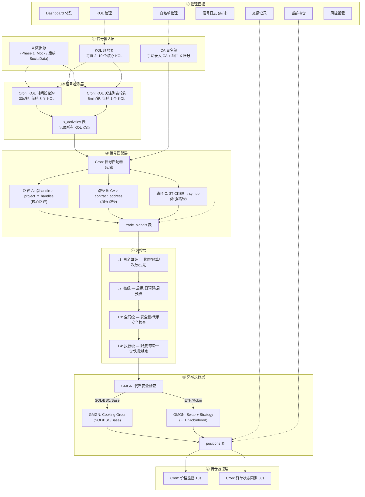
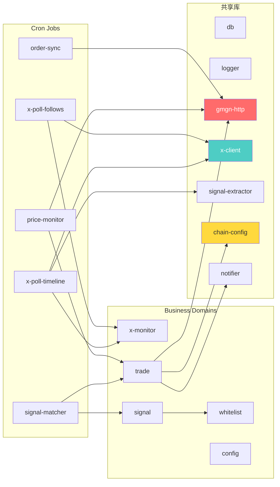
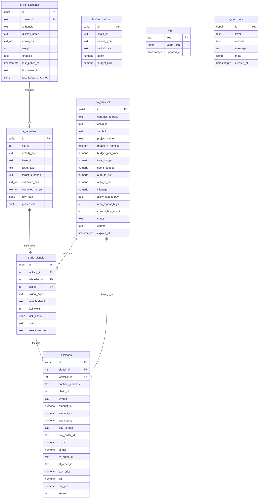

# PRD — MEME 右侧交易系统 v1.2

> **文档编号**: PRD-001
> **项目代号**: xbot
> **创建日期**: 2026-07-19
> **最后更新**: 2026-07-19 v1.2（合并团队评审反馈）
> **状态**: 📋 v1.2 待确认

---

## 目录

1. [产品概述](#1-产品概述)
2. [核心业务流程](#2-核心业务流程)
3. [系统架构](#3-系统架构)
4. [技术选型与工程标准](#4-技术选型与工程标准)
5. [数据库设计](#5-数据库设计)
6. [后端模块设计](#6-后端模块设计)
7. [前端页面设计](#7-前端页面设计)
8. [API 接口规范](#8-api-接口规范)
9. [风控体系](#9-风控体系)
10. [配置体系](#10-配置体系)
11. [日志与监控](#11-日志与监控)
12. [部署方案](#12-部署方案)
13. [分期实施计划](#13-分期实施计划)
14. [术语表](#14-术语表)

---

## 1. 产品概述

### 1.1 产品定位

基于 X（Twitter）核心 KOL 账号行为信号驱动的多链 MEME 代币右侧交易系统。

> [!IMPORTANT]
> **渐进式产品路线**：系统首先作为「右侧信号验证工具」运行——只记录信号、统计命中率、模拟收益，验证信号有效性和 API 可用性。在纸交易数据证明策略有效后，再开启小额自动买入。

**核心逻辑（一句话）**：

> 手动录入 CA 白名单（绑定项目方 X 账号）→ 监听 KOL 与项目方 X 账号的互动 → 信号记录与验证 → (验证通过后) 风控校验 → GMGN 自动买入 + 挂 TP/SL

**具体例子**：

```
你的操作：
  白名单录入: CA = FRBe...4vSp, 链 = SOL, 项目 X = @pepecoin

系统自动执行：
  监听 KOL @elonmusk 的所有动态
      ↓
  发现马斯克 关注/转发/回复/提及了 @pepecoin
      ↓
  查白名单: @pepecoin → 命中 CA FRBe...4vSp on SOL
      ↓
  风控通过 → GMGN 买入 0.5 SOL + 挂止盈 +100% / 止损 -20%
```

### 1.2 支持链

| 链 | GMGN 标识 | Gas 代币 | Swap | Cooking (买入+TP/SL) | KOL/SM Track |
|---|---|---|---|---|---|
| Solana | `sol` | SOL | ✅ | ✅ | ✅ |
| BSC | `bsc` | BNB | ✅ | ✅ | ✅ |
| Base | `base` | ETH | ✅ | ✅ | ❌ |
| Ethereum | `eth` | ETH | ✅ | ❌ | ✅ |
| Robinhood | `robinhood` | ETH (L2) | ✅ | ❌ | ❌ |

> **⚠️ ETH / Robinhood 不支持 Cooking**：需分步执行（先 swap 买入 → 再单独创建 strategy order 挂 TP/SL）。交易引擎根据链能力自动选择执行路径。

> **🔌 新链扩展**：架构采用数据驱动的链注册表设计，加新链 = 加一条配置，零代码改动（详见 §3.3）。

### 1.3 运行环境

| 环境 | 说明 |
|---|---|
| 开发 | Windows 本地 |
| 生产 | Linux VPS（后续部署） |
| 运行要求 | 7×24 不间断 |
| 用户模式 | 单用户（管理员通过 Web 面板操作） |

### 1.4 项目信息

| 项 | 值 |
|---|---|
| 项目代号 | **xbot** |
| 项目路径 | `D:\AI_Projects\xbot` |
| 数据库名 | `xbot` |
| 后端端口 | `3011` |
| 前端端口 | `5173`（Vite 默认） |
| GMGN 凭证 | 复用币安MEME交易项目现有 API Key + Private Key |
| X 数据源 | Phase 1 使用 mock 数据，后续接入 SocialData API 或 X API v2 |

---

## 2. 核心业务流程

### 2.1 全链路数据流



### 2.2 信号匹配逻辑（三路并行）

信号匹配是整个系统的核心决策点。设计为三条并行匹配路径，任一命中即触发：

#### 路径 A — @handle 互动匹配（核心路径）

```
KOL 产生任意活动（推文/转发/回复/关注）
    ↓
提取互动对象 @handle（来自 API 元数据，不需要解析文本）
    ├── 推文 @mention → 所有被 @提及的 handle
    ├── 转发 → 原作者 handle
    ├── 回复 → 被回复者 handle
    └── 关注 → 新关注的 handle
    ↓
查白名单: @handle ∈ ca_whitelist.project_x_handles ?
    ↓
命中 → 触发买入信号
```

**特点**：零误报，因为白名单中的 project_x_handles 是手动维护的精确映射。

#### 路径 B — CA 直接匹配（增强路径）

```
KOL 推文文本中出现合约地址
    ↓
正则提取:
    ├── EVM: /0x[0-9a-fA-F]{40}/g
    └── Solana: /\b[1-9A-HJ-NP-Za-km-z]{32,44}\b/g（需含大小写混合）
    ↓
查白名单: 提取的 CA ∈ ca_whitelist.contract_address ?
    ↓
命中 → 触发买入信号
```

**误报控制**：白名单最多几十条 CA，任何不在白名单中的 CA 自动丢弃。Solana Base58 误匹配（如 TX Hash）不会命中白名单。

#### 路径 C — 代币关键词匹配（增强路径）

```
KOL 推文文本中出现白名单 symbol 对应的关键词（例如 ANSEM，不要求 $ 前缀）
    ↓
按完整单词边界、不区分大小写匹配
    ↓
查白名单: 关键词 = ca_whitelist.symbol ?
    ↓
命中 → 触发买入信号（可能命中多链的同名 TICKER，各自独立评估）
```

**跨链歧义处理**：`$PEPE` 在 SOL 和 BSC 上可能是不同的白名单条目，匹配后各自独立走风控，用各自的预算。

#### 三路合并匹配 SQL

```sql
SELECT DISTINCT ON (contract_address, chain_id) *
FROM ca_whitelist
WHERE status = 'active'
  AND (
    $1 = ANY(project_x_handles)           -- 路径 A: handle
    OR contract_address = ANY($2::text[])  -- 路径 B: CA
    OR UPPER(symbol) = ANY($3::text[])     -- 路径 C: 代币关键词
  )
```

### 2.3 活动检测详细流程

#### 2.3.1 推文/转发/回复检测（x-poll-timeline）

```
Cron 每 30 秒触发
    ↓
读取所有 enabled 的 KOL 账号，按 last_polled_at 排序（最久未刷新优先）
    ↓
每轮最多轮询 3 个 KOL（控制 API rate）
    ↓
调用 X 数据源获取该 KOL 的最新推文（since_id = last_tweet_id）
    ↓
对每条推文:
    ├── 从 API 元数据提取 target_handles（被 @mention / 转发来源 / 回复对象）
    ├── 判断 activity_type: tweet / retweet / quote / reply
    ├── 从推文文本提取 CA，并匹配白名单 symbol 关键词（增强路径）
    └── 写入 x_activities 表（processed = false）
    ↓
更新 KOL 的 last_polled_at 和 last_tweet_id
```

#### 2.3.2 关注变化检测（x-poll-follows）

```
Cron 每 5 分钟触发
    ↓
选择 1 个 KOL（轮询最久未检查的）
    ↓
获取 KOL 当前关注列表
    ↓
与 last_follow_snapshot 做 diff
    ↓
新增关注:
    ├── activity_type = 'follow'
    ├── target_x_handle = 新关注的 @handle
    └── 写入 x_activities 表
    ↓
更新 last_follow_snapshot
```

### 2.4 交易执行详细流程

```
信号通过四层风控
    ↓
读取白名单配置: budget_per_trade / auto_tp_pct / auto_sl_pct / slippage
    ↓
GMGN 代币安全检查:
    ├── is_honeypot == false     → 否则 reject: HONEYPOT_DETECTED
    ├── buy_tax < 阈值           → 否则 reject: HIGH_BUY_TAX
    └── sell_tax < 阈值          → 否则 reject: HIGH_SELL_TAX
    ↓
根据链能力选择执行路径:
    ┌─ SOL / BSC / Base（支持 Cooking）
    │   └── GMGN Cooking Order:
    │       ├── swap 买入
    │       └── 同时挂 TP/SL 条件单
    │
    └─ ETH / Robinhood（不支持 Cooking）
        ├── Step 1: GMGN Swap 买入
        ├── Step 2: 轮询确认订单成交
        └── Step 3: GMGN Strategy Create 挂 TP/SL
    ↓
成功:
    ├── 创建 position 记录（status = 'open'）
    ├── 更新白名单: spent_budget += amount, current_buy_count++
    ├── 更新 budget_tracking 日/周预算
    ├── WebSocket 广播 'trade:executed'
    └── (预留) TG 通知
    ↓
失败:
    ├── 记录错误原因 → position.status = 'failed'
    ├── 连续失败计数 +1
    ├── 连续 3 次失败 → 锁定该 CA（REJECT_COOLDOWN）
    └── WebSocket 广播 'trade:failed'
```

---

## 3. 系统架构

### 3.1 项目目录结构

```
D:\AI_Projects\xbot\
│
├── docs/                                    # 知识库
│   ├── ENGINEERING_LOG.md                   # 工程日志
│   ├── DOCS_DIRECTORY_RULES.md
│   ├── 00_系统架构与全局设计/
│   │   └── PRD-MEME右侧交易系统.md          # 本文档
│   ├── 01_X监控与信号/
│   ├── 02_交易引擎/
│   ├── 03_前端面板/
│   ├── 04_部署与运维/
│   └── 05_参考资料/
│       └── gmgn-skills/                     # GMGN 官方文档（已克隆）
│
├── backend/
│   ├── .env                                 # 环境变量（.gitignore）
│   ├── .env.example                         # 环境变量模板
│   ├── package.json
│   ├── server.js                            # Express + WS + Cron 编排
│   ├── cron.json                            # Cron 任务配置
│   │
│   ├── domains/                             # 业务领域模块
│   │   ├── whitelist/                       # CA 白名单 CRUD
│   │   │   ├── routes.js
│   │   │   ├── service.js
│   │   │   └── queries.js
│   │   ├── x-monitor/                       # X 活动监控
│   │   │   ├── routes.js
│   │   │   ├── service.js
│   │   │   └── queries.js
│   │   ├── signal/                          # 信号匹配 + 风控
│   │   │   ├── matcher.js
│   │   │   ├── risk-manager.js
│   │   │   └── queries.js
│   │   ├── trade/                           # 交易执行 + 持仓
│   │   │   ├── routes.js
│   │   │   ├── trade-engine.js
│   │   │   ├── price-monitor.js
│   │   │   ├── config.js
│   │   │   └── queries.js
│   │   ├── config/                          # 全局配置
│   │   │   ├── routes.js
│   │   │   └── service.js
│   │   └── system/                          # 健康/日志/统计
│   │       └── routes.js
│   │
│   ├── jobs/                                # Cron 定时任务
│   │   ├── x-poll-timeline.js               # KOL 推文轮询
│   │   ├── x-poll-follows.js                # KOL 关注检测
│   │   ├── signal-matcher.js                # 信号匹配触发
│   │   ├── price-monitor.js                 # 持仓价格监控
│   │   ├── order-sync.js                    # GMGN 订单同步
│   │   └── budget-reset.js                  # 日/周预算重置
│   │
│   ├── lib/                                 # 公共基础库
│   │   ├── db.js                            # PostgreSQL 连接池
│   │   ├── logger.js                        # 结构化日志
│   │   ├── gmgn-http.js                     # GMGN OpenAPI 直连
│   │   ├── x-client.js                      # X 数据客户端（可切换实现）
│   │   ├── signal-extractor.js              # 推文 CA/$TICKER 提取
│   │   ├── chain-config.js                  # 多链注册表
│   │   └── notifier.js                      # 通知抽象层（TG 预留）
│   │
│   ├── db/
│   │   ├── init.sql                         # 建表 DDL
│   │   ├── seed.sql                         # 初始数据
│   │   └── migrations/
│   │
│   └── scripts/
│       ├── check-env.js                     # 启动环境检查
│       └── gen-keys.js                      # Ed25519 密钥生成
│
├── frontend/
│   ├── package.json
│   ├── vite.config.ts
│   ├── tsconfig.json
│   ├── index.html
│   └── src/
│       ├── App.tsx                           # 路由 + 布局
│       ├── main.tsx
│       ├── index.css                         # 设计系统
│       ├── lib/
│       │   ├── api.ts                        # API 客户端
│       │   ├── types.ts                      # TypeScript 类型
│       │   └── utils.ts
│       ├── components/
│       │   ├── Layout.tsx                    # 侧边栏布局
│       │   ├── Dashboard.tsx                 # 总览
│       │   ├── WhitelistPage.tsx             # 白名单管理
│       │   ├── KolPage.tsx                   # KOL 管理
│       │   ├── SignalLog.tsx                 # 信号日志
│       │   ├── TradeLog.tsx                  # 交易记录
│       │   ├── PositionsPage.tsx             # 当前持仓
│       │   ├── SettingsPage.tsx              # 设置
│       │   └── ui/                           # 可复用组件
│       │       ├── StatusBadge.tsx
│       │       ├── ChainIcon.tsx
│       │       ├── DataTable.tsx
│       │       ├── Modal.tsx
│       │       ├── Toast.tsx
│       │       └── ProgressBar.tsx
│       └── hooks/
│           ├── useWebSocket.ts
│           └── useApi.ts
│
├── private_key.pem                          # GMGN Ed25519 私钥（.gitignore）
├── public_key.pem
└── .gitignore
```

### 3.2 模块依赖关系



### 3.3 多链扩展架构

**设计原则：加新链 = 加一条配置，零代码改动。**

```javascript
// lib/chain-config.js — 链注册表（数据驱动）

const CHAIN_REGISTRY = {
  sol: {
    name: 'Solana',
    gmgnId: 'sol',
    nativeToken: 'So11111111111111111111111111111111111111112',
    nativeSymbol: 'SOL',
    decimals: 9,
    addressFormat: 'base58',       // 'base58' | 'evm'
    walletEnvKey: 'WALLET_SOL',    // .env 中对应的钱包地址 key
    capabilities: {
      swap: true,
      cooking: true,               // 一键买入+TP/SL
      strategyOrder: true,
      kolTrack: true,
      smartMoneyTrack: true,
    },
    color: '#9945ff',
  },
  bsc: {
    name: 'BSC', gmgnId: 'bsc', nativeSymbol: 'BNB', decimals: 18,
    addressFormat: 'evm', walletEnvKey: 'WALLET_EVM',
    capabilities: { swap: true, cooking: true, strategyOrder: true, kolTrack: true, smartMoneyTrack: true },
    color: '#f3ba2f',
  },
  base: {
    name: 'Base', gmgnId: 'base', nativeSymbol: 'ETH', decimals: 18,
    addressFormat: 'evm', walletEnvKey: 'WALLET_EVM',
    capabilities: { swap: true, cooking: true, strategyOrder: true, kolTrack: false, smartMoneyTrack: false },
    color: '#0052ff',
  },
  eth: {
    name: 'Ethereum', gmgnId: 'eth', nativeSymbol: 'ETH', decimals: 18,
    addressFormat: 'evm', walletEnvKey: 'WALLET_EVM',
    capabilities: { swap: true, cooking: false, strategyOrder: true, kolTrack: true, smartMoneyTrack: true },
    color: '#627eea',
  },
  robinhood: {
    name: 'Robinhood', gmgnId: 'robinhood', nativeSymbol: 'ETH', decimals: 18,
    addressFormat: 'evm', walletEnvKey: 'WALLET_EVM',
    capabilities: { swap: true, cooking: false, strategyOrder: true, kolTrack: false, smartMoneyTrack: false },
    color: '#00c805',
  },
}

// ── 公开接口 ──
function getChain(chainId) {}               // 获取链配置
function getAllChains() {}                   // 所有已注册链
function getEnabledChains() {}              // 结合数据库 config 的启用链
function supportsCapability(chainId, cap) {} // 判断链能力
function getWalletAddress(chainId) {}       // 从 .env 读对应钱包
function getNativeTokenAddress(chainId) {}  // 原生代币地址
function formatAmount(chainId, humanAmount) {} // 人类可读金额 → 最小单位
```

**加新链操作清单**（以 Monad 为例）：

| 步骤 | 操作 | 改动范围 |
|---|---|---|
| 1 | `chain-config.js` CHAIN_REGISTRY 加 `monad` 条目 | 唯一代码改动 |
| 2 | `.env` 加 `WALLET_MONAD=xxx`（如果需要新格式钱包） | 配置 |
| 3 | 数据库 `config` 表 chain_configs 加 monad 预算参数 | 数据 |
| 4 | 前端自动出现（从 API 动态加载链列表） | 无需改动 |

**非 GMGN 链预留**：

```javascript
// 链配置中标记 tradeAdapter = 'custom'
// 未来实现 lib/adapters/custom-adapter.js，接口与 gmgn-http.js 对齐
```

---

## 4. 技术选型与工程标准

### 4.1 技术栈

| 层 | 选型 | 版本 | 理由 |
|---|---|---|---|
| 运行时 | Node.js | 22 LTS | 现有项目统一 |
| HTTP 框架 | Express | 4.x | 复用币安/PM 项目 |
| 数据库 | PostgreSQL | 18 | 本地已安装 |
| DB 驱动 | pg | 8.x | 现有项目统一 |
| 定时调度 | node-cron | 3.x | cron.json 配置化 |
| WebSocket | ws | 8.x | 复用币安项目 broadcast |
| 前端框架 | React | 19.x | 复用现有项目 |
| 构建工具 | Vite | 6.x | 复用现有项目 |
| 前端语言 | TypeScript | 5.x | 类型安全 |
| 样式 | Vanilla CSS | — | 自定义设计系统 |
| 安全中间件 | helmet + cors | latest | 复用 PM 项目 |
| GMGN 交易 | HTTP 直连 + Ed25519 | — | 币安项目 P32 证明比 CLI 快 38% |
| X 数据 | 可插拔（Mock → SocialData → X API） | — | 抽象接口，运行时切换 |

### 4.2 X 数据源方案（决策记录）

Phase 1 使用 **mock 数据** 开发全链路，后续根据需求选择接入方案：

| 方案 | 性质 | 月成本 | 延迟 | 50 KOL 可行性 |
|---|---|---|---|---|
| **Mock 数据** | 开发用 | $0 | 即时 | ✅ Phase 1 |
| **SocialData API** | 第三方聚合 | ~$30~90 | 5~30s | ✅ 推荐 Phase 2 |
| **X API v2 Basic** | X 官方 | $200/月 | 2~5min | ⚠️ 10K 推文/月限额不够 |
| **X API v2 Pro** | X 官方 | $5,000/月 | ~3s 实时流 | ✅ 最佳，但贵 |

> **SocialData（socialdata.tools）不是 X 官方 API**，是一个第三方数据服务，按量付费 $0.0002/条，无月费。
>
> 代码层面通过 `x-client.js` 抽象接口，切换数据源只需改一行配置，不影响业务逻辑。

### 4.3 后端编码标准

#### 命名规范

| 场景 | 格式 | 示例 |
|---|---|---|
| 文件名 | kebab-case | `trade-engine.js`, `x-client.js` |
| 变量/函数 | camelCase | `tradingConfig`, `openPosition()` |
| 常量 | UPPER_SNAKE_CASE | `MAX_RETRIES`, `REJECT_COOLDOWN_MS` |
| 数据库字段 | snake_case | `contract_address`, `chain_id` |
| API 路由 | kebab-case | `/api/whitelist`, `/api/x-monitor` |

#### 错误处理（零静默失败）

```javascript
// ✅ 每个 catch 必须有日志或重新抛出
try {
  await gmgnHttp.swap(params)
} catch (err) {
  logger.error('trade-engine', `Swap failed: ${err.message}`, { chain, ca, stack: err.stack })
  throw new TradeExecutionError(symbol, chainId, err.message)
}

// ❌ 禁止
try { doSomething() } catch (e) {}
```

#### SQL 标准

```javascript
// ✅ 参数化查询
await query('SELECT * FROM ca_whitelist WHERE chain_id = $1 AND status = $2', [chainId, 'active'])

// ❌ 禁止字符串拼接
await query(`SELECT * FROM ca_whitelist WHERE chain_id = '${chainId}'`)
```

#### API 响应标准

```javascript
// 成功
{ "ok": true, "data": { ... } }
{ "ok": true, "data": [...], "total": 42, "page": 1, "pageSize": 20 }

// 失败
{ "ok": false, "error": "具体描述", "code": "BUDGET_EXCEEDED" }
```

### 4.4 前端编码标准

#### CSS 设计系统 Tokens

```css
:root {
  /* 颜色 */
  --color-bg-primary: #0a0a0f;
  --color-bg-card: #1a1a2e;
  --color-text-primary: #e8e8f0;
  --color-text-secondary: #8888a0;
  --color-accent: #6c5ce7;
  --color-success: #00d68f;
  --color-danger: #ff4757;
  --color-warning: #ffa502;

  /* 链颜色 */
  --color-chain-sol: #9945ff;
  --color-chain-bsc: #f3ba2f;
  --color-chain-base: #0052ff;
  --color-chain-eth: #627eea;
  --color-chain-robin: #00c805;

  /* 间距 / 圆角 / 字体 */
  --space-sm: 8px; --space-md: 16px; --space-lg: 24px;
  --radius-md: 10px;
  --font-sans: 'Inter', sans-serif;
  --font-mono: 'JetBrains Mono', monospace;
  --transition-normal: 250ms ease;
}
```

#### TypeScript 核心类型

```typescript
type ChainId = 'sol' | 'bsc' | 'base' | 'eth' | 'robinhood'
type ActivityType = 'tweet' | 'retweet' | 'quote' | 'reply' | 'follow'
type SignalStatus = 'pending' | 'approved' | 'rejected' | 'executed' | 'expired'
type PositionStatus = 'pending' | 'open' | 'tp_hit' | 'sl_hit' | 'manual_close' | 'failed'
type SignalType = 'handle_match' | 'ca_mention' | 'ticker_mention'

interface WhitelistEntry { id: number; contract_address: string; chain_id: ChainId; symbol: string | null; project_name: string | null; project_x_handles: string[]; budget_per_trade: number; total_budget: number; spent_budget: number; auto_tp_pct: number; auto_sl_pct: number; slippage: number; allow_repeat_buy: boolean; max_repeat_buys: number; current_buy_count: number; status: 'active' | 'paused' | 'exhausted' | 'expired'; source: 'manual' | 'semi-auto'; expires_at: string | null; }

interface KolAccount { id: number; x_handle: string; display_name: string | null; chain_ids: ChainId[]; weight: number; enabled: boolean; last_polled_at: string | null; }

interface XActivity { id: number; kol_id: number; kol_handle: string; activity_type: ActivityType; tweet_text: string | null; target_x_handle: string | null; extracted_cas: string[]; extracted_tickers: string[]; processed: boolean; created_at: string; }

interface TradeSignal { id: number; activity_id: number; whitelist_id: number; kol_handle: string; signal_type: SignalType; match_detail: string; kol_weight: number; risk_check: Record<string, boolean>; status: SignalStatus; reject_reason: string | null; }

interface Position { id: number; contract_address: string; chain_id: ChainId; symbol: string | null; amount_in: number; entry_price: number | null; tp_pct: number | null; sl_pct: number | null; pnl: number | null; pnl_pct: number | null; status: PositionStatus; opened_at: string | null; }
```

---

## 5. 数据库设计

### 5.1 ER 关系图



### 5.2 唯一约束（防重复成交）

> [!CAUTION]
> 自动交易系统中，Cron 重叠或重试可能导致同一信号重复买入。以下唯一约束是**生产级必须**。

```sql
-- 同一 activity + 白名单 + 信号类型 只能产生一条信号（防重复匹配）
ALTER TABLE trade_signals
  ADD CONSTRAINT uq_signal_per_activity
  UNIQUE (activity_id, whitelist_id, signal_type);

-- 同一信号只能开一个仓位（防重复成交）
ALTER TABLE positions
  ADD CONSTRAINT uq_position_per_signal
  UNIQUE (signal_id);

-- 同一 CA + 链只能有一条 active 白名单（防录入重复）
CREATE UNIQUE INDEX uq_whitelist_ca_chain_active
  ON ca_whitelist(contract_address, chain_id)
  WHERE status = 'active';

-- 预算周期唯一（防重复插入预算记录）
ALTER TABLE budget_tracking
  ADD CONSTRAINT uq_budget_period
  UNIQUE (chain_id, period_type, period_key);
```

### 5.3 事务安全（预算扣减 + 开仓原子性）

```javascript
// trade-engine.js — 开仓必须在事务中完成
async function openPosition(params) {
  const client = await pool.connect()
  try {
    await client.query('BEGIN')

    // 1. 行锁白名单记录（防并发扣减）
    const { rows: [wl] } = await client.query(
      'SELECT * FROM ca_whitelist WHERE id = $1 FOR UPDATE',
      [params.whitelistId]
    )

    // 2. 行锁预算记录
    await client.query(
      `SELECT * FROM budget_tracking
       WHERE chain_id = $1 AND period_type = 'daily' AND period_key = $2
       FOR UPDATE`,
      [params.chainId, todayKey()]
    )

    // 3. 再次校验预算（事务内重检）
    if (wl.spent_budget + amount > wl.total_budget) {
      throw new RiskError('WL_BUDGET_EXCEEDED')
    }

    // 4. 执行 GMGN 交易
    const result = await gmgnHttp.swap(swapParams)

    // 5. 插入 position（唯一约束防重复）
    await client.query(
      'INSERT INTO positions (signal_id, ...) VALUES ($1, ...)',
      [params.signalId, ...]
    )

    // 6. 扣减预算
    await client.query(
      'UPDATE ca_whitelist SET spent_budget = spent_budget + $1, current_buy_count = current_buy_count + 1 WHERE id = $2',
      [amount, params.whitelistId]
    )

    await client.query('COMMIT')
    return result
  } catch (err) {
    await client.query('ROLLBACK')
    throw err
  } finally {
    client.release()
  }
}
```

### 5.4 索引策略

```sql
CREATE INDEX idx_whitelist_chain_status ON ca_whitelist(chain_id, status);
CREATE INDEX idx_whitelist_ca_chain ON ca_whitelist(contract_address, chain_id);
CREATE INDEX idx_activities_unprocessed ON x_activities(processed) WHERE processed = FALSE;
CREATE INDEX idx_activities_created ON x_activities(created_at DESC);
CREATE INDEX idx_signals_status ON trade_signals(status);
CREATE INDEX idx_positions_status ON positions(status);
CREATE INDEX idx_positions_chain ON positions(chain_id, status);
CREATE INDEX idx_budget_chain_period ON budget_tracking(chain_id, period_type, period_key);
CREATE INDEX idx_logs_module_created ON system_logs(module, created_at DESC);
```

---

## 6. 后端模块设计

### 6.1 lib/gmgn-http.js — GMGN HTTP 直连客户端

**设计原则**（复用币安项目 P32 教训）：

| 原则 | 说明 |
|---|---|
| HTTP 直连 | 不走 CLI 子进程，提速 38% |
| Ed25519 签名 | `message = {path}:{query}:{body}:{timestamp}` |
| 令牌桶限流 | OpenAPI 1 req/s，交易 20 req/s |
| 429 不重试 | 直接报错 + 记录冷却时间 |
| 强制 IPv4 | GMGN 不支持 IPv6 |

**公开方法**：

| 方法 | 用途 |
|---|---|
| `getTokenInfo(chain, ca)` | 代币基础信息 |
| `getTokenSecurity(chain, ca)` | 安全检查（蜜罐/税率） |
| `swap(params)` | 市价单买卖 |
| `cooking(params)` | 买入 + TP/SL 一体（仅 SOL/BSC/Base） |
| `createStrategyOrder(params)` | 创建止盈/止损单 |
| `getOrderStatus(chain, orderId)` | 查询订单状态 |
| `cancelOrder(chain, from, orderId)` | 取消策略单 |
| `getGasPrice(chain)` | 实时 Gas |
| `getPortfolioInfo()` | API Key 绑定钱包 |

### 6.2 lib/x-client.js — X 数据客户端

**可插拔设计**：通过环境变量 `X_DATA_PROVIDER` 切换实现。

```javascript
// 统一接口
class XClient {
  async getUserTimeline(handle, sinceId)  // → Tweet[]
  async getUserFollowing(handle)           // → string[] (@handles)
  async getUserProfile(handle)             // → UserProfile
}

// 实现:
//   X_DATA_PROVIDER=mock    → MockXClient（Phase 1 开发用）
//   X_DATA_PROVIDER=socialdata → SocialDataClient（Phase 2）
//   X_DATA_PROVIDER=xapi    → XApiClient（可选）
```

### 6.3 lib/signal-extractor.js — CA/$TICKER 提取

```javascript
// 10 行核心代码，白名单自动消除误报

function extractFromText(text) {
  // EVM CA: 0x + 40 位十六进制
  const evmCas = [...text.matchAll(/0x[0-9a-fA-F]{40}/g)].map(m => m[0])

  // Solana CA: 32~44 位 Base58（必须混合大小写，排除纯词）
  const solCas = [...text.matchAll(/\b[1-9A-HJ-NP-Za-km-z]{32,44}\b/g)]
    .map(m => m[0])
    .filter(s => /[A-Z]/.test(s) && /[a-z]/.test(s))

  // $TICKER
  const tickers = [...text.matchAll(/\$([A-Z]{1,10})\b/g)].map(m => m[1])

  return {
    cas: [...new Set([...evmCas, ...solCas])],
    tickers: [...new Set(tickers)],
  }
}
```

> **为什么不需要复杂的误报处理？** 因为提取结果直接与白名单碰撞。白名单最多几十条 CA，任何不在白名单中的 CA 自动丢弃。

### 6.4 lib/notifier.js — 通知抽象层（TG 预留）

```javascript
// Phase 1: console.log 输出
// Phase 2: 接入 TG Bot

class Notifier {
  async tradeExecuted(position) {}   // 开仓通知
  async tradeFailed(signal, error) {} // 交易失败通知
  async tpHit(position) {}           // 止盈命中
  async slHit(position) {}           // 止损命中
  async budgetWarning(chain, pct) {} // 预算警告
}
```

### 6.5 Cron 任务配置

```json
[
  {
    "id": "x-poll-timeline",
    "name": "X 时间线轮询",
    "schedule": "*/30 * * * * *",
    "handler": "jobs/x-poll-timeline.js",
    "enabled": true,
    "timeout": 25
  },
  {
    "id": "x-poll-follows",
    "name": "X 关注列表轮询",
    "schedule": "0 */5 * * * *",
    "handler": "jobs/x-poll-follows.js",
    "enabled": true,
    "timeout": 30
  },
  {
    "id": "signal-matcher",
    "name": "信号匹配器",
    "schedule": "*/5 * * * * *",
    "handler": "jobs/signal-matcher.js",
    "enabled": true,
    "timeout": 10
  },
  {
    "id": "price-monitor",
    "name": "持仓价格监控",
    "schedule": "*/10 * * * * *",
    "handler": "jobs/price-monitor.js",
    "enabled": true,
    "timeout": 15
  },
  {
    "id": "order-sync",
    "name": "订单状态同步",
    "schedule": "*/30 * * * * *",
    "handler": "jobs/order-sync.js",
    "enabled": true,
    "timeout": 20
  },
  {
    "id": "budget-reset",
    "name": "预算重置",
    "schedule": "0 0 0 * * *",
    "handler": "jobs/budget-reset.js",
    "enabled": true,
    "timeout": 5
  }
]
```

### 6.6 复用币安项目的架构模式

| 模式 | 来源 | 说明 |
|---|---|---|
| `safeRun()` 互斥锁 | server.js | 同一 Cron 上轮未完成则跳过 |
| 全局冷静期 60s | server.js | 启动后不立即执行 Cron |
| cron.json 配置化 | cron.json | 可热切换 enabled |
| 启动安全锁 arm/disarm | trade-signal-matcher.js | 重启后默认锁定 |
| 拒绝冷却 Map | trade-signal-matcher.js | 被拒 CA 冷却 10 分钟 |
| WebSocket broadcast | server.js | 实时推送前端 |
| 结构化 logger | lib/logger.js | 模块化日志 |
| HTTP 直连替代 CLI | P32 baw-client.js | 适配为 gmgn-http.js |

---

## 7. 前端页面设计

### 7.1 整体布局

```
┌──────────────────────────────────────────────────────────┐
│ xbot                                     🔒 Locked  ⚙️   │
├──────────┬───────────────────────────────────────────────┤
│          │                                               │
│ 📊 总览   │                                               │
│ 📋 白名单  │              Main Content Area                │
│ 👤 KOL    │              (Router Outlet)                  │
│ 📡 信号    │                                               │
│ 💰 交易    │                                               │
│ 📈 持仓    │                                               │
│ ⚙️ 设置    │                                               │
│          │                                               │
└──────────┴───────────────────────────────────────────────┘
```

### 7.2 Dashboard 总览

**数据卡片**（4 列）：今日信号数 | 今日交易数 | 活跃持仓 | 总 PnL

**预算消耗**：每条链一行进度条（绿→黄→红）

**实时信号流**：最近 20 条信号（WebSocket 推送）

**最近交易**：最近 10 笔交易

### 7.3 WhitelistPage 白名单管理

- 顶部：`+ 添加白名单` + 链筛选 tabs + 状态筛选 + 搜索
- 表格列：链 | 代币 | 项目名 | 项目 X | 单笔 | 总预算(进度条) | TP/SL | 买入次数 | 状态 | 操作
- 添加 Modal：CA / 链 / 项目名 / 项目 X 账号 / 交易参数 / 重复买入设置

### 7.4 KolPage KOL 管理

- 表格列：头像 | @Handle | 显示名 | 关联链 | 权重(1~10) | 最近活动 | 启用toggle | 操作

### 7.5 SignalLog 信号日志（实时推送）

- 筛选：链 | 信号类型(handle/CA/ticker) | 状态 | 时间
- 每条卡片：KOL 信息 + 活动类型 + 匹配详情 + 风控结果 + 原文

### 7.6 TradeLog 交易记录

- 表格：时间 | 链 | 代币 | 方向 | 金额 | 价格 | TX Hash | PnL | 触发 KOL | 状态
- 支持分页 + CSV 导出

### 7.7 PositionsPage 当前持仓

- 仅显示 `status = 'open'`
- 每个仓位卡片：入场价 / 当前价 / PnL% / TP 进度条 / 触发 KOL
- 操作：卖出 25% | 卖出 50% | 全部卖出

### 7.8 SettingsPage 设置

设置页固定按用户任务分成三个视图，不再按照后端模块追加卡片：

| 视图 | 内容 |
|---|---|
| 交易 | 真实交易启动/停止、失败后自动重试单开关、白名单派生范围摘要 |
| 运行状态 | GMGN、6551、五链可交易状态；正常只显示摘要，诊断详情默认折叠 |
| 系统维护 | API Key、RPC、数据库、管理员口令、告警测试和凭据轮换 |

白名单拥有 CA、链、金额、次数、滑点、TP/SL 和 X 关系事件的唯一配置权。设置页不得建立第二套业务参数。新链诊断、限时实盘验收和生产批准不提供前端入口。

### 7.9 维护工具产品边界

维护工具不是日常产品功能，默认只提供后端或 CLI 入口。其长期清单、调用条件和副作用以 [`maintenance_tool_registry.md`](./maintenance_tool_registry.md) 为准。

1. 新链首次接入使用只读诊断、单白名单限时验收和生产批准；完成后前端不保留验收卡片。
2. 钱包隔离解除和链熔断重置只在真实异常存在时显示，恢复后自动退出界面。
3. 6551 Watch 正常由 Outbox 自动同步；人工 `watch-apply` 仅作为后台补偿工具。
4. 所有涉及资金范围、凭据或生产批准的维护动作必须要求 `ADMIN_TOKEN`、显式确认和审计记录。
5. 新增维护工具必须先登记，不得通过新增设置卡片规避产品评审。

---

## 8. API 接口规范

### 8.1 REST API

#### 白名单

| 方法 | 路径 | 功能 |
|---|---|---|
| `GET` | `/api/whitelist` | 列表（?chain_id, ?status, ?search, ?page, ?pageSize） |
| `GET` | `/api/whitelist/:id` | 详情 |
| `POST` | `/api/whitelist` | 创建 |
| `PUT` | `/api/whitelist/:id` | 更新 |
| `PATCH` | `/api/whitelist/:id/status` | 更新状态 |
| `DELETE` | `/api/whitelist/:id` | 删除 |
| `POST` | `/api/whitelist/batch-import` | 批量导入 |

#### KOL 管理

| 方法 | 路径 | 功能 |
|---|---|---|
| `GET` | `/api/kol` | 列表 |
| `POST` | `/api/kol` | 创建 |
| `PUT` | `/api/kol/:id` | 更新 |
| `PATCH` | `/api/kol/:id/toggle` | 启用/禁用 |
| `DELETE` | `/api/kol/:id` | 删除 |
| `GET` | `/api/kol/:id/activities` | 该 KOL 最近活动 |

#### X 监控

| 方法 | 路径 | 功能 |
|---|---|---|
| `GET` | `/api/x-monitor/activities` | 活动列表 |
| `GET` | `/api/x-monitor/status` | 监控状态 |
| `POST` | `/api/x-monitor/poll-now` | 手动触发轮询 |

#### 信号

| 方法 | 路径 | 功能 |
|---|---|---|
| `GET` | `/api/signals` | 信号列表 |
| `GET` | `/api/signals/stats` | 信号统计 |

#### 交易

| 方法 | 路径 | 功能 |
|---|---|---|
| `GET` | `/api/trade/positions` | 持仓列表 |
| `POST` | `/api/trade/positions/:id/close` | 手动平仓（body: { percent }） |
| `GET` | `/api/trade/history` | 交易历史 |
| `GET` | `/api/trade/history/export` | 导出 CSV |
| `GET` | `/api/trade/stats` | 交易统计 |

#### 配置

| 方法 | 路径 | 功能 |
|---|---|---|
| `GET` | `/api/config/:key` | 读取配置 |
| `PUT` | `/api/config/:key` | 更新配置 |
| `GET` | `/api/config/chains` | 所有链配置 |
| `PUT` | `/api/config/chains/:chainId` | 更新链配置 |

#### 系统

| 方法 | 路径 | 功能 |
|---|---|---|
| `GET` | `/api/health` | 健康检查 |
| `GET` | `/api/system/dashboard` | Dashboard 聚合数据 |
| `POST` | `/api/system/arm` | 解锁引擎 |
| `POST` | `/api/system/disarm` | 锁定引擎 |
| `GET` | `/api/system/engine-status` | 引擎状态 |
| `GET` | `/api/system/budgets` | 各链预算 |

### 8.2 管理员维护接口

| 方法 | 路径 | 用途 | 日常前端 |
|---|---|---|---|
| `POST` | `/api/trade/chains/:chain/diagnose` | 新链只读诊断与证据生成 | 无 |
| `POST` | `/api/trade/chains/:chain/acceptance/start` | 开启最长 30 分钟、单白名单验收作用域 | 无 |
| `POST` | `/api/trade/acceptance/finish` | 结束或取消验收作用域 | 无 |
| `POST` | `/api/trade/chains/:chain/approve` | 根据完整证据批准新链生产交易 | 无 |
| `POST` | `/api/x-monitor/6551/watch-apply` | 自动 Watch 同步失败后的人工补偿 | 无写入按钮 |
| `POST` | `/api/trade/wallet-lanes/release` | 有证据地解除钱包写入隔离 | 仅异常时 |
| `POST` | `/api/trade/chain-circuits/:chain/reset` | 修复原因后重置链级失败熔断 | 仅异常时 |

以上接口不得复用为普通业务流程。详细前置条件、确认文本和审计要求见维护工具登记表。

### 8.3 WebSocket 事件

```
ws://localhost:3011/ws

signal:new        — 新活动检测到
signal:matched    — 信号匹配白名单
trade:executed    — 交易成功
trade:failed      — 交易失败
position:update   — 持仓价格更新
position:tp_hit   — 止盈命中
position:sl_hit   — 止损命中
budget:warning    — 预算接近上限
engine:status     — 引擎状态变更
cron:done         — Cron 任务完成
```

---

## 9. 风控体系

### 9.1 四层 24 项检查

> [!IMPORTANT]
> v1.2 新增 8 项实盘保护规则（#17~#24），覆盖日亏损熔断、持仓上限、流动性深度、滑点控制、部分成交、TP/SL 挂单失败等场景。

#### Layer 1 — 白名单级

| # | 检查项 | 拒绝码 | 说明 |
|---|---|---|---|
| 1 | status = 'active' | `WL_NOT_ACTIVE` | |
| 2 | spent_budget + amount ≤ total_budget | `WL_BUDGET_EXCEEDED` | |
| 3 | 重复买入次数 < max_repeat_buys | `WL_REPEAT_LIMIT` | |
| 4 | 未过期 | `WL_EXPIRED` | |
| **5** | **该 CA 上次买入 > ca_cooldown_min 分钟** | **`CA_BUY_COOLDOWN`** | **v1.2 新增：防同一 CA 短时间连续买入（默认 30 分钟）** |

#### Layer 2 — 链级

| # | 检查项 | 拒绝码 | 说明 |
|---|---|---|---|
| 6 | 链已启用 | `CHAIN_DISABLED` | |
| 7 | 日预算未超限 | `DAILY_BUDGET_EXCEEDED` | |
| 8 | 周预算未超限 | `WEEKLY_BUDGET_EXCEEDED` | |
| 9 | amount ≤ max_per_trade | `TRADE_TOO_LARGE` | |
| **10** | **该链活跃持仓数 < max_open_positions** | **`MAX_POSITIONS_REACHED`** | **v1.2 新增：每链最大同时持仓（默认 5）** |
| **11** | **今日该链已实现亏损 < daily_loss_limit** | **`DAILY_LOSS_BREAKER`** | **v1.2 新增：日亏损熔断（触发后锁定该链至次日）** |
| **12** | **连续亏损仓位 < consecutive_loss_limit** | **`CONSECUTIVE_LOSS_BREAKER`** | **v1.2 新增：连续亏损熔断（默认连续 5 笔亏损后锁定，需手动解锁）** |

#### Layer 3 — 全局级（代币安全）

| # | 检查项 | 拒绝码 | 说明 |
|---|---|---|---|
| 13 | 引擎已解锁 (armed) | `ENGINE_LOCKED` | |
| 14 | is_honeypot = false | `HONEYPOT_DETECTED` | |
| 15 | buy_tax < 阈值 | `HIGH_BUY_TAX` | |
| 16 | sell_tax < 阈值 | `HIGH_SELL_TAX` | |
| **17** | **流动性 ≥ min_liquidity_usd** | **`LOW_LIQUIDITY`** | **v1.2 新增：流动性深度不足拒绝买入（默认 $10,000）** |

#### Layer 4 — 执行级

| # | 检查项 | 拒绝码 | 说明 |
|---|---|---|---|
| 18 | API 限流余量 | `RATE_LIMITED` | |
| 19 | 本轮未开仓 | `ROUND_LIMIT` | |
| 20 | CA 连续执行失败 < 3 | `CA_FAILURE_LOCKED` | |
| 21 | CA 拒绝冷却 > 10min | `REJECT_COOLDOWN` | |
| **22** | **预估滑点 < max_slippage_pct** | **`SLIPPAGE_TOO_HIGH`** | **v1.2 新增：GMGN quote 返回的价格冲击超限则拒绝（默认 15%）** |

**检查结果完整记录于 `trade_signals.risk_check`（JSONB）**，前端可展示每项通过/失败。

### 9.2 交易异常处理（v1.2 新增）

> [!WARNING]
> 以下场景在 v1.1 中缺失，是实盘前必须解决的边界条件。

#### 部分成交处理

```
GMGN swap 返回结果
    ↓
检查实际成交量 vs 预期成交量:
    ├── 完全成交 (fill_ratio ≥ 95%) → 正常流程
    ├── 部分成交 (fill_ratio < 95%) → 记录实际成交量，position.amount_in = 实际值
    │   ├── TP/SL 条件单按实际持仓挂（sell_ratio_type = hold_amount）
    │   └── 预算扣减按实际消耗金额
    └── 完全失败 (fill_ratio = 0) → position.status = 'failed'
```

#### TP/SL 条件单挂单失败处理

```
Cooking 或 Strategy Create 返回
    ↓
检查 TP/SL 挂单状态:
    ├── 全部成功 → 正常
    ├── 部分失败 → 重试 1 次（间隔 3 秒）
    │   └── 仍然失败 → position.tp_order_id / sl_order_id = null
    │       ├── 标记 position.tpsl_status = 'partial' 或 'failed'
    │       ├── WebSocket 广播 'position:tpsl_failed'
    │       └── 通知（TG）：「⚠️ TP/SL 挂单失败，需手动处理」
    └── 全部失败 → 同上但 tpsl_status = 'failed'

前端 PositionsPage:
    ├── tpsl_status = 'ok' → 正常显示
    ├── tpsl_status = 'partial' → 黄色警告 ⚠️ + 「重新挂单」按钮
    └── tpsl_status = 'failed' → 红色警告 🔴 + 「重新挂单」按钮
```

#### 日亏损熔断机制

```
position 平仓（TP/SL/手动）
    ↓
计算已实现 PnL → 更新 daily_realized_pnl
    ↓
检查: daily_realized_pnl < -daily_loss_limit ?
    ├── 否 → 继续
    └── 是 → 触发熔断:
        ├── 该链 engine_status = 'loss_breaker'
        ├── 该链所有新信号自动 reject: DAILY_LOSS_BREAKER
        ├── 现有持仓不受影响（不强制平仓）
        ├── WebSocket 广播 'risk:daily_loss_breaker'
        └── 恢复方式: 次日自动重置 / 手动在设置页解锁
```

#### 连续亏损熔断机制

```
position 平仓且 PnL < 0
    ↓
consecutive_loss_count++ (内存计数器)
    ↓
consecutive_loss_count ≥ 阈值 (默认 5) ?
    ├── 否 → 继续
    └── 是 → 触发熔断:
        ├── 全局 engine armed → false
        ├── 所有链暂停自动交易
        └── 恢复方式: 仅手动解锁（Settings 页面）

position 平仓且 PnL ≥ 0
    ↓
consecutive_loss_count = 0 (重置)
```

---

## 10. 配置体系

### 10.1 环境变量 (.env)

```env
# ═══ xbot — 环境变量 ═══

# 服务端口
BACKEND_PORT=3011

# 数据库
DB_HOST=localhost
DB_PORT=5432
DB_NAME=xbot
DB_USER=pm_user
DB_PASSWORD=

# GMGN OpenAPI（复用旧项目凭证）
GMGN_API_KEY=
GMGN_PRIVATE_KEY=

# X 数据源
X_DATA_PROVIDER=mock
# SOCIALDATA_API_KEY=

# 链钱包地址
WALLET_SOL=
WALLET_EVM=

# 管理面板认证
ADMIN_TOKEN=

# TG 通知（预留）
# TG_BOT_TOKEN=
# TG_CHAT_ID=
```

### 10.2 数据库动态配置（config 表）

```javascript
// 链级配置
'chain_configs' → {
  "sol":  { "enabled": true,  "daily_budget": 5,  "weekly_budget": 20, "max_per_trade": 0.5, "default_tp_pct": 100, "default_sl_pct": 20, "default_slippage": 10 },
  "bsc":  { "enabled": true,  "daily_budget": 1,  "weekly_budget": 5,  ... },
  "base": { "enabled": true,  "daily_budget": 0.5, ... },
  "eth":  { "enabled": false, ... },
  "robinhood": { "enabled": false, ... }
}

// 全局风控
'risk_config' → {
  "security_check_enabled": true,
  "max_buy_tax": 5,
  "max_sell_tax": 10,
  "consecutive_failure_lock": 3,
  "reject_cooldown_ms": 600000,
  "min_liquidity_usd": 10000,
  "max_slippage_pct": 15,
  "consecutive_loss_limit": 5,
  "ca_cooldown_min": 30
}

// 链级风控（新增字段）
// 每个链配置中增加:
//   "max_open_positions": 5,
//   "daily_loss_limit": 2.0   // 单位为该链原生代币

// X 监控
'x_monitor_config' → {
  "timeline_poll_interval_sec": 30,
  "follows_poll_interval_min": 5,
  "max_kol_per_round": 3
}
```

---

## 11. 日志与监控

### 日志模块标识

```
x-poll          — X 轮询
signal-match    — 信号匹配
risk-manager    — 风控检查
trade-engine    — 交易执行
price-monitor   — 价格监控
gmgn-http       — GMGN API
x-client        — X 数据源
cron            — Cron 调度
```

### 日志级别

- `logger.info()` — 正常流程
- `logger.warn()` — 预期内异常
- `logger.error()` — 非预期异常（同步写入 system_logs 表）
- `logger.trade()` — 交易专用高亮（同步写入 system_logs 表）

---

## 12. 部署方案

### 本地开发

```bash
cd D:\AI_Projects\xbot
cd backend && npm install && npm run dev    # node --watch server.js → port 3011
cd frontend && npm install && npm run dev   # vite → port 5173
```

### VPS 部署（后续）

- PM2 进程管理
- Nginx 反向代理（API + WebSocket + 前端静态文件）
- pg_dump 每日备份

---

## 13. 分期实施计划

> [!IMPORTANT]
> **v1.2 重构**：采纳团队评审建议，从「建完就上线」改为「验证 → 记录 → 模拟 → 实盘」的渐进式路线。核心原则：**信号有效性和外部 API 可用性未被证明之前，不执行任何真实交易。**

### Phase 0 — 数据/交易可行性验证（1~2 天）

**目标**：证明外部依赖可用，排除技术死路。

- [ ] GMGN API 验证
  - [ ] `getTokenInfo` / `getTokenSecurity` 接口可调通
  - [ ] `order quote` 报价接口返回正常
  - [ ] SOL 链 swap 小额测试（0.001 SOL）
  - [ ] Cooking order 小额测试（SOL，含 TP/SL）
  - [ ] Strategy order 创建 + 取消测试
- [ ] X 数据源验证（SocialData API 或替代）
  - [ ] 注册 SocialData，拿到 API Key
  - [ ] 验证 `getUserTimeline` 能拿到推文
  - [ ] 验证 `getUserFollowing` 能拿到关注列表
  - [ ] 测算 50 个 KOL × 30s 轮询的月成本
  - [ ] 如果 SocialData 不可用，评估替代方案
- [ ] 产出：`docs/01_X监控与信号/P00-可行性验证报告.md`

> **Phase 0 Exit Criteria**：GMGN swap + TP/SL 全链路跑通，X 数据源能稳定获取 timeline + following。

### Phase 1 — 信号面板 + 白名单（3~4 天）

**目标**：搭建管理面板，接入真实 X 数据，**只记录信号不买入**。

- [ ] 项目初始化（backend Express + frontend React/Vite）
- [ ] 数据库 init.sql（含唯一约束 + 索引）
- [ ] server.js + Cron 编排 + WebSocket
- [ ] lib/（db, logger, chain-config, signal-extractor）
- [ ] lib/x-client.js（接入 Phase 0 验证通过的数据源）
- [ ] 白名单 CRUD（后端 + 前端页面）
- [ ] KOL 管理 CRUD（后端 + 前端页面）
- [ ] jobs/x-poll-timeline.js + x-poll-follows.js
- [ ] domains/signal/matcher.js（三路匹配，**只记录不执行**）
- [ ] 前端 Layout + 路由 + Dashboard 骨架
- [ ] 前端 SignalLog 页面（实时 WebSocket 推送）
- [ ] 配置管理（后端 + 前端设置页）
- [ ] 管理面板 Bearer Token 认证

> **Phase 1 Exit Criteria**：面板可用，能看到 KOL 活动实时流，信号匹配正确命中白名单 CA，所有信号状态为 `recorded`（不触发交易）。

### Phase 2 — 纸交易 / 前向模拟（2~3 天）

**目标**：每个信号模拟入场，记录价格走势，统计策略有效性。

- [ ] lib/gmgn-http.js（只读接口：getTokenInfo, getTokenSecurity, quote）
- [ ] 纸交易引擎 `domains/trade/paper-engine.js`
  - [ ] 信号触发时记录「虚拟入场价」（GMGN 实时价格）
  - [ ] Cron 追踪虚拟持仓的价格变化
  - [ ] 记录 5m / 15m / 1h / 4h 后的最大涨幅和最大跌幅
  - [ ] 模拟 TP/SL 命中（假设 TP +100% / SL -20%）
- [ ] 纸交易统计面板
  - [ ] 信号总数 / 匹配数 / 模拟胜率
  - [ ] 平均最大涨幅 / 平均最大跌幅
  - [ ] 各 KOL 信号质量排名
  - [ ] 各 activity_type 命中率对比
- [ ] 前端 Dashboard 增加纸交易统计卡片
- [ ] domains/signal/risk-manager.js（四层 24 项检查实现，dry-run 模式）

> **Phase 2 Exit Criteria**：至少运行 3~7 天纸交易，产出统计报告：信号匹配率、模拟胜率、KOL 信号质量排名。基于数据决定是否进入 Phase 3。

### Phase 3 — 小额自动买入（3~4 天）

**目标**：仅开放 1~2 条链，极小金额，带完整风控。

- [ ] lib/gmgn-http.js 完整实现（swap, cooking, strategyOrder）
- [ ] domains/trade/trade-engine.js（真实交易）
  - [ ] Cooking 路径（SOL/BSC/Base）
  - [ ] Swap + Strategy 分步路径（ETH/Robinhood）
  - [ ] 事务安全：SELECT FOR UPDATE + 预算原子扣减
  - [ ] 部分成交处理
  - [ ] TP/SL 挂单失败重试 + 告警
- [ ] 完整风控 24 项检查（正式模式）
  - [ ] 日亏损熔断
  - [ ] 连续亏损熔断
  - [ ] 流动性深度检查
  - [ ] 滑点上限检查
- [ ] jobs/price-monitor.js + order-sync.js
- [ ] 启动安全锁（arm/disarm）
- [ ] 前端 PositionsPage + TradeLog
- [ ] lib/notifier.js TG 通知
- [ ] 仅开放 SOL 或 Base，单笔金额 ≤ 0.01 SOL

> **Phase 3 Exit Criteria**：小额实盘运行 3~5 天，无重复成交、无预算超支、TP/SL 正常触发、熔断机制正常工作。

### Phase 4 — 正式运行 + 加固（2~3 天）

- [ ] 放开更多链和正常金额
- [ ] 异常恢复测试（进程崩溃重启、数据库断连、GMGN 超时）
- [ ] budget-reset Cron
- [ ] 交易历史 CSV 导出
- [ ] 全量日志持久化
- [ ] check-env.js 启动检查
- [ ] .gitignore 加固
- [ ] ENGINEERING_LOG.md
- [ ] VPS 部署准备

---

## 14. 术语表

| 术语 | 全称 | 说明 |
|---|---|---|
| CA | Contract Address | 代币合约地址 |
| KOL | Key Opinion Leader | X 大 V / 核心账号 |
| TP | Take Profit | 止盈 |
| SL | Stop Loss | 止损 |
| Cooking | GMGN Cooking Order | 买入 + 条件单一体化 |
| MEV | Maximum Extractable Value | 前置交易攻击 |
| GMGN | GMGN.ai | Meme 代币交易 API |
| PnL | Profit and Loss | 盈亏 |
| armed | 引擎解锁 | 可执行交易 |
| disarmed | 引擎锁定 | 不执行交易 |
| Robinhood Chain | Robinhood L2 | 基于 Arbitrum 的 EVM L2 |
| SocialData | socialdata.tools | 第三方 X 数据服务（非 X 官方） |
